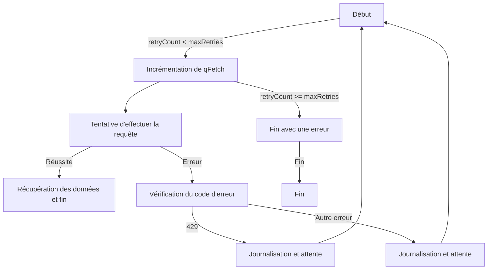

# Optimisation de la gestion des requêtes dans Google Apps Script

Afin d'optimiser la gestion des requêtes vers des serveurs externes dans Google Apps Script, il est essentiel de prendre en compte les erreurs possibles, les retards de réponses, ainsi que de comptabiliser le nombre total de requêtes effectuées.

## Exemple de code avec logique de tentative-réessai (`retry`)

Voici un exemple de code qui illustre cette approche, en utilisant `UrlFetchApp.fetch` avec une logique de tentative-réessai (`retry`) :

```javascript
let qFetch = 0;

// Logique de tentative-réessai
do {
    try {
        // Tentative de requête avec UrlFetchApp.fetch
        UrlFetchApp.fetch("URL_DU_SERVEUR");
        
        // Incrémentation de la variable qFetch en cas de succès
        qFetch++;
    } catch (error) {
        // Gestion des erreurs, aucune incrémentation de qFetch ici
    }
} while (/* Condition de sortie de la boucle */);

// Affichage du nombre total de requêtes effectuées
console.log(`Nombre total de requêtes : ${qFetch}`);
```

Un autre exemple, en utilisant `UrlFetchApp.fetch` avec une logique de tentative-réessai (`retry`) dans mon parser:

```javascript

for (var retryCount = 0; retryCount < maxRetries; retryCount++) {
  qFetch++; //wrong
  try {
    qFetch++;
    response = UrlFetchApp.fetch(url, { muteHttpExceptions: false });
    fetchedData = response.getContentText();
    break;
  } catch (error) {
    if (response && response.getResponseCode() == 429) {
      Logger.log("Erreur 429. Réessayez après " + retryDelay + " secondes.");
      totalSleepTime += retryDelay;
      Utilities.sleep(retryDelay);
    } else {
      Logger.log("Erreur lors de la récupération des données : " + error + " Pause (ms) : " + retryDelay);
      totalSleepTime += retryDelay;
      Utilities.sleep(retryDelay);
    }
  }
}
```

Dans ce script, la variable qFetch est incrémentée à chaque tentative, que le UrlFetchApp.fetch réussisse ou rencontre une erreur. Cela permet de comptabiliser le nombre total de requêtes envoyées au serveur externe, offrant ainsi une visibilité sur les performances du script.



En prenant en compte ces aspects, vous pouvez améliorer la robustesse de votre script et obtenir des informations utiles sur son comportement lors de l'interaction avec des serveurs externes.