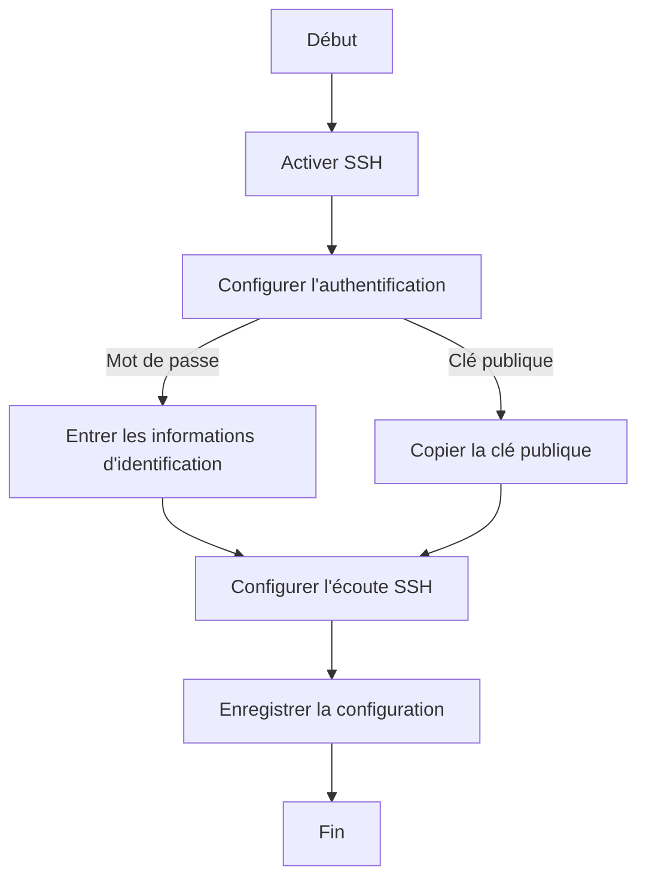

# Configuration de l'accès SSH sur un routeur Cisco

La configuration de l'accès SSH sur un routeur Cisco est une étape cruciale pour assurer une gestion sécurisée et flexible de votre réseau. SSH (Secure Shell) est un protocole de réseau crypté qui permet d'établir une connexion sécurisée et de gérer à distance votre routeur Cisco.

## Étapes de configuration de SSH

Voici les étapes à suivre pour configurer SSH sur votre routeur Cisco :

### Étape 1 : Accéder à l'interface de configuration

Commencez par vous connecter à l'interface de configuration de votre routeur Cisco. Vous pouvez utiliser une connexion série ou une connexion Ethernet pour y accéder. Une fois connecté, vous devriez voir un prompt de commande similaire à celui-ci :

```
Router>
```

### Étape 2 : Activer SSH

Pour activer SSH sur votre routeur Cisco, vous devez entrer la commande suivante :

```
Router# crypto key generate rsa
```

Cette commande génère une paire de clés RSA qui sera utilisée pour chiffrer les connexions SSH. Vous pouvez spécifier la taille de la clé en utilisant l'option de taille, par exemple :

```
Router# crypto key generate rsa modulus 2048
```

### Étape 3 : Configurer l'authentification SSH

Vous pouvez configurer l'authentification SSH pour contrôler qui peut accéder au routeur. Vous pouvez utiliser l'authentification par mot de passe ou par clé publique.

#### Authentification par mot de passe

Pour activer l'authentification par mot de passe, entrez la commande suivante :

```
Router(config)# username nom_utilisateur password mot_de_passe
```

Remplacez "nom_utilisateur" et "mot_de_passe" par les informations d'identification souhaitées.

#### Authentification par clé publique

Pour utiliser l'authentification par clé publique, vous devez d'abord générer une paire de clés publique et privée sur votre ordinateur. Ensuite, copiez la clé publique sur le routeur Cisco en utilisant la commande suivante :

```
Router(config)# username nom_utilisateur key-hash clé_publique
```

Remplacez "nom_utilisateur" par le nom d'utilisateur et "clé_publique" par la clé publique encodée en Base64.

### Étape 4 : Configurer l'écoute SSH

Pour permettre au routeur d'écouter les connexions SSH entrantes, entrez la commande suivante :

```
Router(config)# ip ssh version 2
Router(config)# line vty 0 4
Router(config-line)# transport input ssh
Router(config-line)# login local
```

Ces commandes activent SSH sur les lignes VTY et configurent l'authentification locale.

### Étape 5 : Enregistrer la configuration

Une fois que vous avez terminé la configuration, n'oubliez pas d'enregistrer vos modifications pour qu'elles soient appliquées lors du redémarrage du routeur :

```
Router(config)# end
Router# write memory
```

## Diagramme de flux de configuration SSH

Voici un diagramme de flux représentant les étapes de configuration de SSH sur un routeur Cisco :



En suivant ces étapes, vous pouvez configurer en toute sécurité l'accès SSH à votre routeur Cisco, ce qui vous permet de gérer et de surveiller votre réseau à distance de manière flexible et sécurisée.

J'espère que cet article vous a été utile pour configurer SSH sur votre routeur Cisco. N'oubliez pas de tester la connexion SSH et de vérifier que tout fonctionne correctement. Si vous avez des questions ou des commentaires, n'hésitez pas à les ajouter dans la section commentaires ci-dessous.