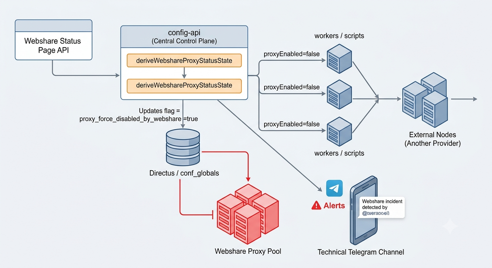
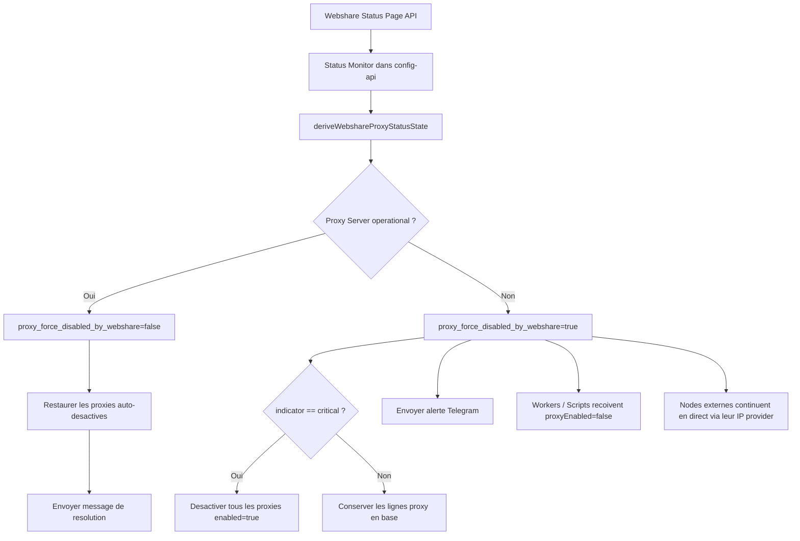
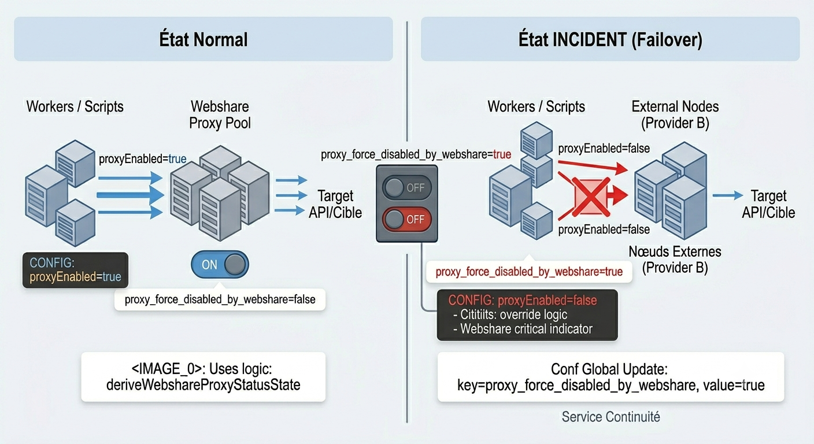
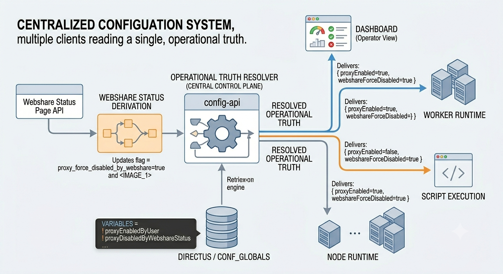
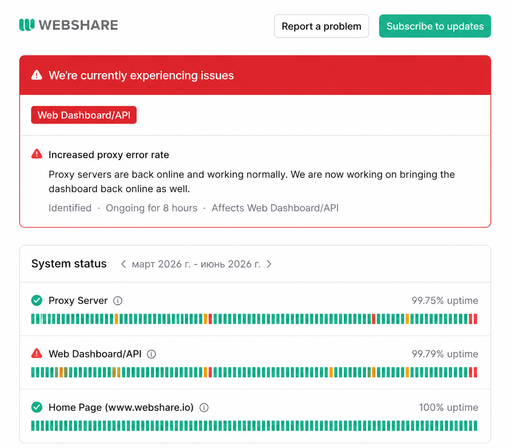
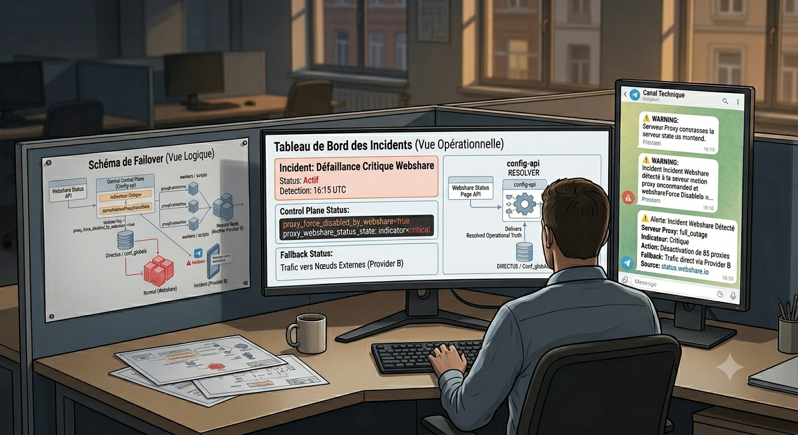

# Quand un fournisseur des proxies tombe...

{: .shadow }
*La carte standard est remplacée par une vue d'incident pour éviter toute ambiguïté côté opérateur.*

J'ai récemment mis en place une automatisation assez intéressante côté production : si `webshare.io` dégrade ou perd son service proxy, l'infrastructure coupe automatiquement l'usage des proxys Webshare, désactive les entrées proxy concernées, bascule le trafic vers des nœuds externes d'un autre fournisseur, et notifie immédiatement un canal Telegram technique.

Le sujet touche directement au **DevOps** et au **SRE** :

- détection d'incident fournisseur
- changement de comportement runtime sans intervention manuelle
- réduction du blast radius
- restauration automatique après résolution
- visibilité opérationnelle dans le dashboard

> En une phrase : quand Webshare tombe, le système coupe les proxys, garde le service en ligne via les nœuds externes, puis restaure l’état automatiquement.
{: .prompt-info }

## Le problème

Un incident fournisseur n'est pas un simple warning UI. C'est un **événement de pilotage runtime**.

Dans beaucoup d'architectures de scraping, d'API mediation, ou de collecte distribuée, les proxys sont traités comme une ressource stable. En pratique, ils sont souvent un point de défaillance externe.

Le cas était simple :

- une partie du trafic passe normalement par Webshare
- les workers et scripts consomment une configuration centrale
- les nœuds externes peuvent continuer à traiter des requêtes en direct via leur propre IP fournisseur
- lors d'un incident Webshare, continuer à utiliser ce pool ne fait qu'augmenter les erreurs, le bruit d'alerting et la consommation de retries

Le but n'était pas de "réparer" Webshare. Le but était de **retirer Webshare du chemin critique le plus vite possible**.

> Nous n’aimons pas les incidents. Pourtant, ce genre de moment donne de l’expérience, de la pratique, et fait progresser vite. Cet incident a duré huit heures...
{: .prompt-tip }

## Objectif d'architecture

La logique retenue :

1. surveiller `https://status.webshare.io/api/v2/summary.json`
2. dériver un état machine exploitable
3. activer un override global `proxy_force_disabled_by_webshare`
4. si l'incident est critique, désactiver aussi toutes les lignes proxy actives en base
5. faire recharger la configuration runtime aux nœuds
6. faire continuer le trafic via les nœuds externes en mode direct
7. envoyer une notification Telegram technique
8. restaurer automatiquement l'état quand le fournisseur revient à la normale



## Vue logique



> Ici, on parle du plan de contrôle. Le chemin réel des requêtes est séparé.
{: .prompt-tip }

## Principe de décision

Il y a deux niveaux :

- **incident actif** : on coupe le runtime proxy via un flag global
- **incident critique** : on coupe aussi les lignes proxy en base pour que l'état opérationnel soit cohérent partout

En pratique :

| État Webshare | Runtime proxy | Lignes proxy en base | Trafic |
|---|---|---|---|
| `operational` | activé | inchangées / restaurées | Webshare normal |
| `degraded_performance` | désactivé | conservées | fallback sur nœuds externes |
| `critical` / `full_outage` | désactivé | `enabled=false` auto | fallback sur nœuds externes |

## 1. Le monitor d'incident

Le monitor tourne côté `config-api`. Il lit régulièrement le JSON de la status page et stocke un état normalisé dans la configuration globale.

```javascript
const WEBSHARE_STATUS_SUMMARY_URL =
  process.env.WEBSHARE_STATUS_SUMMARY_URL ||
  'https://status.webshare.io/api/v2/summary.json';

const PROXY_FORCE_DISABLED_BY_WEBSHARE_KEY = 'proxy_force_disabled_by_webshare';
const PROXY_WEBSHARE_STATUS_STATE_KEY = 'proxy_webshare_status_state';
const PROXY_AUTO_DISABLED_BY_WEBSHARE_CRITICAL_KEY =
  'proxy_auto_disabled_by_webshare_critical';

function deriveWebshareProxyStatusState(summary) {
  const components = Array.isArray(summary?.components) ? summary.components : [];
  const incidents = Array.isArray(summary?.incidents) ? summary.incidents : [];

  const proxyServer =
    components.find((component) => String(component?.name || '').trim() === 'Proxy Server') || null;

  const dashboardApi =
    components.find((component) => String(component?.name || '').trim() === 'Web Dashboard/API') || null;

  const ongoingIncident =
    incidents.find((incident) => String(incident?.status || '').trim().toLowerCase() !== 'resolved') || null;

  const proxyComponentStatus = String(proxyServer?.status || 'unknown').trim().toLowerCase();
  const dashboardComponentStatus = String(dashboardApi?.status || 'unknown').trim().toLowerCase();
  const summaryIndicator = String(summary?.status?.indicator || 'unknown').trim().toLowerCase();

  return {
    active: proxyComponentStatus !== 'operational',
    incident_id: ongoingIncident?.id ? String(ongoingIncident.id) : null,
    incident_name: ongoingIncident?.name ? String(ongoingIncident.name) : null,
    incident_status: ongoingIncident?.status ? String(ongoingIncident.status) : null,
    proxy_component_status: proxyComponentStatus,
    dashboard_component_status: dashboardComponentStatus,
    summary_indicator: summaryIndicator,
    checked_at: new Date().toISOString(),
    source: 'https://status.webshare.io/'
  };
}
```

On ne lit pas cette status page comme un humain. On la convertit en **état décisionnel**. Cet état sert ensuite à piloter la configuration.

## 2. L'override global qui coupe le runtime

Une fois l'état dérivé, le système décide si l'usage des proxys doit être coupé.

```javascript
async function syncWebshareProxyAvailability(trigger = 'manual') {
  const currentState = parseStoredWebshareStatusState(
    globalMap.get(PROXY_WEBSHARE_STATUS_STATE_KEY)
  );

  const currentOverride = parseBooleanFlag(
    globalMap.get(PROXY_FORCE_DISABLED_BY_WEBSHARE_KEY),
    false
  );

  const summary = await fetchWebshareStatusSummary();
  const nextState = deriveWebshareProxyStatusState(summary);

  const shouldDisable = nextState.active;
  const shouldDisableProxyRows = nextState.summary_indicator === 'critical';

  const activationChanged =
    shouldDisable !== currentState.active ||
    shouldDisable !== currentOverride;

  if (activationChanged) {
    await upsertConfGlobal({
      key: PROXY_FORCE_DISABLED_BY_WEBSHARE_KEY,
      value: shouldDisable ? 'true' : 'false',
      type: 'boolean'
    });
  }
}
```

Ce flag global centralise la décision. Il est lu par plusieurs runtimes. Il évite de dupliquer la même condition partout.

## 3. Le mode critique : désactiver aussi les proxys en base

Quand l'indicateur global passe à `critical`, l'override runtime seul ne suffit plus. La base et le dashboard doivent afficher le même état que le runtime.

```javascript
async function disableEnabledProxiesForWebshareCritical() {
  const proxies = await directusRead(
    COLLECTIONS.CONF_PROXIES,
    { enabled: { _eq: true } },
    'id,proxy_ip,enabled,updated_at',
    null,
    -1
  );

  const disabledEntries = [];

  for (const proxy of proxies || []) {
    const updated = await directusUpdate(COLLECTIONS.CONF_PROXIES, proxy.id, {
      enabled: false
    });

    disabledEntries.push({
      id: proxy.id,
      proxy_ip: proxy.proxy_ip,
      disabled_at: updated?.updated_at || null
    });
  }

  return disabledEntries;
}
```

À la résolution :

```javascript
async function restoreProxiesAutoDisabledByWebshareCritical(entries) {
  for (const entry of entries) {
    const proxy = proxyMap.get(String(entry.id));
    if (!proxy) continue;
    if (proxy.enabled !== false) continue;

    if (entry.disabled_at && proxy.updated_at && proxy.updated_at !== entry.disabled_at) {
      continue; // ne pas écraser une modification humaine plus récente
    }

    await directusUpdate(COLLECTIONS.CONF_PROXIES, entry.id, {
      enabled: true
    });
  }
}
```

Le système **ne réactive pas** tout le pool. Il réactive uniquement ce qu'il a désactivé lui-même, et seulement si personne n'a modifié l'entrée entre-temps.

> Le point important ici : l’automatisation ne doit pas écraser une décision humaine plus récente.
{: .prompt-warning }

## 4. L'anti-spam d'alerting

Un piège classique dans ce genre d'automatisation est le "storm d'alertes". Si l'état critique est déjà actif, il ne faut pas réémettre l'alerte à chaque refresh de page ou à chaque cycle de monitoring.

La correction a consisté à mémoriser un vrai état :

```javascript
{
  critical_active: true,
  entries: [...]
}
```

et non pas à inférer ce statut uniquement depuis une liste de proxys désactivés.

Cela évite le scénario :

- l'incident est toujours actif
- il n'y a plus de proxys supplémentaires à désactiver
- le système croit qu'il doit re-alerter car la liste est vide

Un système d'alerting doit détecter une panne, mais il doit aussi **éviter le bruit**.

> Un incident répété ne doit pas produire une alerte répétée si l’état n’a pas changé.
{: .prompt-info }

## 5. Le basculement côté nœuds

Une fois l'override global posé, les nœuds doivent l'appliquer sans redéploiement.



```javascript
const globalsRows = await directusRead(
  COLLECTIONS.CONF_GLOBALS,
  { key: { _in: ['proxy_enabled', 'proxy_force_disabled_by_webshare'] } },
  DEFAULT_DIRECTUS_URL,
  DEFAULT_DIRECTUS_TOKEN
);

proxyEnabledByUser = parseBooleanFlag(globalsMap.proxy_enabled, true);
proxyForceDisabledByWebshare = parseBooleanFlag(
  globalsMap.proxy_force_disabled_by_webshare,
  false
);

WEBSHARE_ENABLED = proxyEnabledByUser && !proxyForceDisabledByWebshare;
PROXY_POOL_ENABLED = WEBSHARE_ENABLED;
RESOLVED_NODE_IP = (nodeConfig.proxy_ip || envIP || localIP || '').trim();
```

Résultat :

- l'application reste en ligne
- le service ne s'arrête pas
- le pool Webshare est désactivé
- les nœuds externes continuent à répondre en direct avec leur propre IP fournisseur

On ne fait pas "stop the world". On retire une dépendance externe défaillante.

## 6. La configuration envoyée aux workers

Les scripts et workers ne doivent pas recalculer cet état. Ils reçoivent une configuration déjà résolue :



```javascript
const proxyEnabled = computeEffectiveProxyEnabledFromGlobals(globals);
const proxyDisabledByWebshareStatus = parseBooleanFlag(
  globals.proxy_force_disabled_by_webshare,
  false
);

const config = {
  global: {
    proxyEnabled,
    proxyDisabledByWebshareStatus
  }
};
```

Les clients restent simples. La logique reste centralisée. Le dashboard affiche le même état que le runtime.

## 7. La notification Telegram technique

En cas d'incident, le système envoie un message avec :

- type d'action exécutée
- nombre de proxys auto-désactivés
- niveau `indicator`
- nom et statut de l'incident
- statut des composants Webshare
- source du signal
- trigger (`startup` ou `schedule`)

Exemple de message :

```text
⚠️ Webshare incident detected
Action: proxy usage auto-disabled
Proxies auto-disabled: 85
Indicator: critical
Incident: Increased proxy error rate
Status: identified
Proxy Server: full_outage
Web Dashboard/API: full_outage
Trigger: schedule
Source: status.webshare.io
```

{: .shadow }
*Notification envoyée dès que l'incident est détecté et que l'override proxy est activé.*

Le message de résolution confirme la reprise, l'auto-restore éventuel et la fin de l'override.

{: .shadow }
*Message de retour à la normale après levée automatique du failover.*

> Sur les images, vous pouvez voir que 0 proxy ont été désactivés et réactivés automatiquement. Tout est normal, puisque je les avais désactivés manuellement et qu’ils doivent donc être réactivés manuellement également.

{: .shadow }

Pour l’instant, tout ce que j’ai fait reste théorique et mérite d’être vérifié en pratique. J’attends avec impatience la prochaine interruption du réseau Webshare…
Un paresseux qui n’a tout simplement pas envie d’écrire des tests. 😄
{: .prompt-info }


## 8. Visibilité dans le dashboard

Un mécanisme de failover doit rester visible. J'ai donc ajouté dans le dashboard :

- un bouton d'état `Webshare.io`
- un code couleur `OK / Warning / Critical`
- une carte incident qui remplace une métrique classique quand l'incident est actif
- un tooltip sur `Proxy runtime: disabled`
- l'affichage de l'heure du dernier check


*La status page Webshare fournit ici le signal externe qui déclenche la logique de protection.*

Le but est simple :

> Est-ce que le système a un bug interne, ou bien est-ce qu'il s'est volontairement protégé contre un incident fournisseur ?

## 9. Pourquoi ce pattern est utile en SRE

Cette automatisation couvre plusieurs besoins SRE :

- **dégradation contrôlée** : le système fonctionne encore, avec moins de dépendances
- **centralisation de la décision** : un seul état fait foi
- **auto-rémédiation** : pas besoin d'action humaine immédiate
- **protection contre les erreurs en cascade** : moins de retries inutiles, moins de bruit, moins de consommation
- **restauration automatique** : pas de dette manuelle à la fin de l'incident

## 10. Ce que je retiens

Si un composant externe est critique dans le chemin de requête, il faut préparer trois choses avant la panne :

1. un signal machine exploitable
2. une stratégie de coupure rapide
3. une capacité de fallback qui garde le service utile

Dans ce cas précis, Webshare n'était plus une simple dépendance "up/down". C'était un paramètre de routage.

C'est le type d'automatisation qui change la résilience réelle d'un système.


---

Cette logique devient utile quand **monitoring**, **configuration**, **runtime**, **alerting** et **visibilité opérateur** racontent la même chose.

Merci de votre attention !