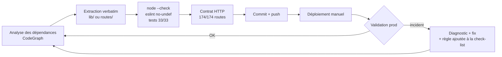

# Claude Fable 5 : trois jours, 100 000+ lignes, une prod vivante

Bonjour à tous !
J'ai passé les trois derniers jours (8-10 juillet) sur un chantier que je repoussais depuis des mois : le refactoring complet de mon infrastructure de production (celle qui fait tourner mes projets de trading et de monitoring). Un backend Express de **24 702 lignes dans un seul fichier**, un dashboard React avec des pages de 2 700 lignes, des API qui mettaient 20 secondes à répondre, et une base PostgreSQL qui grossissait sans limite.

Ce chantier, j'avais déjà essayé de le lancer avec d'autres modèles - y compris ceux d'OpenAI. Le scénario était toujours le même : au bout de quelques fichiers, le contexte saturait, le modèle perdait le fil des décisions prises, et finissait par me suggérer d'« ouvrir une nouvelle conversation ». Sur une base de plus de 100 000 lignes, repartir de zéro tous les quarts d'heure, c'est rédhibitoire.

La différence cette fois : j'ai travaillé en binôme avec **Claude Fable 5**, le nouveau modèle d'Anthropic (classe Mythos, au-dessus d'Opus), via Claude Code. Trois jours dans **une seule et même conversation continue**, qui a traversé le backend, le frontend, les mesures navigateur et les patchs SQL sans jamais me demander de recommencer. Et le résultat dépasse ce que j'aurais cru possible.

> En une phrase : ~90 commits en 3 jours, un monolithe divisé par 60, des API jusqu'à 35x plus rapides, 4.5 GB récupérés sur PostgreSQL - et zéro rollback.
{: .prompt-info }

## Le point de départ

| Zone | État au 8 juillet |
|---|---|
| `config-api.js` (backend Express) | 24 702 lignes, 174 routes, 260 commits en 6 mois, un seul fichier |
| Pages du dashboard React | 6 pages « chaudes » de 1 500 à 2 700 lignes chacune |
| Bundle frontend | 1 007 kB en un seul chunk (warning Vite permanent) |
| `GET /api/cloudflare/workers` | **19.8 secondes** |
| PostgreSQL | tables système Directus à 4.5 GB, aucune rétention sur les métriques |

Ce n'est pas un projet jouet : c'est la prod qui fait tourner mes workers Cloudflare, mes scripts de monitoring Steam Market et ma comptabilité. Chaque erreur coûte de l'argent réel.

{: .shadow }
*Une partie du périmètre : 63 workers Cloudflare répartis sur 12 comptes, avec quotas CPU, graphes 48h et redéploiement en masse. C'est la page dont l'API mettait 19.8 secondes à répondre.*

## La méthode : l'IA ne réécrit pas, elle déplace

Le piège classique avec un LLM sur du code legacy, c'est la « réécriture créative » : le modèle améliore au passage, et trois semaines plus tard on découvre une régression silencieuse. La règle imposée dès le premier jour était l'inverse :

>Les règles imposées au modèle, non négociables :
1. **Déplacement verbatim** — byte-identique, vérifié par comparaison git. Pas d'« amélioration » au passage.
2. **Un commit = un changement**, toujours réversible.
3. **Après chaque étape** : `node --check`, tests, eslint no-undef, comparaison du contrat HTTP (174/174 routes).
4. **Déploiement et validation en prod** avant l'étape suivante.
{: .prompt-danger }

Ce qui m'a marqué : Fable 5 a **transformé ses propres incidents en check-list**. Le premier jour, un export oublié a cassé la page Workers en prod (500). Le modèle a diagnostiqué, corrigé, puis ajouté « eslint no-undef obligatoire après chaque extraction » à sa procédure - et l'incident ne s'est jamais reproduit sur les ~40 extractions suivantes.



## Les outils donnés au modèle

Un point sous-estimé : la qualité du travail dépend directement des accès qu'on donne à l'agent. Au fil des trois jours, Fable 5 a travaillé avec :

- **CodeGraph** (MCP) : graphe de tous les symboles du repo, pour l'analyse de dépendances avant chaque extraction
- **Directus MCP** : accès direct en lecture à la base vivante - c'est lui qui a confirmé « 100 proxies × 35 ms = vos 3.5 secondes »
- **Chrome DevTools MCP** : le modèle a piloté un Chrome, s'est fait ouvrir une session sur mon dashboard, et a mesuré lui-même chaque endpoint de chaque page
- **pgAdmin4** : via le même Chrome piloté, il a rempli le Query Tool, exécuté les patchs SQL et lu les résultats dans la grille

Ce dernier point mérite d'être souligné : je n'ai pas donné d'accès root à PostgreSQL. Le modèle a proposé de lui-même l'option la moins privilégiée (le panel pgAdmin plutôt que le serveur), et j'ai vu chaque requête passer à l'écran.

## Jours 1-2 : le monolithe

`config-api.js` est passé de 24 702 à **413 lignes** - un composition root qui ne fait plus que du bootstrap et onze appels `registerXxxRoutes(app)`. Les 174 routes vivent dans 10 modules `routes/`, la logique dans 26 modules `lib/`.

Au passage, le modèle a trouvé ce que six mois de commits avaient enterré :

- 3 bugs préexistants (un `ReferenceError` dormant dans l'auto-pause, un flood de 403 sur les vieilles collections, une déduplication de masques cassée)
- 2 fonctions dupliquées mortes (`sleep()`, `parseBooleanFlag()` - dont une seule version s'exécutait grâce au hoisting)
- 3 incidents attrapés en prod, chacun converti en règle de vérification

## Jour 3 : mesurer d'abord, optimiser ensuite

La règle du plan était stricte : « l'optimisation ne commence qu'après des mesures ». Le modèle a d'abord fait du code splitting par route (bundle principal : 1 007 → 204 kB), puis a parcouru chaque page du dashboard dans le navigateur et relevé les temps de chaque appel API.

Le verdict était sans appel - et trois fois le même coupable :

```js
// Le pattern qui coûtait des secondes, trouvé dans TROIS endpoints différents :
for (const script of scripts) {
  const items = await directusRead(COLLECTIONS.CONF_ITEMS,
    { id: { _in: script.monitored_items } });   // 85 requêtes séquentielles...
}
```

{: .shadow }
*La page Scripts : 76 scripts de monitoring, étoiles de cadence, quotas UrlFetch. Elle appelait `GET /api/scripts`... qui chargeait les items de chaque script un par un.*

Un N+1 classique, mais version REST : 85 appels Directus séquentiels à ~50 ms pièce. Le fix est un batch unique - avec un piège que le modèle a repéré seul : **Directus limite les lectures à 100 lignes par défaut**, donc un batch sans `limit: -1` aurait tronqué silencieusement les résultats.

{: .shadow }
*Mesures réelles, prises dans le navigateur avec une session authentifiée - avant le 8 juillet, après le 10.*

| Endpoint | Avant | Après | Gain |
|---|---:|---:|---:|
| `GET /api/scripts` (appelé sur 5 pages) | ~5 s | **0.9 s** | ×5.7 |
| `GET /api/proxies` | ~3.5 s | **0.1 s** | ×35 |
| `GET /api/cloudflare/workers` | 19.8 s | **~3 s** | ×6 |

Pour le endpoint Cloudflare, le N+1 était côté API externe (63 workers × un appel `settings` chacun, concurrence 4) : concurrence relevée, lectures D1 parallélisées, et un cache in-process avec invalidation dans les trois seuls endpoints qui modifient les bindings. Le tout mesuré avant/après dans le même navigateur.

Bonus découvert pendant les mesures : la page Proxies re-déclenchait **4 requêtes lourdes toutes les 5 secondes** tant que l'onglet restait ouvert - un `invalidateQueries` trop large sur un timer. La pression de fond sur le nœud a été divisée par ~70.

## La base de données : 4.5 GB retrouvés

La carte des tables a révélé une anomalie : `directus_revisions` pesait **3 384 MB pour... 7 244 lignes vivantes**. D'anciens nettoyages avaient supprimé les lignes, mais PostgreSQL ne rend jamais l'espace à l'OS sans `VACUUM FULL`.

| Table | Avant | Après | Durée du lock |
|---|---:|---:|---:|
| `directus_revisions` | 3 384 MB | **3.4 MB** | 4.8 s |
| `directus_activity` | 1 121 MB | **1.8 MB** | 1.1 s |
| `script_execution_logs` | 935 MB | compactée (−354 788 lignes) | 3.6 s |

Et pour que ça ne se reproduise pas : trois fonctions de rétention + jobs pg_cron (30 jours pour les logs, 60 jours pour les métriques horaires), le tout documenté avec un snapshot vivant des **18 jobs** actifs.

{: .shadow }
*Le Query Tool de pgAdmin, piloté par Fable 5 via le navigateur : les 18 jobs pg_cron actifs, dont les trois rétentions ajoutées ce jour-là (noms de base anonymisés).*

Ma partie préférée : une « énigme » de 3 009 révisions sur `directus_collections`. Le modèle a remonté la piste via `user_agent` et `origin` dans la table d'activité... pour découvrir que le coupable, c'était **moi** : chaque drag-and-drop de collection dans l'admin Directus envoie un PATCH sur toutes les collections du groupe. Pas de bug, pas de fix - juste une réponse honnête.

> Même les jobs pg_cron « disparus » ont eu leur autopsie : `cron.job_run_details` garde les traces des jobs supprimés. L'un d'eux n'avait jamais existé - le compteur de remplacements proxy ne se serait jamais remis à zéro le jour de facturation.
{: .prompt-tip }

> Un agent avec accès prod reste un outil à encadrer : accès minimum nécessaire, actions destructives uniquement sur validation explicite, et fenêtres calmes pour tout ce qui verrouille la base. Le modèle a respecté ce cadre de lui-même - mais c'est à vous de le poser.
{: .prompt-warning }

## Ce que Fable 5 change, concrètement

J'utilise des LLM pour coder depuis longtemps. Voici ce qui est différent avec cette génération :

1. **Le contexte ne casse plus.** C'est le changement le plus visible venant des modèles OpenAI que j'utilisais avant : plus de « veuillez ouvrir un nouveau chat », plus de résumés à recopier à la main d'une session à l'autre. Fable 5 a tenu trois jours et 100 000+ lignes de code dans un fil continu - et quand une session reprenait, il rechargeait lui-même l'état exact du chantier depuis sa mémoire persistante.
2. **L'autonomie tient sur la durée.** Le découpage des 6 pages React (13 500 lignes analysées, 15 modules extraits, 6 commits, build + tests après chaque page) s'est fait en un seul run autonome, sans une question.
3. **Il refuse de tricher.** Sur trois pages, l'extraction complète aurait exigé de changer les props - donc le comportement. Le modèle a extrait ce qui était sûr, documenté ce qu'il laissait, et expliqué pourquoi. C'est exactement ce qu'on attend d'un senior.
4. **Il mesure au lieu de deviner.** Chaque optimisation est passée par : mesure → cause → fix minimal → re-mesure. Quand j'ai dit « la cause est sûrement dans la base », il a vérifié dans la base vivante - et prouvé que c'était un N+1 applicatif, pas un index manquant.
5. **Il instrumente son propre environnement.** Accès navigateur manquant ? Il a configuré le MCP Chrome DevTools lui-même, m'a juste demandé de me loguer, et a fait le reste.
6. **La mémoire persiste.** Chaque session reprend avec l'état exact du chantier, les pièges connus (« Directus limit 100 », « ne pas fusionner les helpers homonymes de Bank et Inventory ») et les décisions déjà prises.

## Bilan

| Métrique | Résultat |
|---|---|
| Durée | 3 jours, ~90 commits |
| Backend | 24 702 → 413 lignes, contrat HTTP intact (174/174) |
| Frontend | bundle ×5 plus léger, 6 pages découpées |
| API | ×5.7 à ×35 selon l'endpoint |
| PostgreSQL | −4.5 GB, 18 jobs pg_cron documentés |
| Rollbacks | **0** |
| Bugs préexistants corrigés au passage | 3 |

Le coût réel de ma participation : des décisions (retention 30 ou 60 jours ? quel créneau pour le `VACUUM FULL` ?), des déploiements, et des validations visuelles après chaque étape. Tout le reste - l'analyse, le code, les mesures, les patchs SQL, la documentation - c'est le modèle.

Il y a un an, ce chantier m'aurait pris un mois et je l'aurais probablement abandonné au tiers. Mes essais précédents avec les modèles d'OpenAI butaient systématiquement sur la même limite : la taille et la durée. Ici, honnêtement, j'ai été surpris - voir un modèle absorber l'équivalent de tout mon monorepo, garder les décisions en tête pendant trois jours et corriger ses propres erreurs en route, ça ressemble moins à une amélioration incrémentale qu'à un **changement de niveau**.

La question n'est plus « est-ce que l'IA peut aider sur du legacy », mais « quels accès et quelle méthode lui donner pour qu'elle travaille comme un SRE senior ». Avec la bonne check-list et les bons garde-fous, Fable 5 est le meilleur binôme technique avec lequel j'ai travaillé. Quelque chose de réellement puissant est en train d'arriver.
