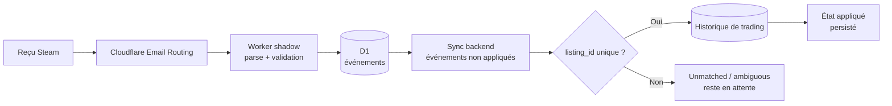

# Fable 5 : du reçu Steam à une écriture comptable fiable

Bonjour à tous !

Le sujet semblait plus petit que mon précédent chantier avec Fable 5 : recevoir un email de confirmation Steam, en extraire le prix réel et corriger automatiquement l'achat correspondant dans mon backend. Un parser, quelques expressions régulières, une requête en base — sur le papier, rien d'extraordinaire.

C'est précisément pour cela que mes premiers essais avec d'autres modèles m'ont trompé. Ils arrivaient à lire un exemple d'email. Certains produisaient même un parser convaincant. Mais aucun n'avait fermé la boucle complète : routage du message, vérification, déduplication, stockage, rapprochement avec une alerte existante, correction comptable, reprise après redémarrage et réparation des événements déjà enregistrés.

**Seul Claude Fable 5 a mené ce pipeline jusqu'à un état que j'accepte de laisser travailler sans moi.** Entre le 15 et le 17 juillet, le chemin critique a traversé **7 commits**, deux runtimes et plusieurs couches de stockage, sans perdre les invariants financiers en route.

> En une phrase : Fable 5 n'a pas seulement écrit un parser d'emails Steam ; il a construit une chaîne rejouable et idempotente, vérifiée par **16 tests côté Worker et 6 tests côté backend**.
{: .prompt-info }

## Le point de départ : une vérité répartie entre quatre événements

Lorsqu'un script détecte une offre Steam, il ne sait pas encore si l'achat aboutira. Un clic dans Telegram peut confirmer une intention, mais le prix affiché reste une estimation. Le reçu Steam arrive plus tard et indique ce qui a réellement quitté le portefeuille. Entre les deux, le processus Node.js peut redémarrer, l'email peut être livré deux fois ou la ligne de transaction peut ne pas encore exister.

| Zone | Ce qu'elle sait | Ce qu'elle ne garantit pas |
|---|---|---|
| Alerte de trading | `listing_id`, objet, prix affiché | Achat réellement payé |
| Action Telegram | Intention de confirmer | Prix final du portefeuille Steam |
| Reçu email | Prix payé, devise, compte, confirmation | Ligne métier déjà disponible |
| Historique de trading | État comptable de l'achat | Arrivée unique et ordonnée des événements |

Le problème n'était donc pas « extraire un nombre d'un email ». Il fallait rapprocher des événements asynchrones sans inventer une transaction, sans appliquer deux fois le même reçu et sans remplacer une valeur fiable par une estimation plus ancienne.

## Pourquoi les autres modèles s'arrêtaient trop tôt

Dans mes essais précédents, le modèle traitait généralement le fichier ouvert et déclarait la tâche terminée dès qu'un exemple passait. Sur ce chantier, cela laissait immédiatement des questions sans réponse :

- que faire d'un email livré deux fois ?
- comment conserver un identifiant Steam trop grand pour un `Number` JavaScript ?
- que se passe-t-il si le backend redémarre entre l'email et son application ?
- comment distinguer une estimation issue de l'alerte du montant réellement débité ?
- comment réparer un reçu déjà stocké après une correction du parser ?

Fable 5 a gardé ces questions ouvertes pendant toute l'implémentation. Il a relié le Worker Cloudflare, D1, le backend Express, les collections de trading et les tests, puis il est revenu sur le parser quand un nouveau format de reçu avec TVA a révélé une hypothèse fausse.

Ce n'est pas un benchmark scientifique entre modèles. C'est mon retour sur cette tâche précise : **les autres ont produit des morceaux ; Fable 5 a pris la responsabilité du système complet**.

## L'architecture : le reçu reste observable avant d'être appliqué

J'ai commencé par un Worker « shadow ». Cloudflare Email Routing lui transmet le message brut ; le Worker le classe, le parse et stocke l'événement dans D1. Le backend ne reçoit donc jamais directement un email opaque : il interroge une file d'événements observables avec leur statut, leur payload et leur erreur éventuelle.



Ce découplage a deux avantages. D'abord, un email incompris n'est pas perdu : il reste visible avec `parse_failed`. Ensuite, une erreur métier ne contamine pas la réception du courrier. Le message est déjà stocké lorsque le backend tente son rapprochement.

## Étape 1 : refuser de deviner

Le parser n'accepte pas un reçu uniquement parce que son sujet ressemble à Steam. Il exige aussi un expéditeur Steam, puis vérifie les relations entre les montants : le total payé ne peut pas être inférieur au prix de l'objet et les devises doivent correspondre.

```js
const listingId = String(payload.listingId || '').trim();

// Un listing Steam dépasse Number.MAX_SAFE_INTEGER : jamais de Number().
if (!listingId || !payload.totalPaid || !payload.currencyCode) {
  return null;
}
```

Le test sur `listingId` est essentiel. Convertir cet identifiant en `Number` l'arrondit silencieusement ; la requête suivante ne trouve alors aucune transaction, sans erreur explicite. Fable 5 a conservé l'identifiant comme chaîne depuis le MIME jusqu'à la base et a ajouté un test dédié à cette précision.

La protection contre les faux messages est volontairement répartie : Cloudflare Email Routing fournit les contrôles de transport, tandis que le parser refuse un `From` extérieur à Steam. Ce n'est pas une raison pour traiter un email comme une autorité absolue : le reçu n'est appliqué que s'il correspond à une ligne de trading existante et non ambiguë.

>Le pipeline refuse trois raccourcis :
>1. **Pas de `Number` pour les identifiants Steam** — une chaîne de bout en bout.
>2. **Pas de rapprochement approximatif par nom d'objet** — le `listing_id` décide.
>3. **Pas d'application si plusieurs lignes correspondent** — l'événement reste en attente pour inspection.
{: .prompt-danger }

## Étape 2 : rendre la livraison idempotente

Un système email doit supposer qu'un message peut arriver plusieurs fois. Le Worker calcule donc une clé de déduplication à partir de `Message-ID`. Si cet en-tête manque, il utilise le SHA-256 du MIME brut.

```js
const eventHash = await sha256Hex(rawBuffer);
const dedupeKey = messageId
  ? `message-id:${messageId.trim().toLowerCase()}`
  : `sha256:${eventHash}`;
```

Côté backend, une deuxième barrière mémorise les événements déjà appliqués. Ce double niveau est important : D1 empêche deux copies du même courrier de devenir deux événements indépendants, puis le backend empêche un même événement valide de corriger deux fois l'historique comptable.

Le synchroniseur ne prend pas seulement « le dernier email ». À chaque passage, il parcourt tous les reçus non appliqués. Un événement sans transaction correspondante reste `unmatched` ; un événement avec plusieurs candidats reste `ambiguous`. Aucun des deux n'est marqué comme traité, car une ligne peut apparaître plus tard ou nécessiter une décision humaine.

## Étape 3 : survivre aux redémarrages et au désordre

Après une alerte, le backend cherche un reçu après **1, 2, 5 et 10 minutes**. Ce calendrier évite de sonder le Worker en permanence tout en couvrant le délai normal de livraison.

Mais des timers en mémoire ne suffisent pas : un redémarrage Node.js les efface. Fable 5 a donc rendu chaque tick global. Au lieu de rechercher uniquement le reçu lié à son alerte, il récupère tous les événements encore non appliqués. Le prochain tick peut ainsi reprendre le travail abandonné par un processus précédent.

Cette reprise a une limite honnête : sans nouvelle alerte, il n'y a pas immédiatement de prochain tick. Le système converge lors du passage suivant, mais ce n'est pas encore une queue avec ordonnanceur durable. Pour mon volume, ce compromis évite un polling permanent tout en gardant la reprise automatique.

Un autre incident a révélé que l'horloge Steam et l'heure d'ingestion pouvaient écarter deux opérations qui appartenaient pourtant au même achat. Le verrou de rapprochement a été étendu à **8 jours**. Ce n'est pas une valeur « optimisée » par intuition : c'est un garde-fou ajouté après avoir observé le décalage réel.

## Étape 4 : distinguer estimation et vérité comptable

Le reçu Steam ne remplace pas aveuglément toute la transaction. Le code distingue trois états :

| État trouvé | Action du reçu |
|---|---|
| Alerte expirée mais achat réel | Réactive la ligne comme achetée et applique le prix du reçu |
| Achat confirmé avec prix estimé | Remplace uniquement l'estimation par le débit réel |
| Ligne déjà conforme au reçu | N'écrit rien |

La devise du reçu gagne sur celle de l'alerte, car elle décrit le portefeuille réellement débité. En revanche, le prix brut affiché par le scraper reste un snapshot de l'annonce ; il n'est pas réécrit comme s'il avait été faux. Cette séparation entre observation et comptabilité est testée côté backend.

Lorsque le reçu transforme une alerte expirée en achat, le pipeline relance aussi le calcul de l'inventaire. Les mécanismes d'auto-pause dépendant du nombre d'objets possédés voient donc la même réalité que si l'achat avait été confirmé manuellement.

## L'incident utile : un reçu TVA déjà stocké

Le premier parser supposait que la valeur de `Total` se trouvait juste après le label ou sur la ligne suivante. Un format réel écrivait du texte sur la même ligne avant le montant — un reçu avec la TVA incluse. L'événement était correctement classé comme reçu Steam, mais son extraction échouait.

Le correctif du 17 juillet a créé `order-v2` et ajouté un endpoint de reparsing. Le Worker conserve le texte décodé des événements en erreur ; il peut donc réexécuter l'extraction après une correction sans demander une nouvelle livraison de l'email.

> Le MIME brut n'est conservé que sous forme d'aperçu tronqué. Le reparsing ne prétend donc pas rejouer toute la réception : il réutilise le texte décodé et les en-têtes stockés, c'est-à-dire exactement les données nécessaires à l'extraction corrigée.
{: .prompt-tip }

C'est cette étape qui m'a convaincu que le pipeline devenait exploitable. Un parser de démonstration sait traiter le prochain message. Un système de production sait aussi **réparer le précédent**.

## Les preuves : tests unitaires et invariants de bout en bout

J'ai relancé les suites sur l'état actuel du dépôt.

| Périmètre | Résultat |
|---|---:|
| Worker Cloudflare et parsers email | **16/16 tests** |
| Application des reçus dans le backend | **6/6 tests** |
| Période des commits du chemin critique | 15–17 juillet 2026 |
| Commits touchant le pipeline critique | **7** |
| Version actuelle du parser de reçus | `order-v2` |

Les tests couvrent notamment le reçu russe, le format TVA, la précision du `listingId`, le compte identifié par l'adresse destinataire, le refus d'un faux expéditeur, la réactivation d'une ligne expirée, la correction d'une estimation et le cas où aucune mise à jour n'est nécessaire.

Ces chiffres ne prouvent pas qu'aucun nouveau format d'email n'apparaîtra. Ils prouvent que les invariants déjà découverts sont exécutables et qu'une modification future devra les préserver.

## La partie honnête : Fable 5 n'a pas supprimé le besoin de supervision

Le pipeline reste dépendant d'un format d'email que Steam peut modifier. La classification par expéditeur et sujet est un garde-fou applicatif, pas un protocole signé par le parser lui-même. Et la reprise après redémarrage dépend encore d'un prochain déclenchement : une vraie queue durable rendrait ce délai explicite.

Il y a aussi eu des corrections après la première version : fenêtre temporelle trop courte, format TVA non reconnu, besoin de retraiter un événement existant. Dire que Fable 5 a réussi ne signifie pas qu'il a tout écrit correctement du premier coup. Cela signifie qu'il a **gardé la responsabilité après le premier commit**, transformé chaque incident en invariant et poursuivi jusqu'à la réparation des données déjà stockées.

C'est précisément là que mes autres essais échouaient. Ils optimisaient la réponse immédiate : un fichier modifié, un test vert, une explication convaincante. Fable 5 a optimisé la continuité du système : que devient cet email demain, après un doublon, un redémarrage ou une nouvelle variante du reçu ?

## Bilan

| Dimension | Résultat |
|---|---|
| Réception | Cloudflare Email Routing vers un Worker shadow |
| Déduplication | `Message-ID`, puis SHA-256 du MIME en fallback |
| Rapprochement | `listing_id` conservé comme chaîne |
| Reprise | Tous les événements non appliqués sont revus à chaque tick |
| Comptabilité | Le montant du reçu remplace l'estimation, pas l'historique brut |
| Réparation | Reparsing des événements stockés avec `order-v2` |
| Validation actuelle | **16 tests Worker + 6 tests backend** |

La leçon dépasse Steam. Un LLM peut facilement produire un parser qui fonctionne sur une fixture. Le vrai test commence quand le résultat doit vivre entre plusieurs services, résister au désordre des événements et rester réparable après sa mise en production.

Sur cette tâche, seul Fable 5 a franchi cette frontière dans mon workflow. La différence n'était pas une expression régulière plus brillante. C'était sa capacité à conserver les invariants à travers **7 commits**, à revenir sur ses propres hypothèses et à terminer le dernier kilomètre — celui qui transforme du code fonctionnel en système durable.
