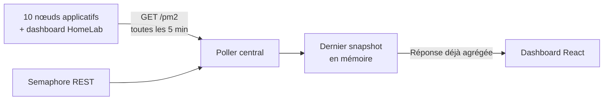

# 11 serveurs, 66 processus et aucun cluster de monitoring

Bonjour à tous !

Je fais tourner une petite infrastructure volontairement hétérogène : dix nœuds applicatifs et un dashboard dans mon HomeLab. La plupart des serveurs n'ont qu'**un vCPU et 1 à 2 GB de RAM**. Huit machines Oracle restent dans le free tier, un VPS avec une IPv4 dédiée me coûte aujourd'hui **2 dollars par mois**, et le dashboard tourne chez moi parce que j'aime simplement mettre les mains dans le matériel.

Sur ce genre de machines, une couche d'abstraction n'est jamais gratuite. Installer une plateforme complète uniquement pour savoir si mes processus PM2 sont encore `online` aurait ajouté des services, du stockage et un nouveau cycle de vie à maintenir. Je voulais répondre à quelques questions beaucoup plus simples : quels processus tournent, combien de CPU et de mémoire ils utilisent, combien de fois ils ont redémarré, et si mes mises à jour se sont bien terminées.

J'ai donc écrit un agent HTTP Node.js de **112 lignes**, déployé sous PM2 lui-même, puis relié les onze machines à mon dashboard via Tailscale. Il ne conserve aucune série temporelle : le service central garde uniquement le dernier état connu en mémoire.

> En une phrase : **11 machines, 66 processus PM2, 0,3 % de CPU médian et 61,4 MiB de RSS par agent**, avec environ 62,3 MiB de JSON par mois et 24 dollars de cloud payant par an.
{: .prompt-info }

## Le point de départ

Avant cet agent, le dashboard savait déjà si un nœud répondait et conservait les statistiques métier de mes scripts. Mais un serveur joignable ne garantit pas que tous ses processus sont sains. Un worker peut être arrêté, redémarrer en boucle ou avoir disparu après un déploiement alors que le serveur continue de répondre normalement.

| Zone | État avant l'agent PM2 |
|---|---|
| Disponibilité du serveur | Connue depuis le dashboard |
| État détaillé des processus | Vérification manuelle avec `pm2 status` |
| CPU et RSS par processus | Visibles seulement en SSH |
| Nombre de redémarrages | Visible seulement en SSH |
| Dernière mise à jour système | Déjà disponible via Semaphore |
| Historique CPU/RAM | Non nécessaire pour mon usage |

Le but n'était donc pas de construire une nouvelle plateforme d'observabilité. Il fallait simplement fermer l'espace entre « le serveur répond » et « les processus qui m'intéressent fonctionnent réellement ».

{: .shadow }
*Le dashboard affiche 10/10 nœuds applicatifs en ligne. Le dashboard HomeLab est suivi séparément. Le tooltip PM2 expose le statut, le CPU, la mémoire et les redémarrages de chaque processus ; les adresses et certains noms internes sont masqués.*

Les compteurs de requêtes et leur taux de succès visibles sur cette capture sont des métriques métier préexistantes. L'agent PM2 ne produit pas ces graphes et ne conserve pas leur historique.

## Ma règle : une abstraction doit payer son loyer

J'aime les conteneurs quand ils m'apportent une isolation utile, une distribution reproductible ou une frontière de sécurité. Ici, Linux et PM2 géraient déjà le cycle de vie des applications. Ajouter un runtime de conteneurs uniquement pour lancer un système de monitoring aurait dupliqué une fonction que je possédais déjà.

Ma philosophie peut se résumer ainsi :

> Une couche d'abstraction a un coût et une utilité. Un script est plus léger qu'un conteneur, comme un conteneur est plus léger qu'une machine virtuelle. Mais le bon choix n'est pas toujours la couche la plus basse : c'est la couche la plus basse qui fournit encore les garanties réellement nécessaires.
{: .prompt-tip }

Zabbix et Grafana ne sont pas « mauvais » ni nécessairement chers. [Zabbix est open source](https://www.zabbix.com/license), et [Grafana Cloud propose un plan gratuit](https://grafana.com/pricing/). Mais leur valeur vient justement de fonctions que je ne cherchais pas ici : séries temporelles, rétention, requêtes, alertes complexes, logs et corrélation.

>Ce que je refusais de construire sans besoin concret :
>1. **Une base de métriques** — je n'analyse pas l'évolution du RSS sur six mois.
>2. **Un pipeline de logs** — mes logs restent gérés par les outils existants.
>3. **Une couche de conteneurs** — PM2 et le système d'exploitation assurent déjà le redémarrage.
>4. **Un faux clone de Grafana** — si ces besoins arrivent, j'utiliserai une plateforme spécialisée.
{: .prompt-danger }

## Un endpoint au-dessus de `pm2 jlist`

L'agent n'invente aucun collector. PM2 connaît déjà les processus, leur statut et leurs compteurs. L'endpoint exécute `pm2 jlist`, réduit le résultat et renvoie uniquement les champs utiles au dashboard :

```js
const list = JSON.parse(jlistJson);
const procs = list.map((p) => ({
  name: p?.name,
  status: p?.pm2_env?.status,
  cpu: p?.monit?.cpu ?? 0,
  mem: p?.monit?.memory ?? 0,
  restarts: p?.pm2_env?.restart_time ?? 0,
  uptime: p?.pm2_env?.pm_uptime ?? null,
}));
```

Le contrat HTTP tient dans un seul endpoint `GET /pm2`. Un Bearer token peut protéger la route, mais les agents ne sont de toute façon accessibles que par le LAN privé ou Tailscale. Le port public correspondant est fermé.

L'agent est lui-même déclaré dans `ecosystem.config.js`. PM2 surveille donc l'outil qui interroge PM2. Cela paraît circulaire, mais le modèle de panne reste simple : si l'agent disparaît, le service central reçoit une erreur ou un timeout et marque son snapshot comme périmé.

## Un snapshot, pas une base

Le flux complet comporte quatre étapes :



Le navigateur ne contacte jamais directement les onze agents. Le poller central les interroge environ toutes les cinq minutes, puis le dashboard lit le résultat déjà préparé. Ouvrir cinq onglets ne multiplie donc pas les appels vers les petits serveurs.

Semaphore reste la source de vérité pour les mises à jour de paquets. Je ne copie pas son historique dans une nouvelle base : le dashboard récupère le dernier état de ses tâches par API et l'affiche à côté du statut PM2.

Le compromis est volontaire : après un redémarrage du service central, le snapshot en mémoire disparaît. Il est reconstruit au prochain cycle. Pour un état opérationnel de quelques minutes, je préfère cette perte temporaire à une nouvelle base à sauvegarder, nettoyer et migrer.

## Ce que le dashboard montre réellement

Chaque nœud reçoit un badge comme `6/6` ou `8/8`. Il devient vert lorsque tous les processus remontés par son agent sont `online`. Au survol, le tooltip affiche pour chaque processus :

- son nom et son statut ;
- le CPU instantané rapporté par PM2 ;
- le RSS en mémoire ;
- le nombre de redémarrages ;
- l'heure du dernier contrôle.

Le timestamp est aussi important que la couleur. Un badge vert datant de deux heures ne prouve rien sur l'état actuel. Le dashboard doit distinguer « tout va bien » de « tout allait bien lors du dernier contact ».

Sur la capture, le `8/8` visible appartient à une ligne, tandis que le tooltip `pm2 6/6` est ancré sur le badge d'une autre ligne plus basse. Le composant React utilise la même paire `online/total` pour le badge et son tooltip : il n'existe pas deux méthodes de calcul concurrentes.

## Les mesures réelles

J'ai lancé cinq cycles de lecture sur les onze agents, soit **55 réponses réussies**. Les appels ont été effectués via les adresses privées, sans écrire de données ni redémarrer de processus.

| Mesure | Résultat |
|---|---:|
| Machines interrogées | **11** |
| Processus lors du dernier cycle | **66/66 online** |
| CPU de l'agent, médiane | **0,3 %** |
| CPU de l'agent, p95 | **0,7 %** |
| Pic CPU observé dans la série | 2,9 % |
| RSS de l'agent, minimum | 29,3 MiB |
| RSS de l'agent, médiane | **61,4 MiB** |
| RSS de l'agent, maximum | 73,0 MiB |
| Réponse JSON, médiane | 690 octets |
| Réponse JSON complète des 11 hôtes | **7 563 octets** |
| Payload JSON par jour | 2,08 MiB |
| Payload JSON sur 30 jours | **62,3 MiB** |
| Latence médiane depuis mon poste | 708 ms |
| Latence p95 depuis mon poste | 934 ms |

Le calcul réseau couvre uniquement le corps JSON, pas les en-têtes HTTP/TCP. Et le CPU est une photographie PM2, pas un benchmark scientifique de Node.js. Lors d'une première lecture isolée, un agent avait même affiché 7,2 %. La série suivante a montré une médiane à 0,3 % et un p95 à 0,7 % : retenir un seul échantillon aurait donné une conclusion trompeuse.

Il n'existe pas de tableau « avant/après » pour la RAM : avant l'agent, cette fonction n'existait pas. Inventer le coût hypothétique d'un Zabbix auto-hébergé sur mes machines ne rendrait pas la comparaison plus honnête.

## 24 dollars de cloud par an

La topologie est presque aussi importante que le code. Elle mélange du free tier, un VPS loué et du matériel domestique :

| Partie | Coût réel actuel |
|---|---:|
| 8 VM Oracle Cloud | **0 dollar**, free tier |
| VPS avec IPv4 dédiée dans un datacenter russe | **2 dollars par mois** |
| Même VPS avant le changement de prix | 1 dollar par mois |
| Cloud payant sur douze mois, aujourd'hui | **24 dollars** |
| Tailscale Personal | **0 dollar** dans ce périmètre |
| Dashboard HomeLab | matériel et électricité non inclus |

Rapportés aux dix nœuds affichés, les 24 dollars représentent **2,40 dollars par nœud et par an**. Ce chiffre ne transforme pas le HomeLab en machine gratuite : il mesure seulement la facture d'hébergement cloud. Le matériel, l'électricité et la connexion existent toujours.

Le dashboard pourrait tourner chez un fournisseur comme les autres. Je l'héberge chez moi parce que c'est plus intéressant : j'aime construire des machines, comprendre leur comportement et conserver une partie de l'infrastructure à portée de main. Ce choix relève autant du hobby que de l'optimisation.

Le faible prix n'est pas une raison pour traiter ces serveurs comme jetables. Au contraire : avec un vCPU et 1 à 2 GB de RAM, chaque daemon inutile réduit directement la marge disponible pour les applications. Le minimalisme devient une contrainte opérationnelle, pas une posture esthétique.

## La partie honnête : le petit agent a quand même cassé

Le fichier est court, mais son intégration au cycle de vie réel a produit plusieurs incidents utiles.

### `pm2 resurrect` a fait disparaître l'agent

La première version avait été lancée avec un simple `pm2 start`. Lors d'un `pm2 resurrect`, seuls les processus décrits dans la configuration durable sont revenus. L'agent fonctionnait donc jusqu'au prochain redémarrage propre.

Le correctif n'était pas dans le code HTTP : il fallait l'intégrer à `ecosystem.config.js`. Un processus n'appartient réellement à l'infrastructure que lorsque le mécanisme normal de restauration sait le recréer.

### Le bon serveur, le mauvais utilisateur

Sur certaines machines, `pm2 list` semblait vide. Les processus existaient, mais sous un autre utilisateur et un autre `PM2_HOME`. L'agent interrogeait correctement PM2 — simplement pas le bon daemon.

PM2 n'est pas un service global abstrait : son état dépend de l'utilisateur Unix qui le lance. Cette contrainte est maintenant incluse dans le déploiement.

### `pm2 restart` a conservé l'ancien entrypoint

Sur le dashboard, un ancien agent renvoyait un contrat incomplet. Redémarrer le processus ne changeait évidemment pas le chemin du script déjà enregistré. Il a fallu supprimer l'entrée puis la créer à nouveau avec le bon fichier.

### L'automatisation peut devenir la panne

Un déploiement distant interrompu a laissé planer un doute sur l'état réel des processus. Avant de relancer la tâche en masse, j'ai vérifié les processus depuis le système d'exploitation. Même une automatisation conçue pour fiabiliser dix serveurs doit savoir s'arrêter sans devenir leur point de défaillance commun.

> Le code minimal réduit le nombre de composants à diagnostiquer. Il ne dispense pas de comprendre les utilisateurs Unix, le démarrage, la restauration et l'idempotence du déploiement.
{: .prompt-warning }

## Ce que ce système ne fait pas

Cette architecture répond à un ensemble de questions volontairement limité. Elle ne fournit pas :

- de séries temporelles CPU ou RAM ;
- de graphiques historiques PM2 ;
- de PromQL ;
- de collecte centralisée des logs ;
- de SNMP ou de découverte matérielle ;
- de règles d'alerte complexes ;
- de snapshot persistant après le redémarrage de l'API centrale.

Si j'ai un jour besoin de corréler six mois de métriques, d'envoyer des alertes multi-canaux ou d'explorer des logs distribués, une plateforme spécialisée deviendra une dépendance justifiée. Je ne transformerai pas cet agent en mauvaise copie de Zabbix ou de Grafana.

## Bilan

| Métrique | Résultat |
|---|---:|
| Machines surveillées | **11** |
| Nœuds applicatifs visibles | **10/10 online** |
| Processus PM2 mesurés | **66/66 online** |
| Taille de l'agent | **112 lignes** |
| CPU médian de l'agent | **0,3 %** |
| RSS médian de l'agent | **61,4 MiB** |
| Payload JSON mensuel | **62,3 MiB** |
| Dépense cloud payante | **24 dollars par an** |
| Base de métriques supplémentaire | **aucune** |
| Conteneur supplémentaire | **aucun** |

Je n'ai pas remplacé Zabbix. J'ai construit exactement le niveau d'observation dont cette infrastructure a besoin aujourd'hui : un endpoint, un poller, un snapshot et un badge qui me dit quels processus sont réellement vivants.

Le résultat le plus intéressant n'est pas qu'un script soit « meilleur » qu'un conteneur. C'est qu'une architecture devient souvent plus claire lorsqu'on demande à chaque nouvelle couche de justifier son existence. Les conteneurs, les bases de métriques et les plateformes d'observabilité ont tous une valeur réelle — mais seulement lorsque le problème à résoudre existe réellement.

Sur des machines à un vCPU, payées en moyenne quelques dollars par an, cette question n'est plus théorique : **est-ce que cette dépendance m'apporte davantage que les ressources et la complexité qu'elle consomme ?** Pour surveiller mes 66 processus, la réponse tenait finalement dans 112 lignes de Node.js.
