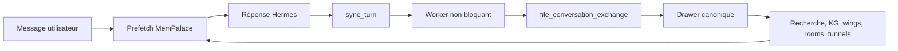

# Hermes × MemPalace : une mémoire qui participe enfin à la vie de l’agent

Je viens de participer au plus gros pull request open source de mon parcours jusqu’ici : l’intégration native de MemPalace comme provider de mémoire pour Hermes. Son parcours a commencé avec un premier commit le 7 avril 2026 ; le 11 août, le cœur a été fusionné dans `develop` après **2 591 lignes ajoutées**, six fichiers touchés, huit jobs CI réussis et une approbation explicite pour la vague 3.7.0.[1][8][9]

Ce n’est pourtant pas mon nom qui apparaît comme auteur du PR fusionné.[1]

Le travail principal appartient à [Raman Gupta](https://github.com/raman325).[1]

Ma contribution a pris une autre forme : j’ai transformé quatre problèmes signalés en review en un patch testable, puis j’ai audité le backfill et trouvé deux chemins qui perdaient silencieusement des réponses de Hermes. Une partie de mon patch a été remplacée par une conception plus propre ; les problèmes et les tests qu’il matérialisait ont, eux, changé le résultat final.[1][2][4]

> En une phrase : MemPalace ne donne pas seulement de nouveaux boutons à Hermes ; il s’insère dans son cycle de vie, archive les échanges sans bloquer la conversation, précharge le contexte pertinent et expose **27 outils** sur un palais local structuré.[1]
{: .prompt-info }

## 126 jours du prototype au merge

Si l’on regarde seulement le PR #1915, l’histoire commence le 2 juillet 2026. Mais il s’agit déjà de l’itération finale du cœur du provider, pas du début du développement de l’intégration.[1]

Le premier commit de l’intégration, [`11b1996d`](https://github.com/MemPalace/mempalace/commit/11b1996db7c82b9d728b912307906074ec1832ba) (`feat: Hermes memory provider integration`), a été créé le 7 avril à 00:16 UTC. Quelques secondes plus tard, ZK-Snarky a ouvert le PR #3 avec le même concept : un memory provider natif, l’enregistrement automatique des conversations, les outils du palace et une commande d’installation.[8][9]

La première version est arrivée vite. Les quatre commits d’origine ont été créés le 7 avril entre 00:16 et 06:51 UTC, soit environ six heures et demie. Le PR #3 a ensuite été fermé parce qu’il était devenu obsolète face à la branche principale et à l’évolution de l’API Hermes, mais le travail ne s’est pas arrêté là.[9]

Le PR #1684 indique explicitement qu’il reprend #3. Raman a conservé les quatre commits d’origine de ZK-Snarky à la base de la branche, effectué un rebase, puis reconstruit l’intégration pour l’API `MemoryProvider` actuelle. Le travail prolongeait aussi la discussion du provider dans l’issue Hermes Agent #6323. Après review, ce grand PR a été découpé.[5][10]

C’est ainsi qu’est né #1915. Sa description précise que #1684 est séparé en deux PR et que celui-ci constitue la première partie : le cœur du provider et ses tests. La commande `mempalace hermes install`, le backfill des sessions existantes et la documentation ont été déplacés dans un PR de suivi afin que le cœur puisse être examiné séparément.[1]

| Étape | Date | Événement |
|---|---|---|
| Premier commit d’implémentation | 7 avril 2026, 00:16 UTC | Début du développement du provider |
| PR #3 | 7 avril 2026 | Première version complète de l’intégration |
| PR #1684 | 3 juin 2026 | Reprise du travail, rebase et adaptation à la nouvelle API |
| PR #1915 | 2 juillet 2026, 18:46 UTC | Le cœur du provider devient un PR séparé |
| Merge de #1915 | 11 août 2026, 10:53 UTC | Le cœur est accepté dans `develop` |

Entre le premier commit et le merge, il s’est écoulé **126 jours et 10 heures**, soit un peu plus de quatre mois. La phase finale d’implémentation et de review dans #1915 a duré **39 jours et 16 heures**, environ 40 jours calendaires.[1][8]

> Ces 126 jours ne représentent pas 126 jours-homme de développement. C’est le parcours calendaire de la fonctionnalité : un premier prototype rapide, la fermeture d’un PR devenu obsolète, l’évolution de l’API Hermes, la reprise du travail, un rebase, plusieurs rounds de review et le découpage de l’implémentation en PR plus petits.
{: .prompt-tip }

Le mot « intégration » demande donc une précision : le 11 août, seul le cœur du memory provider a été fusionné. L’installation, le backfill et la documentation restaient alors dans un PR de suivi.[1][4]

## Le point de départ : Hermes avait déjà des plugins de mémoire

Dire que MemPalace « apporte enfin la mémoire à Hermes » serait faux. La documentation actuelle de Hermes décrit déjà **huit providers externes** ; un seul peut être actif à la fois, en complément de `MEMORY.md` et `USER.md`. Le contrat provider sait injecter du contexte, précharger des souvenirs avant un tour, synchroniser les échanges après la réponse, réagir à la fin d’une session et exposer ses propres outils.[6]

La vraie question n’était donc pas : *peut-on brancher une base vectorielle sur Hermes ?* Elle était : *peut-on faire de MemPalace une partie cohérente du fonctionnement de Hermes, sans créer une seconde vérité à côté de l’agent ?*

| Zone | Avant ce PR | Avec le provider MemPalace |
|---|---|---|
| Déclenchement | Le modèle doit appeler explicitement un outil ou un serveur MCP | Hermes appelle les hooks du provider au bon moment |
| Écriture des tours | Risque d’un chemin spécifique à l’intégration | Même `file_conversation_exchange()` que le reste de MemPalace |
| Rappel | Recherche déclenchée à la demande | Préchargement de contexte avant le tour, plus recherche explicite |
| Données | Mémoire bornée de Hermes ou service externe séparé | Palais local, drawers, wings, rooms, graphe de connaissances et tunnels |
| Surface agent | Outils ajoutés par un plugin | **27 outils** plus les hooks de cycle de vie |
| Latence d’écriture | Une écriture peut ralentir la réponse | Worker borné en arrière-plan |
| Contextes système | Cron et flush peuvent contaminer les souvenirs | Garde explicite contre ces contextes |

## Pourquoi ce n’est pas « encore un plugin »

Un plugin MCP classique étend surtout ce que l’agent **peut demander**. Le provider MemPalace étend aussi ce que l’infrastructure **fait automatiquement** autour de chaque réponse : initialisation, injection du contexte, `prefetch`, `sync_turn`, changement de session, miroir des écritures mémoire et arrêt propre. C’est cette différence qui change le niveau d’intégration.[1][6]



Le détail important est `file_conversation_exchange()`. Les conversations importées après coup et les tours capturés en direct doivent recevoir les mêmes métadonnées, les mêmes identifiants et le même routage. Sinon, deux mémoires apparemment compatibles deviennent deux formats qui divergent lentement : une recherche trouve l’historique mais pas le direct, un filtre de date ignore certains drawers, ou une wing se comporte différemment selon le chemin d’ingestion.[1]

Le provider passe également par `ChromaBackend.get_or_create_collection()` au lieu d’ouvrir ChromaDB directement. Cela centralise la fonction d’embedding et évite de recréer le bug de dimension qui avait bloqué plusieurs tentatives précédentes côté Hermes. Les opérations de statut sont plafonnées à **5 000 métadonnées** et signalent explicitement quand la vue est tronquée, afin qu’un grand palais ne transforme pas une simple inspection en chargement complet.[1]

> Le nouveau niveau ne vient pas du nombre d’outils. Il vient d’un invariant : capture automatique, rappel automatique et opérations explicites doivent tous viser le même palais, la même collection et le même format de drawer.
{: .prompt-tip }

## Le premier vrai blocage : enregistrer deux fois la même conversation

La première review maintainer a identifié un défaut dangereux : `sync_turn()` enregistrait chaque tour terminé, puis `on_session_end()` reprenait le transcript complet. Comme `filed_at` participe à l’identifiant du drawer, la seconde écriture ne remplaçait pas la première ; elle créait un nouveau souvenir presque identique.[1]

Sur une longue utilisation, ce n’est pas un défaut cosmétique. Les résultats de recherche finissent pollués par des répétitions et les statistiques gonflent.[1]

J’ai ouvert un PR empilé de **170 additions et 9 suppressions** avec des tests pour traiter ce problème, aligner les outils passthrough sur le `palace_path` configuré, refléter le target mémoire par défaut et proposer une prise en charge du backup.[2]

Raman a fermé ce patch sans le fusionner tel quel.[2]

Son choix initial était plus simple et plus sûr : faire de `sync_turn()` l’unique chemin de capture dans le core, puis construire la récupération des tours manqués dans un PR séparé.[1][2]

C’était la bonne décision. Dédupliquer deux représentations différentes d’un même tour — arguments nettoyés d’un côté, transcript brut avec outils et contenu injecté de l’autre — est plus subtil qu’un compteur ou une comparaison de texte.[1][3]

Le follow-up [#1941](https://github.com/MemPalace/mempalace/pull/1941) ajoute justement des fingerprints, une analyse des lignées de branches et une politique explicite : en cas d’ambiguïté, accepter un doublon borné plutôt que perdre un tour. Au moment où j’écris, il reste ouvert en draft.[3]

## Le deuxième blocage : écrire dans un palais et chercher dans un autre

Le provider connaissait `self._palace_path`, mais plusieurs de ses 27 outils déléguaient au serveur MCP de MemPalace, qui résolvait sa propre configuration globale.[1] Avec un chemin personnalisé, Hermes pouvait donc enregistrer et rechercher dans un palais pendant que les opérations CRUD, les doublons ou les tunnels modifiaient un autre emplacement.[1]

Pour l’utilisateur, le symptôme ressemble exactement à une perte de mémoire : « je viens de l’ajouter, pourquoi la recherche ne le trouve pas ? » Mon patch a rendu le problème concret. La version retenue est allée plus loin : elle a unifié la résolution du palais, de la collection et du graphe de connaissances, sans introduire un second réglage susceptible de diverger.[1][2]

La même review a trouvé que `on_memory_write()` ne copiait que `target="user"`, alors que Hermes utilise `target="memory"` par défaut. Le provider pouvait donc ignorer la majorité des notes ordinaires. La correction finale distingue les deux sujets dans le graphe : les faits utilisateur et les notes de l’agent ne sont plus mélangés.[1]

## Mon second passage : le backfill perdait les réponses avec outils

Après le core, j’ai relu le PR d’installation et de backfill. Les tests passaient, mais ils n’utilisaient que des paires simples `user → assistant`. Un vrai tour d’agent ressemble souvent à ceci :

```text
user
→ assistant(tool_use)
→ user(tool_result)
→ assistant(réponse finale)
```

Le parseur associait le message utilisateur au premier message assistant seulement. Il archivait donc le stub `tool_use`, souvent sans texte, et abandonnait la vraie réponse finale. Pour un coding agent, ce n’est pas un cas rare : c’est le flux normal.[4]

J’ai aussi reproduit un second défaut : `hermes sessions export` produit un objet session par ligne JSONL, avec les messages imbriqués. Le backfill traitait chaque ligne comme si elle était directement un message et retournait silencieusement zéro échange.[4]

Ces deux findings ont été corrigés dans le commit de suivi : le backfill réutilise désormais la segmentation du provider live, conserve les marqueurs d’outils et la réponse finale, et comprend la forme réelle des exports JSONL. Le PR #1942 crédite explicitement `@GoXLd` pour ces deux découvertes. Il est lui aussi encore ouvert en draft au moment de cette publication.[4]

>Une mémoire « verbatim » n’a pas le droit de réussir silencieusement :
>1. **Un tour avec outils doit conserver la réponse finale**, pas seulement le stub d’appel.
>2. **Un export valide qui produit zéro échange doit être testé comme une erreur fonctionnelle.**
>3. **En cas de doute entre doublon et perte, la perte est le mauvais côté du compromis.**
{: .prompt-danger }

## Les participants : un PR porté par une discussion, pas par une seule personne

Le thread de #1915 compte cinq participants humains. Les reviewers automatisés Gemini Code Assist et Copilot ont aussi produit des remarques, mais je les sépare volontairement des personnes.[1]

| Participant | Rôle dans le thread |
|---|---|
| [raman325](https://github.com/raman325) | Auteur du provider, des tests et des corrections finales ; il a découpé l’ancien grand PR en une série reviewable |
| [igorls](https://github.com/igorls) | Maintainer et reviewer ; il a imposé les invariants d’architecture, demandé les corrections, approuvé puis fusionné le core |
| [GoXLd](https://github.com/GoXLd) | Auteur du patch de review empilé, tests des quatre blocages, puis audit du backfill ayant trouvé deux pertes de données |
| [vavush](https://github.com/vavush) | Relance du thread après plusieurs semaines d’attente et vérification du statut des blocages |
| [alistairwalsh](https://github.com/alistairwalsh) | Retour d’expérience indépendant sur une installation Qdrant de grande taille et proposition de follow-ups sur la durabilité |

La chaîne qui va de #3 à #1915 en passant par #1684 est une raison supplémentaire de ne pas présenter ce résultat comme le travail isolé d’un seul auteur. Elle comprend l’implémentation initiale de ZK-Snarky, la reconstruction de Raman pour l’API modifiée, les exigences du maintainer et les contributions apportées pendant les reviews.[1][8][9][10]

## La partie honnête : ma contribution n’est pas dans le merge comme je l’avais écrite

Le PR fusionné ne contient aucun commit signé `GoXLd`. Mon PR vers le fork de Raman a été fermé, et sa stratégie de déduplication n’a pas été reprise telle quelle. Affirmer « j’ai écrit la feature fusionnée » serait donc incorrect.[1][2]

Ma contribution réelle est néanmoins vérifiable : un patch de deux fichiers avec des tests, quatre problèmes transformés en comportement concret, une discussion technique qui a conduit à une solution plus propre, puis deux bugs de backfill reproduits avec les formes réelles de messages et d’exports. C’est moins visible qu’un compteur de lignes dans le merge final, mais plus proche de ce qu’est une bonne contribution à un projet mature : réduire le risque avant la release.[2][4]

Autre limite importante : **seul le core #1915 est fusionné**.[1]

La récupération scan-based des tours manqués (#1941) et la commande `mempalace hermes install` avec backfill et documentation (#1942) sont encore des drafts.[3][4]

La dernière release publique visible reste v3.6.0.[7]

Le reviewer a placé le core dans le train 3.7.0, mais l’expérience d’installation complète n’est pas encore publiée.[1][4]

## Bilan

| Élément | État vérifié le 11 août 2026 |
|---|---|
| Core provider Hermes | **Fusionné dans `develop`** |
| Parcours calendaire complet | **126 jours et 10 heures** du premier commit au merge du cœur |
| Itération finale #1915 | **39 jours et 16 heures** de l’ouverture du PR au merge |
| Diff #1915 | **2 591 additions**, 1 suppression, 6 fichiers |
| Surface MemPalace exposée | **27 outils** |
| Tests annoncés dans le core | **42 nouveaux tests** |
| CI du merge | **8 jobs réussis** : build, GPU, lint, Linux 3.9/3.11/3.13, macOS, Windows |
| Mon patch empilé | 170 additions, 9 suppressions ; fermé après redesign |
| Findings backfill | **2 défauts** reproduits et corrigés dans #1942 |
| Train de release | Core approuvé pour **3.7.0** ; release publique encore absente |
| Follow-ups | #1941 et #1942 ouverts en draft |

L’importance de cette intégration n’est pas que Hermes obtient une mémoire de plus. Hermes sait déjà charger plusieurs providers. Le changement est qu’un palais local peut maintenant suivre la vie réelle de l’agent : préparer le contexte, absorber chaque tour, respecter les changements de session, refléter les notes, exposer sa topologie et rester cohérent avec les imports historiques.[1][6]

Pour moi, ce PR change aussi la définition d’une contribution. Mon code n’a pas été fusionné mot pour mot, mais il a servi de prototype, de suite de tests et de pression constructive sur les invariants les plus risqués. La question n’est plus « combien de mes lignes sont dans le merge ? », mais « quelles pertes de mémoire n’atteindront jamais les utilisateurs grâce à cette review ? »

## Sources

[1] https://github.com/MemPalace/mempalace/pull/1915 — MemPalace PR #1915 — Hermes memory provider core
[2] https://github.com/raman325/mempalace/pull/2 — GoXLd review fixes for PR #1915
[3] https://github.com/MemPalace/mempalace/pull/1941 — MemPalace PR #1941 — scan-based dedup safety nets
[4] https://github.com/MemPalace/mempalace/pull/1942 — MemPalace PR #1942 — backfill, install command, and docs
[5] https://github.com/NousResearch/hermes-agent/issues/6323 — Hermes Agent issue #6323 — MemPalace memory provider
[6] https://hermes-agent.nousresearch.com/docs/user-guide/features/memory-providers — Hermes Agent — Memory Providers
[7] https://github.com/MemPalace/mempalace/releases — MemPalace releases
[8] https://github.com/MemPalace/mempalace/commit/11b1996db7c82b9d728b912307906074ec1832ba — Premier commit de l’intégration Hermes memory provider
[9] https://github.com/MemPalace/mempalace/pull/3 — PR initial #3 — Hermes memory provider integration
[10] https://github.com/MemPalace/mempalace/pull/1684 — Reprise du PR #3, rebase et adaptation à l’API MemoryProvider actuelle
