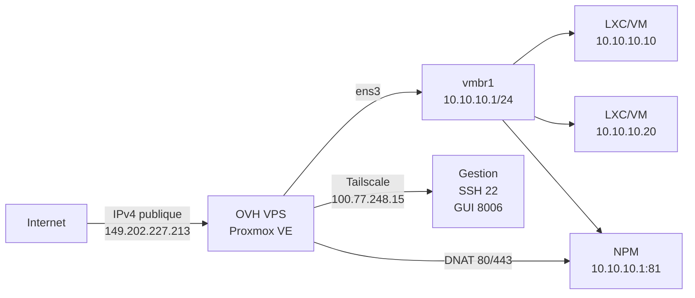

# Proxmox VE sur un VPS OVHcloud : de la vérification KVM au firewall durci

J'ai un VPS OVHcloud "Model 3" (6 vCore, 12 Go RAM, 100 Go NVMe, 2 Gbit/s illimité) qui tourne sous Debian 13 Trixie. Objectif : y installer Proxmox VE 8 pour faire tourner des LXC et, si le matériel le permet, de vraies VM KVM. OVH ne propose pas d'image Proxmox toute faite — il faut monter le stack soi-même, et la première question est : **le nested KVM est-il vraiment dispo ?**

> En une phrase : nested KVM validé (`vmx` + `/dev/kvm` + `kvm-ok`), Proxmox installé sur Debian 13, réseau NAT `vmbr1` (10.10.10.0/24) avec DNAT 80/443 vers NPM, firewall nftables *default-drop* n'exposant que Tailscale (SSH 22, GUI 8006) et Tailscale UDP 41641 — 0 unités systemd en échec.
{: .prompt-info }

## Le point de départ

| Zone | État initial |
|---|---|
| VPS | OVH Model 3 — 6 vCore / 12 Go / 100 Go NVMe / 2 Gbit/s |
| OS de base | Debian 13 (Trixie) minimal, hostname `vps-17aa660c-vps-ovh-net` |
| Accès | KVM console OVH + SSH (clé éd25519) |
| Proxmox | Non installé |
| Réseau | 1 IPv4 publique, pas d'IP failover |
| Objectif | Proxmox VE 8 + LXC/VM + reverse proxy interne + surface publique minimale |

Ce VPS n'est pas un *bare metal* : c'est un KVM inside KVM. La doc OVH dit « custom config autorisée, à vos risques » — donc la charge de la preuve est sur moi.

## Vérifier le nested KVM avant d'acheter

J'avais déjà un VPS OVH plus petit sous la main. J'ai lancé la batterie de tests **avant** de commander le Model 3.

```bash
# 1. Flag CPU VT-x/AMD-V exposé au guest
egrep -wo 'vmx|svm' /proc/cpuinfo | head
# vmx
# vmx
# vmx
# vmx

# 2. Device KVM présent
ls -la /dev/kvm
# crw-rw---- 1 root kvm 10, 232 Sep 7 15:22 /dev/kvm

# 3. Modules noyau chargés
lsmod | grep kvm
# kvm_intel 413696 0
# kvm 1380352 1 kvm_intel
# irqbypass 12288 1 kvm

# 4. Test officiel
apt update && apt install -y cpu-checker
kvm-ok
# INFO: /dev/kvm exists
# KVM acceleration can be used
```

Les quatre checks passent. **Le nested KVM est opérationnel** : le VPS peut héberger Proxmox qui lui-même lancera des VM KVM accélérées matériellement.

> Si `kvm-ok` dit « KVM acceleration can NOT be used », Proxmox s'installe quand même mais les VM QEMU seront en TCG (émulation logicielle) — inutilisables en prod. LXC seulement.
{: .prompt-danger }

## Installation : Debian 13 → Proxmox VE 8

Pas d'ISO via la console KVM OVH. La méthode supportée : **Proxmox par-dessus Debian**.

```bash
# 1. Hostname propre
hostnamectl set-hostname gxd
# /etc/hosts : 127.0.0.1 gxd gxd.local

# 2. Clé SSH (éd25519) déjà en place pour root@gxd

# 3. Repo Proxmox (no-subscription)
echo "deb http://download.proxmox.com/debian/pve bookworm pve-no-subscription" \
  > /etc/apt/sources.list.d/pve-install-repo.list
wget -qO- https://enterprise.proxmox.com/debian/proxmox-release-bookworm.gpg \
  | gpg --dearmor > /etc/apt/trusted.gpg.d/proxmox.gpg

# 4. Install
apt update
apt install -y proxmox-ve postfix open-iscsi
# (postfix : configuration "Internet site", mail name = gxd)

# 5. Reboot → interface https://<IP>:8006
```

L'installation a pris ~4 min. Au reboot, l'interface Proxmox répond sur le port 8006.

> **Règle non négociable** : ne jamais toucher au réseau Proxmox (`/etc/network/interfaces`, `vmbr0`) sans avoir la console KVM OVH ouverte en parallèle. Une erreur = perte SSH = récupération uniquement via KVM.
{: .prompt-warning }

## Réseau : un IPv4 public → NAT + DNAT

Avec une seule IPv4 publique, le bridge `vmbr0` « comme sur dedicated » ne marche pas. J'ai monté un **bridge NAT interne** (`vmbr1`) et un **DNAT** vers Nginx Proxy Manager.



**`/etc/network/interfaces`** (extrait pertinent) :

```bash
auto vmbr1
iface vmbr1 inet static
    address 10.10.10.1/24
    bridge-ports none
    bridge-stp off
    bridge-fd 0
    # NAT + DNAT gérés par nftables (voir plus bas)
```

**nftables** — politique *default-drop* sur `input` et `forward`, autorisations explicites seulement :

```nft
table inet filter {
  chain input {
    type filter hook input priority filter; policy drop;
    iifname "lo" accept
    ct state established,related accept
    ip protocol icmp accept
    ip6 nexthdr ipv6-icmp accept
    # Gestion UNIQUEMENT via Tailscale
    iifname "tailscale0" tcp dport { 22, 8006 } accept
    # Tailscale transport + DHCP OVH
    iifname "ens3" udp dport 41641 accept
    iifname "ens3" udp sport 67 udp dport 68 accept
  }
  chain forward {
    type filter hook forward priority filter; policy drop;
    ct state established,related accept
    # NAT sortant vmbr1 → ens3
    iifname "vmbr1" oifname "ens3" accept
    # DNAT entrant 80/443 → NPM (10.10.10.1)
    iifname "ens3" oifname "vmbr1" ip daddr 10.10.10.1 tcp dport { 80, 443 } accept
    # Tailscale ↔ vmbr1
    iifname "tailscale0" oifname "vmbr1" ip daddr 10.10.10.0/24 accept
    iifname "vmbr1" oifname "tailscale0" ip saddr 10.10.10.0/24 accept
  }
}
table ip nat {
  chain prerouting {
    type nat hook prerouting priority dstnat; policy accept;
    iifname "ens3" ip daddr 149.202.227.213 tcp dport 80  dnat to 10.10.10.1:80
    iifname "ens3" ip daddr 149.202.227.213 tcp dport 443 dnat to 10.10.10.1:443
  }
  chain postrouting {
    type nat hook postrouting priority srcnat; policy accept;
    oifname "ens3" ip saddr 10.10.10.0/24 masquerade
  }
}
```

Résultat : **surface publique = 2 ports (80, 443) + UDP 41641 (Tailscale)**. SSH (22) et GUI Proxmox (8006) **inaccessibles depuis l'internet** — uniquement via Tailscale.

## Nginx Proxy Manager en LXC (10.10.10.1)

Un conteneur LXC Debian 13 léger (512 Mo RAM, 4 Go disque), Docker + NPM officiel.

```bash
# Dans le LXC NPM
docker run -d \
  --name npm \
  --network host \
  -v /data:/data \
  -v /letsencrypt:/etc/letsencrypt \
  jc21/nginx-proxy-manager:latest
```

NPM écoute sur `10.10.10.1:81` (GUI admin) et `10.10.10.1:80/443` (traffic). Le DNAT nftables route le trafic public vers lui.

## Validation post-install

| Check | Commande | Résultat |
|---|---|---|
| Units systemd en échec | `systemctl --failed` | **0 loaded units listed** |
| Ports écoutés publics | `ss -ltnp | grep -E ':22\|:8006\|:3128\|:81'` | 22/8006/3128/81 **absents** sur `ens3` |
| Ports sur Tailscale | `ss -ltnp | grep 100.77.248.15` | 22, 8006 **présents** |
| DNAT 80/443 | `nft list table ip nat` | Règles `dnat to 10.10.10.1:80/443` **présentes** |
| MASQUERADE vmbr1 | `nft list table ip nat` | `oifname "ens3" ip saddr 10.10.10.0/24 masquerade` **présent** |
| Accès Proxmox GUI | `curl -k https://100.77.248.15:8006` | **200 OK** (via Tailscale) |
| Accès NPM GUI | `curl http://100.77.248.15:81` | **200 OK** (via Tailscale) |
| Nested KVM dans Proxmox | `kvm-ok` (dans Proxmox host) | **KVM acceleration can be used** |

Le port 3128 (SPICE proxy) est écouté sur `*` mais **bloqué par le firewall** — pas d'accès console SPICE depuis l'extérieur. noVNC (via 8006) suffit.

> **Note SPICE** : si un jour tu veux la console SPICE, ajoute `iifname "tailscale0" tcp dport 3128 accept` dans la chain `input`. Pour noVNC, rien à changer.
{: .prompt-tip }

## Ce qui n'a pas marché / pièges

1. **Hostname OVH par défaut** (`vps-xxx-vps-ovh-net`) — Proxmox l'utilise pour le nom du nœud dans le cluster. Changer **avant** l'install Proxmox, sinon galère à renommer le nœud PVE après coup.
2. **`rpcbind` sur 0.0.0.0:111** et **LLMNR sur :5355** — actifs par défaut sur Debian/Proxmox. Désactivés via `systemctl disable --now rpcbind.socket rpcbind` et `systemctl mask systemd-resolved` (LLMNR). Firewall les bloquait déjà, mais propre = silencieux.
3. **IPv6** — OVH donne un `/64` mais je n'ai pas encore monté le routage IPv6 vers `vmbr1`. Pour l'instant : IPv4 only + Tailscale (qui fait de l'IPv6 ULA).
4. **Sauvegarde Proxmox** — pas encore de job `vzdump` vers storage distant. À faire.

## Bilan

| Métrique | Résultat |
|---|---|
| Nested KVM | Validé (`vmx`, `/dev/kvm`, `kvm-ok` ✓) |
| Installation | Debian 13 → Proxmox VE 8 (no-subscription) |
| RAM dispo pour guests | ~10 Go (2 Go host Proxmox) |
| Stockage dispo pour guests | ~85 Go (après OS + Proxmox) |
| Surface publique | TCP 80, 443 + UDP 41641 seulement |
| Accès admin | Tailscale uniquement (SSH 22, GUI 8006, NPM 81) |
| Reverse proxy | NPM en LXC (10.10.10.1) + DNAT nftables |
| Firewall | nftables *default-drop*, 0 unités failed |
| Prochaine étape | Premier LXC service (ex: 10.10.10.10) → DNS → HTTPS via NPM → cert Let's Encrypt |

La question n'est plus « est-ce que ça marche » mais **« quel premier service je déploie dans le LXC 10.10.10.10 »**. Le stack est prêt : Proxmox gère le cycle de vie, nftables filtre, Tailscale donne l'admin propre, NPM termine le TLS. Le reste, c'est de l'application.

---

*VPS OVH Model 3 — 6 vCore / 12 Go / 100 Go NVMe / 2 Gbit/s — Proxmox VE 8.2 / Debian 13 Trixie / nftables / Tailscale / Nginx Proxy Manager. Config réseau validée le 2026-09-09.*