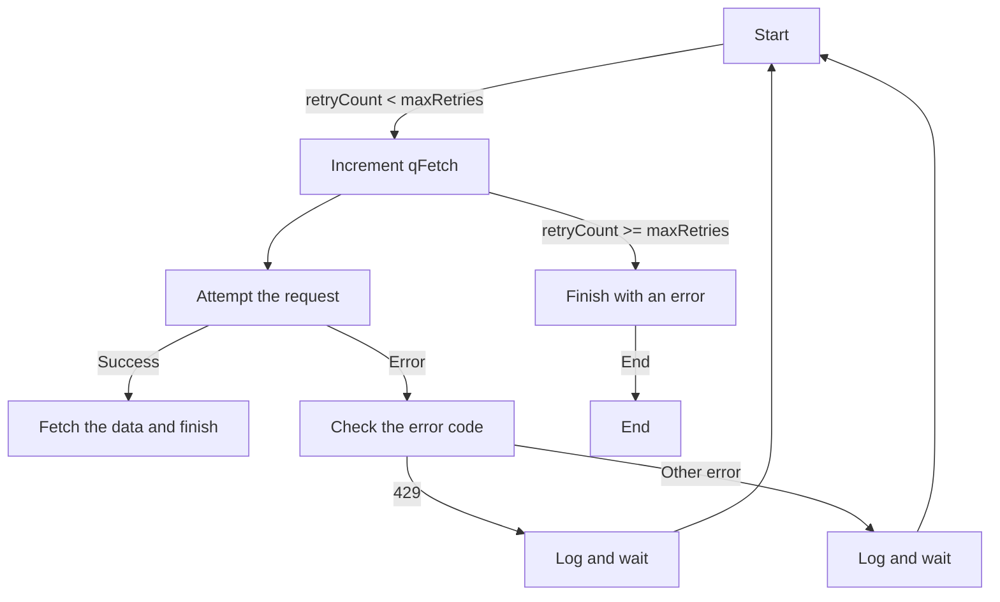

# Optimizing request handling in Google Apps Script

To optimize the handling of requests to external servers in Google Apps Script, it is essential to account for possible errors and delayed responses, and to count the total number of requests made.

## Code example with retry logic

Here is a code example illustrating this approach, using `UrlFetchApp.fetch` with retry logic:

```javascript
let qFetch = 0;

// Retry logic
do {
    try {
        // Attempt the request with UrlFetchApp.fetch
        UrlFetchApp.fetch("URL_DU_SERVEUR");
        
        // Increment qFetch on success
        qFetch++;
    } catch (error) {
        // Error handling, qFetch is not incremented here
    }
} while (/* Loop exit condition */);

// Print the total number of requests made
console.log(`Nombre total de requêtes : ${qFetch}`);
```

Another example, using `UrlFetchApp.fetch` with retry logic in my parser:

```javascript

for (var retryCount = 0; retryCount < maxRetries; retryCount++) {
  qFetch++; //wrong
  try {
    qFetch++;
    response = UrlFetchApp.fetch(url, { muteHttpExceptions: false });
    fetchedData = response.getContentText();
    break;
  } catch (error) {
    if (response && response.getResponseCode() == 429) {
      Logger.log("Erreur 429. Réessayez après " + retryDelay + " secondes.");
      totalSleepTime += retryDelay;
      Utilities.sleep(retryDelay);
    } else {
      Logger.log("Erreur lors de la récupération des données : " + error + " Pause (ms) : " + retryDelay);
      totalSleepTime += retryDelay;
      Utilities.sleep(retryDelay);
    }
  }
}
```

In this script, the qFetch variable is incremented on every attempt, whether `UrlFetchApp.fetch` succeeds or fails. This makes it possible to count the total number of requests sent to the external server, giving visibility into the script's performance.



By taking these aspects into account, you can improve the robustness of your script and gain useful insight into its behavior when interacting with external servers.
