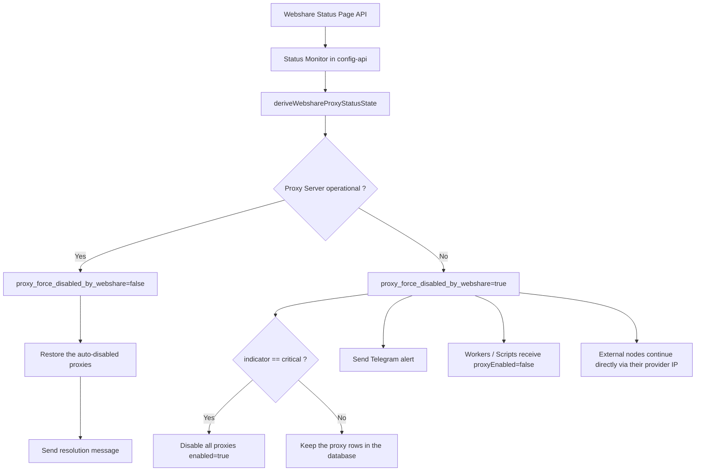

# When a proxy provider goes down...

{: .shadow }
*The standard card is replaced by an incident view to avoid any ambiguity for the operator.*

I recently set up a rather interesting automation on the production side: if `webshare.io` degrades or loses its proxy service, the infrastructure automatically cuts off the use of Webshare proxies, disables the affected proxy entries, switches traffic to external nodes from another provider, and immediately notifies a technical Telegram channel.

The subject speaks directly to **DevOps** and **SRE**:

- provider incident detection
- runtime behavior change without manual intervention
- blast radius reduction
- automatic restoration after resolution
- operational visibility in the dashboard

> In one sentence: when Webshare goes down, the system cuts the proxies, keeps the service online via the external nodes, then restores the state automatically.
{: .prompt-info }

## The problem

A provider incident is not a mere UI warning. It is a **runtime steering event**.

In many scraping, API-mediation or distributed-collection architectures, proxies are treated as a stable resource. In practice, they are often an external point of failure.

The case was simple:

- part of the traffic normally goes through Webshare
- the workers and scripts consume a central configuration
- the external nodes can keep processing requests directly via their own provider IP
- during a Webshare incident, continuing to use that pool only increases errors, alerting noise and retry consumption

The goal was not to "fix" Webshare. The goal was to **remove Webshare from the critical path as fast as possible**.

> We don't like incidents. Yet these moments bring experience and practice, and make you progress quickly. This incident lasted eight hours...
{: .prompt-tip }

## Architecture goal

The chosen logic:

1. monitor `https://status.webshare.io/api/v2/summary.json`
2. derive a machine-actionable state
3. activate a global `proxy_force_disabled_by_webshare` override
4. if the incident is critical, also disable all active proxy rows in the database
5. make the nodes reload the runtime configuration
6. keep traffic flowing via the external nodes in direct mode
7. send a technical Telegram notification
8. automatically restore the state when the provider returns to normal


## Logical view



> Here we're talking about the control plane. The actual request path is separate.
{: .prompt-tip }

## Decision principle

There are two levels:

- **active incident**: we cut the proxy runtime via a global flag
- **critical incident**: we also cut the proxy rows in the database so the operational state is consistent everywhere

In practice:

| Webshare state | Proxy runtime | Proxy rows in DB | Traffic |
|---|---|---|---|
| `operational` | enabled | unchanged / restored | Webshare normal |
| `degraded_performance` | disabled | preserved | fallback to external nodes |
| `critical` / `full_outage` | disabled | `enabled=false` auto | fallback to external nodes |

## 1. The incident monitor

The monitor runs on the `config-api` side. It regularly reads the status page's JSON and stores a normalized state in the global configuration.

```javascript
const WEBSHARE_STATUS_SUMMARY_URL =
  process.env.WEBSHARE_STATUS_SUMMARY_URL ||
  'https://status.webshare.io/api/v2/summary.json';

const PROXY_FORCE_DISABLED_BY_WEBSHARE_KEY = 'proxy_force_disabled_by_webshare';
const PROXY_WEBSHARE_STATUS_STATE_KEY = 'proxy_webshare_status_state';
const PROXY_AUTO_DISABLED_BY_WEBSHARE_CRITICAL_KEY =
  'proxy_auto_disabled_by_webshare_critical';

function deriveWebshareProxyStatusState(summary) {
  const components = Array.isArray(summary?.components) ? summary.components : [];
  const incidents = Array.isArray(summary?.incidents) ? summary.incidents : [];

  const proxyServer =
    components.find((component) => String(component?.name || '').trim() === 'Proxy Server') || null;

  const dashboardApi =
    components.find((component) => String(component?.name || '').trim() === 'Web Dashboard/API') || null;

  const ongoingIncident =
    incidents.find((incident) => String(incident?.status || '').trim().toLowerCase() !== 'resolved') || null;

  const proxyComponentStatus = String(proxyServer?.status || 'unknown').trim().toLowerCase();
  const dashboardComponentStatus = String(dashboardApi?.status || 'unknown').trim().toLowerCase();
  const summaryIndicator = String(summary?.status?.indicator || 'unknown').trim().toLowerCase();

  return {
    active: proxyComponentStatus !== 'operational',
    incident_id: ongoingIncident?.id ? String(ongoingIncident.id) : null,
    incident_name: ongoingIncident?.name ? String(ongoingIncident.name) : null,
    incident_status: ongoingIncident?.status ? String(ongoingIncident.status) : null,
    proxy_component_status: proxyComponentStatus,
    dashboard_component_status: dashboardComponentStatus,
    summary_indicator: summaryIndicator,
    checked_at: new Date().toISOString(),
    source: 'https://status.webshare.io/'
  };
}
```

We don't read this status page like a human. We convert it into a **decision state**. That state then drives the configuration.

## 2. The global override that cuts the runtime

Once the state is derived, the system decides whether proxy usage must be cut.

```javascript
async function syncWebshareProxyAvailability(trigger = 'manual') {
  const currentState = parseStoredWebshareStatusState(
    globalMap.get(PROXY_WEBSHARE_STATUS_STATE_KEY)
  );

  const currentOverride = parseBooleanFlag(
    globalMap.get(PROXY_FORCE_DISABLED_BY_WEBSHARE_KEY),
    false
  );

  const summary = await fetchWebshareStatusSummary();
  const nextState = deriveWebshareProxyStatusState(summary);

  const shouldDisable = nextState.active;
  const shouldDisableProxyRows = nextState.summary_indicator === 'critical';

  const activationChanged =
    shouldDisable !== currentState.active ||
    shouldDisable !== currentOverride;

  if (activationChanged) {
    await upsertConfGlobal({
      key: PROXY_FORCE_DISABLED_BY_WEBSHARE_KEY,
      value: shouldDisable ? 'true' : 'false',
      type: 'boolean'
    });
  }
}
```

This global flag centralizes the decision. It is read by several runtimes. It avoids duplicating the same condition everywhere.

## 3. Critical mode: disable the proxies in the database too

When the global indicator turns `critical`, the runtime override alone is no longer enough. The database and the dashboard must show the same state as the runtime.

```javascript
async function disableEnabledProxiesForWebshareCritical() {
  const proxies = await directusRead(
    COLLECTIONS.CONF_PROXIES,
    { enabled: { _eq: true } },
    'id,proxy_ip,enabled,updated_at',
    null,
    -1
  );

  const disabledEntries = [];

  for (const proxy of proxies || []) {
    const updated = await directusUpdate(COLLECTIONS.CONF_PROXIES, proxy.id, {
      enabled: false
    });

    disabledEntries.push({
      id: proxy.id,
      proxy_ip: proxy.proxy_ip,
      disabled_at: updated?.updated_at || null
    });
  }

  return disabledEntries;
}
```

At resolution:

```javascript
async function restoreProxiesAutoDisabledByWebshareCritical(entries) {
  for (const entry of entries) {
    const proxy = proxyMap.get(String(entry.id));
    if (!proxy) continue;
    if (proxy.enabled !== false) continue;

    if (entry.disabled_at && proxy.updated_at && proxy.updated_at !== entry.disabled_at) {
      continue; // don't overwrite a more recent human change
    }

    await directusUpdate(COLLECTIONS.CONF_PROXIES, entry.id, {
      enabled: true
    });
  }
}
```

The system **does not re-enable** the whole pool. It re-enables only what it disabled itself, and only if nobody modified the entry in the meantime.

> The important point here: automation must not overwrite a more recent human decision.
{: .prompt-warning }

## 4. Alerting anti-spam

A classic trap in this kind of automation is the "alert storm". If the critical state is already active, the alert must not be re-emitted on every page refresh or every monitoring cycle.

The fix consisted of remembering a real state:

```javascript
{
  critical_active: true,
  entries: [...]
}
```

rather than inferring that status solely from a list of disabled proxies.

That avoids the scenario:

- the incident is still active
- there are no additional proxies left to disable
- the system thinks it must re-alert because the list is empty

An alerting system must detect an outage, but it must also **avoid noise**.

> A repeated incident must not produce a repeated alert if the state hasn't changed.
{: .prompt-info }

## 5. The switchover on the node side

Once the global override is set, the nodes must apply it without a redeploy.


```javascript
const globalsRows = await directusRead(
  COLLECTIONS.CONF_GLOBALS,
  { key: { _in: ['proxy_enabled', 'proxy_force_disabled_by_webshare'] } },
  DEFAULT_DIRECTUS_URL,
  DEFAULT_DIRECTUS_TOKEN
);

proxyEnabledByUser = parseBooleanFlag(globalsMap.proxy_enabled, true);
proxyForceDisabledByWebshare = parseBooleanFlag(
  globalsMap.proxy_force_disabled_by_webshare,
  false
);

WEBSHARE_ENABLED = proxyEnabledByUser && !proxyForceDisabledByWebshare;
PROXY_POOL_ENABLED = WEBSHARE_ENABLED;
RESOLVED_NODE_IP = (nodeConfig.proxy_ip || envIP || localIP || '').trim();
```

Result:

- the application stays online
- the service doesn't stop
- the Webshare pool is disabled
- the external nodes keep responding directly with their own provider IP

We don't "stop the world". We remove a failing external dependency.

## 6. The configuration sent to the workers

The scripts and workers must not recompute this state. They receive an already-resolved configuration:


```javascript
const proxyEnabled = computeEffectiveProxyEnabledFromGlobals(globals);
const proxyDisabledByWebshareStatus = parseBooleanFlag(
  globals.proxy_force_disabled_by_webshare,
  false
);

const config = {
  global: {
    proxyEnabled,
    proxyDisabledByWebshareStatus
  }
};
```

The clients stay simple. The logic stays centralized. The dashboard shows the same state as the runtime.

## 7. The technical Telegram notification

In case of an incident, the system sends a message with:

- the type of action executed
- the number of auto-disabled proxies
- the `indicator` level
- the incident's name and status
- the status of the Webshare components
- the signal source
- the trigger (`startup` or `schedule`)

Example message:

```text
⚠️ Webshare incident detected
Action: proxy usage auto-disabled
Proxies auto-disabled: 85
Indicator: critical
Incident: Increased proxy error rate
Status: identified
Proxy Server: full_outage
Web Dashboard/API: full_outage
Trigger: schedule
Source: status.webshare.io
```

{: .shadow }
*Notification sent as soon as the incident is detected and the proxy override is activated.*

The resolution message confirms the recovery, any auto-restore, and the end of the override.

{: .shadow }
*Back-to-normal message after the failover is automatically lifted.*

> In the images you can see that 0 proxies were disabled and re-enabled automatically. Everything is normal, since I had disabled them manually, so they must also be re-enabled manually.

{: .shadow }

For now, everything I've done remains theoretical and deserves to be verified in practice. I'm impatiently awaiting the next Webshare network outage…
A lazy person who simply doesn't feel like writing tests. 😄
{: .prompt-info }


## 8. Visibility in the dashboard

A failover mechanism must remain visible. So I added to the dashboard:

- a `Webshare.io` status button
- an `OK / Warning / Critical` color code
- an incident card that replaces a classic metric while the incident is active
- a tooltip on `Proxy runtime: disabled`
- the display of the last check time


*The Webshare status page provides the external signal that triggers the protection logic here.*

The goal is simple:

> Does the system have an internal bug, or did it deliberately protect itself against a provider incident?

## 9. Why this pattern is useful in SRE

This automation covers several SRE needs:

- **controlled degradation**: the system still works, with fewer dependencies
- **decision centralization**: a single state is authoritative
- **auto-remediation**: no immediate human action needed
- **protection against cascading failures**: fewer useless retries, less noise, less consumption
- **automatic restoration**: no manual debt at the end of the incident

## 10. What I take away

If an external component is critical in the request path, three things must be prepared before the outage:

1. a machine-actionable signal
2. a fast cut-off strategy
3. a fallback capability that keeps the service useful

In this specific case, Webshare was no longer a simple "up/down" dependency. It was a routing parameter.

This is the type of automation that changes a system's real resilience.


---

This logic becomes useful when **monitoring**, **configuration**, **runtime**, **alerting** and **operator visibility** all tell the same story.

Thank you for your attention!
