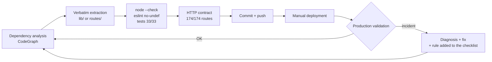

# Claude Fable 5: three days, 100,000+ lines, a living production

Hello everyone!
I spent the last three days (July 8-10) on a project I had been putting off for months: the complete refactoring of my production infrastructure (the one running my trading and monitoring projects). An Express backend of **24,702 lines in a single file**, a React dashboard with 2,700-line pages, APIs taking 20 seconds to respond, and a PostgreSQL database growing without limit.

I had already tried to launch this project with other models - including OpenAI's. The scenario was always the same: after a few files, the context saturated, the model lost track of the decisions made, and ended up suggesting I "open a new conversation". On a codebase of more than 100,000 lines, starting from scratch every fifteen minutes is a deal-breaker.

The difference this time: I worked in tandem with **Claude Fable 5**, Anthropic's new model (Mythos class, above Opus), via Claude Code. Three days in **one single continuous conversation**, which crossed the backend, the frontend, the browser measurements and the SQL patches without ever asking me to start over. And the result exceeds what I would have thought possible.

> In one sentence: ~90 commits in 3 days, a monolith divided by 60, APIs up to 35x faster, 4.5 GB reclaimed on PostgreSQL - and zero rollbacks.
{: .prompt-info }

## The starting point

| Area | State on July 8 |
|---|---|
| `config-api.js` (Express backend) | 24,702 lines, 174 routes, 260 commits in 6 months, a single file |
| React dashboard pages | 6 "hot" pages of 1,500 to 2,700 lines each |
| Frontend bundle | 1,007 kB in a single chunk (permanent Vite warning) |
| `GET /api/cloudflare/workers` | **19.8 seconds** |
| PostgreSQL | Directus system tables at 4.5 GB, no retention on metrics |

This is not a toy project: it is the production that runs my Cloudflare workers, my Steam Market monitoring scripts and my accounting. Every mistake costs real money.

{: .shadow }
*Part of the scope: 63 Cloudflare workers spread across 12 accounts, with CPU quotas, 48h graphs and mass redeployment. This is the page whose API took 19.8 seconds to respond.*

## The method: the AI doesn't rewrite, it moves

The classic trap with an LLM on legacy code is "creative rewriting": the model improves things along the way, and three weeks later you discover a silent regression. The rule imposed from day one was the opposite:

>The rules imposed on the model, non-negotiable:
1. **Verbatim relocation** — byte-identical, verified by git comparison. No "improvements" along the way.
2. **One commit = one change**, always reversible.
3. **After every step**: `node --check`, tests, eslint no-undef, HTTP contract comparison (174/174 routes).
4. **Deployment and validation in production** before the next step.
{: .prompt-danger }

What struck me: Fable 5 **turned its own incidents into a checklist**. On the first day, a forgotten export broke the Workers page in production (500). The model diagnosed, fixed, then added "mandatory eslint no-undef after every extraction" to its procedure - and the incident never happened again across the ~40 following extractions.



## The tools given to the model

An underestimated point: the quality of the work depends directly on the access you give the agent. Over the three days, Fable 5 worked with:

- **CodeGraph** (MCP): a graph of all the repo's symbols, for dependency analysis before each extraction
- **Directus MCP**: direct read access to the live database - it's what confirmed "100 proxies × 35 ms = your 3.5 seconds"
- **Chrome DevTools MCP**: the model drove a Chrome, had a session opened on my dashboard, and measured every endpoint of every page itself
- **pgAdmin4**: via the same driven Chrome, it filled the Query Tool, executed the SQL patches and read the results in the grid

That last point deserves emphasis: I did not give root access to PostgreSQL. The model itself proposed the least-privileged option (the pgAdmin panel rather than the server), and I watched every query go by on screen.

## Days 1-2: the monolith

`config-api.js` went from 24,702 to **413 lines** - a composition root that now only does bootstrap and eleven `registerXxxRoutes(app)` calls. The 174 routes live in 10 `routes/` modules, the logic in 26 `lib/` modules.

Along the way, the model found what six months of commits had buried:

- 3 pre-existing bugs (a dormant `ReferenceError` in the auto-pause, a flood of 403s on old collections, a broken mask deduplication)
- 2 dead duplicated functions (`sleep()`, `parseBooleanFlag()` - of which only one version was executing thanks to hoisting)
- 3 incidents caught in production, each converted into a verification rule

## Day 3: measure first, optimize second

The plan's rule was strict: "optimization only starts after measurements". The model first did per-route code splitting (main bundle: 1,007 → 204 kB), then walked through every dashboard page in the browser and recorded the timing of each API call.

The verdict was damning - and three times the same culprit:

```js
// The pattern that cost seconds, found in THREE different endpoints:
for (const script of scripts) {
  const items = await directusRead(COLLECTIONS.CONF_ITEMS,
    { id: { _in: script.monitored_items } });   // 85 sequential requests...
}
```

{: .shadow }
*The Scripts page: 76 monitoring scripts, cadence stars, UrlFetch quotas. It called `GET /api/scripts`... which loaded each script's items one by one.*

A classic N+1, but the REST version: 85 sequential Directus calls at ~50 ms each. The fix is a single batch - with a trap the model spotted on its own: **Directus limits reads to 100 rows by default**, so a batch without `limit: -1` would have silently truncated the results.

{: .shadow }
*Real measurements, taken in the browser with an authenticated session - before July 8, after the 10th.*

| Endpoint | Before | After | Gain |
|---|---:|---:|---:|
| `GET /api/scripts` (called on 5 pages) | ~5 s | **0.9 s** | ×5.7 |
| `GET /api/proxies` | ~3.5 s | **0.1 s** | ×35 |
| `GET /api/cloudflare/workers` | 19.8 s | **~3 s** | ×6 |

For the Cloudflare endpoint, the N+1 was on the external API side (63 workers × one `settings` call each, concurrency 4): concurrency raised, D1 reads parallelized, and an in-process cache with invalidation in the only three endpoints that modify bindings. All of it measured before/after in the same browser.

A bonus discovered during the measurements: the Proxies page was re-triggering **4 heavy requests every 5 seconds** as long as the tab stayed open - an overly broad `invalidateQueries` on a timer. The background pressure on the node was divided by ~70.

## The database: 4.5 GB recovered

The table map revealed an anomaly: `directus_revisions` weighed **3,384 MB for... 7,244 live rows**. Old cleanups had deleted the rows, but PostgreSQL never returns the space to the OS without a `VACUUM FULL`.

| Table | Before | After | Lock duration |
|---|---:|---:|---:|
| `directus_revisions` | 3,384 MB | **3.4 MB** | 4.8 s |
| `directus_activity` | 1,121 MB | **1.8 MB** | 1.1 s |
| `script_execution_logs` | 935 MB | compacted (−354,788 rows) | 3.6 s |

And so it doesn't happen again: three retention functions + pg_cron jobs (30 days for logs, 60 days for hourly metrics), all documented with a living snapshot of the **18 active jobs**.

{: .shadow }
*pgAdmin's Query Tool, driven by Fable 5 through the browser: the 18 active pg_cron jobs, including the three retentions added that day (database names anonymized).*

My favorite part: a "mystery" of 3,009 revisions on `directus_collections`. The model traced the trail via `user_agent` and `origin` in the activity table... only to discover the culprit was **me**: every drag-and-drop of a collection in the Directus admin sends a PATCH to all the collections in the group. No bug, no fix - just an honest answer.

> Even the "vanished" pg_cron jobs got their autopsy: `cron.job_run_details` keeps traces of deleted jobs. One of them had never existed - the proxy replacement counter would never have reset on billing day.
{: .prompt-tip }

> An agent with production access remains a tool that needs guardrails: minimum necessary access, destructive actions only upon explicit validation, and quiet windows for anything that locks the database. The model respected this framework on its own - but it's up to you to set it.
{: .prompt-warning }

## What Fable 5 changes, concretely

I have been using LLMs to code for a long time. Here is what is different with this generation:

1. **The context no longer breaks.** This is the most visible change coming from the OpenAI models I used before: no more "please open a new chat", no more summaries to copy by hand from one session to the next. Fable 5 held three days and 100,000+ lines of code in one continuous thread - and when a session resumed, it reloaded the exact state of the project itself from its persistent memory.
2. **The autonomy lasts.** The carving-up of the 6 React pages (13,500 lines analyzed, 15 modules extracted, 6 commits, build + tests after each page) was done in a single autonomous run, without a single question.
3. **It refuses to cheat.** On three pages, the full extraction would have required changing the props - and therefore the behavior. The model extracted what was safe, documented what it left, and explained why. That is exactly what you expect from a senior.
4. **It measures instead of guessing.** Every optimization went through: measure → cause → minimal fix → re-measure. When I said "the cause is surely in the database", it checked in the live database - and proved it was an application-level N+1, not a missing index.
5. **It instruments its own environment.** Missing browser access? It configured the Chrome DevTools MCP itself, just asked me to log in, and did the rest.
6. **The memory persists.** Each session resumes with the exact state of the project, the known traps ("Directus limit 100", "don't merge the same-named helpers of Bank and Inventory") and the decisions already made.

## Summary

| Metric | Result |
|---|---|
| Duration | 3 days, ~90 commits |
| Backend | 24,702 → 413 lines, HTTP contract intact (174/174) |
| Frontend | bundle 5x lighter, 6 pages carved up |
| API | ×5.7 to ×35 depending on the endpoint |
| PostgreSQL | −4.5 GB, 18 pg_cron jobs documented |
| Rollbacks | **0** |
| Pre-existing bugs fixed along the way | 3 |

The real cost of my participation: decisions (retention 30 or 60 days? which window for the `VACUUM FULL`?), deployments, and visual validations after each step. Everything else - the analysis, the code, the measurements, the SQL patches, the documentation - is the model.

A year ago, this project would have taken me a month and I would probably have abandoned it a third of the way through. My previous attempts with OpenAI's models systematically hit the same limit: size and duration. Here, honestly, I was surprised - watching a model absorb the equivalent of my entire monorepo, keep the decisions in mind for three days and fix its own mistakes along the way feels less like an incremental improvement than a **level change**.

The question is no longer "can AI help with legacy code", but "what access and what method to give it so it works like a senior SRE". With the right checklist and the right guardrails, Fable 5 is the best technical pair I have ever worked with. Something genuinely powerful is coming.
