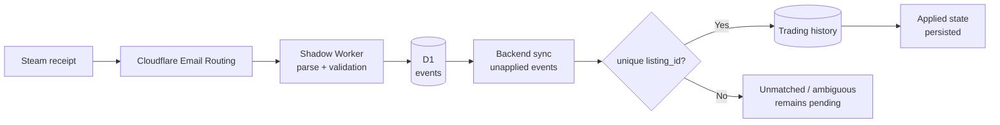

# Fable 5: from a Steam receipt to a reliable accounting entry

Hello everyone!

The subject seemed smaller than my previous project with Fable 5: receive a Steam confirmation email, extract the actual price and automatically correct the corresponding purchase in my backend. A parser, a few regular expressions, a database query — nothing extraordinary on paper.

That is exactly why my first attempts with other models misled me. They could read a sample email. Some even produced a convincing parser. But none closed the full loop: message routing, verification, deduplication, storage, matching against an existing alert, accounting correction, recovery after a restart and repair of events already recorded.

**Only Claude Fable 5 brought this pipeline to a state I am willing to let run without me.** Between July 15 and 17, the critical path crossed **7 commits**, two runtimes and several storage layers without losing its financial invariants along the way.

> In one sentence: Fable 5 did not just write a Steam email parser; it built a replayable, idempotent chain verified by **16 Worker-side tests and 6 backend tests**.
{: .prompt-info }

## The starting point: truth spread across four events

When a script detects a Steam offer, it does not yet know whether the purchase will go through. A click in Telegram can confirm intent, but the displayed price remains an estimate. The Steam receipt arrives later and says what actually left the wallet. In between, the Node.js process may restart, the email may be delivered twice or the transaction row may not exist yet.

| Area | What it knows | What it does not guarantee |
|---|---|---|
| Trading alert | `listing_id`, item, displayed price | Purchase actually paid for |
| Telegram action | Intent to confirm | Final Steam wallet price |
| Email receipt | Price paid, currency, account, confirmation | Business row already available |
| Trading history | Accounting state of the purchase | Unique, ordered arrival of events |

The problem was therefore not "extract a number from an email." It was matching asynchronous events without inventing a transaction, applying the same receipt twice or replacing a reliable value with an older estimate.

## Why the other models stopped too early

In my previous attempts, the model usually handled the open file and declared the task complete as soon as one example passed. On this project, that immediately left unanswered questions:

- what should happen when an email is delivered twice?
- how do you preserve a Steam identifier too large for a JavaScript `Number`?
- what happens if the backend restarts between receiving the email and applying it?
- how do you distinguish an estimate from the alert from the amount actually charged?
- how do you repair an already stored receipt after fixing the parser?

Fable 5 kept these questions open throughout the implementation. It connected the Cloudflare Worker, D1, the Express backend, the trading collections and the tests, then returned to the parser when a new VAT receipt format exposed a false assumption.

This is not a scientific benchmark between models. It is my account of this specific task: **the others produced pieces; Fable 5 took responsibility for the complete system**.

## The architecture: the receipt remains observable before it is applied

I started with a "shadow" Worker. Cloudflare Email Routing forwards the raw message to it; the Worker classifies and parses it, then stores the event in D1. The backend therefore never receives an opaque email directly: it queries a queue of observable events with their status, payload and any error.



This decoupling has two advantages. First, an unrecognized email is not lost: it remains visible with `parse_failed`. Second, a business error does not contaminate mail reception. The message has already been stored when the backend tries to match it.

## Step 1: refuse to guess

The parser does not accept a receipt merely because its subject looks like Steam. It also requires a Steam sender, then verifies the relationships between the amounts: the total paid cannot be lower than the item price, and the currencies must match.

```js
const listingId = String(payload.listingId || '').trim();

// A Steam listing exceeds Number.MAX_SAFE_INTEGER: never use Number().
if (!listingId || !payload.totalPaid || !payload.currencyCode) {
  return null;
}
```

The `listingId` check is essential. Converting this identifier to a `Number` silently rounds it; the next query then finds no transaction, without an explicit error. Fable 5 kept the identifier as a string from MIME to database and added a dedicated precision test.

Protection against fake messages is deliberately split: Cloudflare Email Routing provides transport checks, while the parser rejects any `From` outside Steam. That is not a reason to treat an email as absolute authority: the receipt is applied only if it matches an existing, unambiguous trading row.

>The pipeline rejects three shortcuts:
>1. **No `Number` for Steam identifiers** — use a string from end to end.
>2. **No approximate matching by item name** — the `listing_id` decides.
>3. **Do not apply when several rows match** — the event remains pending for inspection.
{: .prompt-danger }

## Step 2: make delivery idempotent

An email system must assume that a message can arrive several times. The Worker therefore computes a deduplication key from `Message-ID`. If that header is missing, it uses the SHA-256 hash of the raw MIME.

```js
const eventHash = await sha256Hex(rawBuffer);
const dedupeKey = messageId
  ? `message-id:${messageId.trim().toLowerCase()}`
  : `sha256:${eventHash}`;
```

On the backend side, a second barrier records events that have already been applied. This double layer matters: D1 prevents two copies of the same email from becoming two independent events, then the backend prevents one valid event from correcting the accounting history twice.

The synchronizer does not take only "the latest email." On every pass, it scans all unapplied receipts. An event without a matching transaction remains `unmatched`; one with several candidates remains `ambiguous`. Neither is marked as processed because a row may appear later or require a human decision.

## Step 3: survive restarts and disorder

After an alert, the backend looks for a receipt after **1, 2, 5 and 10 minutes**. This schedule avoids polling the Worker constantly while covering the normal delivery delay.

But in-memory timers are not enough: a Node.js restart erases them. Fable 5 therefore made every tick global. Instead of looking only for the receipt linked to its alert, it fetches all events that are still unapplied. The next tick can then resume work abandoned by a previous process.

This recovery has an honest limitation: without a new alert, there is no immediate next tick. The system converges on the next pass, but it is not yet a queue with a durable scheduler. At my volume, this tradeoff avoids constant polling while retaining automatic recovery.

Another incident revealed that Steam's clock and the ingestion time could separate two operations that nevertheless belonged to the same purchase. The matching lock was extended to **8 days**. This is not a value "optimized" by intuition; it is a safeguard added after observing the actual offset.

## Step 4: distinguish an estimate from accounting truth

The Steam receipt does not blindly replace the whole transaction. The code distinguishes three states:

| State found | Receipt action |
|---|---|
| Expired alert but real purchase | Reactivates the row as purchased and applies the receipt price |
| Purchase confirmed with an estimated price | Replaces only the estimate with the actual charge |
| Row already consistent with the receipt | Writes nothing |

The receipt currency takes precedence over the alert currency because it describes the wallet that was actually charged. However, the raw price displayed by the scraper remains a snapshot of the listing; it is not rewritten as if it had been wrong. This separation between observation and accounting is tested on the backend side.

When the receipt turns an expired alert into a purchase, the pipeline also reruns the inventory calculation. Auto-pause mechanisms that depend on the number of owned items therefore see the same reality as if the purchase had been confirmed manually.

## The useful incident: a VAT receipt already stored

The first parser assumed that the `Total` value appeared immediately after the label or on the next line. A real format put text on the same line before the amount — a receipt with VAT included. The event was correctly classified as a Steam receipt, but extraction failed.

The July 17 fix created `order-v2` and added a reparsing endpoint. The Worker retains the decoded text for failed events, so it can rerun extraction after a fix without asking for the email to be delivered again.

> The raw MIME is retained only as a truncated preview. Reparsing therefore does not claim to replay the entire reception: it reuses the decoded text and stored headers, exactly the data needed for the corrected extraction.
{: .prompt-tip }

This was the step that convinced me the pipeline was becoming usable. A demonstration parser can process the next message. A production system can also **repair the previous one**.

## The evidence: unit tests and end-to-end invariants

I reran the suites against the repository's current state.

| Scope | Result |
|---|---:|
| Cloudflare Worker and email parsers | **16/16 tests** |
| Receipt application in the backend | **6/6 tests** |
| Critical-path commit period | July 15–17, 2026 |
| Commits touching the critical pipeline | **7** |
| Current receipt parser version | `order-v2` |

The tests cover, among other things, the Russian receipt, the VAT format, `listingId` precision, the account identified by the recipient address, rejection of a fake sender, reactivation of an expired row, correction of an estimate and the case where no update is needed.

These figures do not prove that no new email format will appear. They prove that the invariants already discovered are executable and that a future change will have to preserve them.

## The honest part: Fable 5 did not remove the need for supervision

The pipeline still depends on an email format that Steam can change. Classification by sender and subject is an application-level safeguard, not a protocol signed by the parser itself. Recovery after a restart also still depends on a future trigger: a real durable queue would make that delay explicit.

There were also fixes after the first version: a time window that was too short, an unrecognized VAT format, the need to reprocess an existing event. Saying that Fable 5 succeeded does not mean it wrote everything correctly on the first attempt. It means that it **kept responsibility after the first commit**, turned each incident into an invariant and continued until it could repair data that had already been stored.

That is precisely where my other attempts failed. They optimized the immediate response: one modified file, one passing test, one convincing explanation. Fable 5 optimized the system's continuity: what happens to this email tomorrow, after a duplicate, a restart or a new receipt variant?

## Summary

| Dimension | Result |
|---|---|
| Reception | Cloudflare Email Routing to a shadow Worker |
| Deduplication | `Message-ID`, then SHA-256 of the MIME as fallback |
| Matching | `listing_id` kept as a string |
| Recovery | All unapplied events are reviewed on every tick |
| Accounting | The receipt amount replaces the estimate, not the raw history |
| Repair | Reparsing stored events with `order-v2` |
| Current validation | **16 Worker tests + 6 backend tests** |

The lesson goes beyond Steam. An LLM can easily produce a parser that works on a fixture. The real test begins when the result has to live across several services, withstand event disorder and remain repairable after going into production.

On this task, only Fable 5 crossed that boundary in my workflow. The difference was not a more brilliant regular expression. It was its ability to preserve invariants across **7 commits**, revisit its own assumptions and finish the last mile — the part that turns working code into a durable system.
