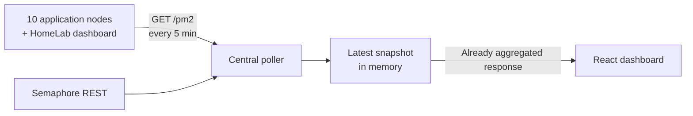

# 11 servers, 66 processes and no monitoring cluster

Hello everyone!

I run a deliberately heterogeneous small infrastructure: ten application nodes and one dashboard in my HomeLab. Most of the servers have only **one vCPU and 1 to 2 GB of RAM**. Eight Oracle machines remain in the free tier, a VPS with a dedicated IPv4 address currently costs me **$2 a month**, and the dashboard runs at home simply because I enjoy working with the hardware myself.

On machines like these, an abstraction layer is never free. Installing a complete platform just to know whether my PM2 processes were still `online` would have added services, storage and another lifecycle to maintain. I wanted answers to a few much simpler questions: which processes are running, how much CPU and memory they use, how many times they have restarted, and whether my updates completed successfully.

So I wrote a **112-line** Node.js HTTP agent, deployed it under PM2 itself, then connected all eleven machines to my dashboard through Tailscale. It stores no time series: the central service keeps only the latest known state in memory.

> In one sentence: **11 machines, 66 PM2 processes, 0.3% median CPU and 61.4 MiB RSS per agent**, with about 62.3 MiB of JSON per month and $24 a year in paid cloud hosting.
{: .prompt-info }

## The starting point

Before this agent, the dashboard already knew whether a node was responding and retained the business statistics from my scripts. But a reachable server does not guarantee that all of its processes are healthy. A worker can be stopped, stuck in a restart loop or missing after a deployment while the server continues to respond normally.

| Area | State before the PM2 agent |
|---|---|
| Server availability | Known from the dashboard |
| Detailed process state | Manual check with `pm2 status` |
| CPU and RSS per process | Visible only over SSH |
| Restart count | Visible only over SSH |
| Last system update | Already available through Semaphore |
| CPU/RAM history | Not needed for my use case |

The goal was not to build a new observability platform. I only needed to close the gap between "the server responds" and "the processes I care about are actually running."

{: .shadow }
*The dashboard shows 10/10 application nodes online. The HomeLab dashboard is tracked separately. The PM2 tooltip exposes each process's status, CPU, memory and restart count; addresses and some internal names are hidden.*

The request counters and success rates visible in this screenshot are pre-existing business metrics. The PM2 agent does not produce these graphs or retain their history.

## My rule: an abstraction must pay its rent

I like containers when they give me useful isolation, reproducible distribution or a security boundary. Here, Linux and PM2 already managed the application lifecycle. Adding a container runtime solely to launch a monitoring system would have duplicated a function I already had.

My philosophy can be summed up as follows:

> An abstraction layer has a cost and a purpose. A script is lighter than a container, just as a container is lighter than a virtual machine. But the right choice is not always the lowest layer: it is the lowest layer that still provides the guarantees you actually need.
{: .prompt-tip }

Zabbix and Grafana are not "bad" or necessarily expensive. [Zabbix is open source](https://www.zabbix.com/license), and [Grafana Cloud offers a free plan](https://grafana.com/pricing/). But their value comes precisely from features I was not looking for here: time series, retention, queries, complex alerts, logs and correlation.

>What I refused to build without a concrete need:
>1. **A metrics database** — I do not analyze RSS trends over six months.
>2. **A log pipeline** — my logs remain managed by the existing tools.
>3. **A container layer** — PM2 and the operating system already handle restarts.
>4. **A fake Grafana clone** — if those needs arise, I will use a specialized platform.
{: .prompt-danger }

## An endpoint on top of `pm2 jlist`

The agent does not invent a collector. PM2 already knows the processes, their status and their counters. The endpoint runs `pm2 jlist`, reduces the result and returns only the fields the dashboard needs:

```js
const list = JSON.parse(jlistJson);
const procs = list.map((p) => ({
  name: p?.name,
  status: p?.pm2_env?.status,
  cpu: p?.monit?.cpu ?? 0,
  mem: p?.monit?.memory ?? 0,
  restarts: p?.pm2_env?.restart_time ?? 0,
  uptime: p?.pm2_env?.pm_uptime ?? null,
}));
```

The HTTP contract consists of a single `GET /pm2` endpoint. A Bearer token can protect the route, although the agents are accessible only through the private LAN or Tailscale anyway. The corresponding public port is closed.

The agent itself is declared in `ecosystem.config.js`. PM2 therefore monitors the tool that queries PM2. It may sound circular, but the failure model remains simple: if the agent disappears, the central service receives an error or timeout and marks its snapshot as stale.

## A snapshot, not a database

The complete flow has four steps:



The browser never contacts the eleven agents directly. The central poller queries them about every five minutes, then the dashboard reads the prepared result. Opening five tabs therefore does not multiply the calls to the small servers.

Semaphore remains the source of truth for package updates. I do not copy its history into a new database: the dashboard retrieves the latest state of its tasks through the API and displays it alongside the PM2 status.

The trade-off is deliberate: after the central service restarts, the in-memory snapshot disappears. It is rebuilt during the next cycle. For operational state that is only a few minutes old, I prefer this temporary loss to another database that needs backups, cleanup and migrations.

## What the dashboard actually shows

Each node gets a badge such as `6/6` or `8/8`. It turns green when every process reported by its agent is `online`. On hover, the tooltip displays the following for each process:

- its name and status;
- the instantaneous CPU value reported by PM2;
- its memory RSS;
- its restart count;
- the time of the latest check.

The timestamp matters as much as the color. A green badge from two hours ago proves nothing about the current state. The dashboard must distinguish "everything is fine" from "everything was fine at the last contact."

In the screenshot, the visible `8/8` belongs to one row, while the `pm2 6/6` tooltip is anchored to the badge of another row lower down. The React component uses the same `online/total` pair for the badge and its tooltip: there are no two competing calculation methods.

## The actual measurements

I ran five polling cycles against the eleven agents, for **55 successful responses**. The calls used private addresses and did not write data or restart any process.

| Measurement | Result |
|---|---:|
| Machines queried | **11** |
| Processes in the final cycle | **66/66 online** |
| Agent CPU, median | **0.3%** |
| Agent CPU, p95 | **0.7%** |
| Peak CPU observed in the series | 2.9% |
| Agent RSS, minimum | 29.3 MiB |
| Agent RSS, median | **61.4 MiB** |
| Agent RSS, maximum | 73.0 MiB |
| JSON response, median | 690 bytes |
| Complete JSON response from 11 hosts | **7,563 bytes** |
| JSON payload per day | 2.08 MiB |
| JSON payload over 30 days | **62.3 MiB** |
| Median latency from my workstation | 708 ms |
| p95 latency from my workstation | 934 ms |

The network calculation covers only the JSON body, not the HTTP/TCP headers. And the CPU value is a PM2 snapshot, not a scientific Node.js benchmark. During an initial isolated read, one agent even showed 7.2%. The next series produced a 0.3% median and 0.7% p95: keeping a single sample would have led to a misleading conclusion.

There is no "before/after" table for RAM: before the agent, this function did not exist. Inventing the hypothetical cost of a self-hosted Zabbix deployment on my machines would not make the comparison more honest.

## $24 of cloud hosting per year

The topology is almost as important as the code. It combines free-tier instances, a rented VPS and hardware at home:

| Part | Current actual cost |
|---|---:|
| 8 Oracle Cloud VMs | **$0**, free tier |
| VPS with dedicated IPv4 in a Russian data center | **$2 per month** |
| Same VPS before the price change | $1 per month |
| Paid cloud hosting over twelve months, today | **$24** |
| Tailscale Personal | **$0** within this scope |
| HomeLab dashboard | hardware and electricity not included |

Spread across the ten displayed nodes, $24 represents **$2.40 per node per year**. This figure does not make the HomeLab a free machine: it measures only the cloud hosting bill. The hardware, electricity and connection still exist.

The dashboard could run at a provider like the other machines. I host it at home because that is more interesting: I like building machines, understanding how they behave and keeping part of the infrastructure within reach. This choice is as much about the hobby as it is about optimization.

The low price is no reason to treat these servers as disposable. Quite the opposite: with one vCPU and 1 to 2 GB of RAM, every unnecessary daemon directly reduces the resources available to applications. Minimalism becomes an operational constraint, not an aesthetic pose.

## The honest part: the small agent still broke

The file is short, but integrating it into the real lifecycle produced several useful incidents.

### `pm2 resurrect` made the agent disappear

The first version had been launched with a simple `pm2 start`. During a `pm2 resurrect`, only the processes described in the persistent configuration returned. The agent therefore worked only until the next clean restart.

The fix was not in the HTTP code: I had to add it to `ecosystem.config.js`. A process truly belongs to the infrastructure only when the normal restoration mechanism knows how to recreate it.

### The right server, the wrong user

On some machines, `pm2 list` appeared empty. The processes existed, but under another user and another `PM2_HOME`. The agent queried PM2 correctly, just not the right daemon.

PM2 is not an abstract global service: its state depends on the Unix user that launches it. This constraint is now part of the deployment.

### `pm2 restart` kept the old entry point

On the dashboard, an old agent returned an incomplete contract. Restarting the process obviously did not change the path of the already registered script. I had to delete the entry and create it again with the correct file.

### Automation can become the failure

An interrupted remote deployment left some doubt about the processes' actual state. Before rerunning the task across all machines, I checked the processes from the operating system. Even automation designed to make ten servers more reliable must know how to stop without becoming their shared point of failure.

> Minimal code reduces the number of components to diagnose. It does not remove the need to understand Unix users, startup, restoration and deployment idempotency.
{: .prompt-warning }

## What this system does not do

This architecture answers a deliberately limited set of questions. It does not provide:

- CPU or RAM time series;
- historical PM2 graphs;
- PromQL;
- centralized log collection;
- SNMP or hardware discovery;
- complex alerting rules;
- a persistent snapshot after the central API restarts.

If I ever need to correlate six months of metrics, send multi-channel alerts or explore distributed logs, a specialized platform will become a justified dependency. I will not turn this agent into a poor copy of Zabbix or Grafana.

## Summary

| Metric | Result |
|---|---:|
| Machines monitored | **11** |
| Application nodes visible | **10/10 online** |
| PM2 processes measured | **66/66 online** |
| Agent size | **112 lines** |
| Median agent CPU | **0.3%** |
| Median agent RSS | **61.4 MiB** |
| Monthly JSON payload | **62.3 MiB** |
| Paid cloud expenditure | **$24 per year** |
| Additional metrics database | **none** |
| Additional container | **none** |

I did not replace Zabbix. I built exactly the level of observation this infrastructure needs today: one endpoint, one poller, one snapshot and one badge that tells me which processes are actually alive.

The most interesting result is not that a script is "better" than a container. It is that an architecture often becomes clearer when every new layer has to justify its existence. Containers, metrics databases and observability platforms all have real value, but only when the problem they solve actually exists.

On one-vCPU machines that cost an average of a few dollars a year, this is no longer a theoretical question: **does this dependency provide more than the resources and complexity it consumes?** For monitoring my 66 processes, the answer ultimately fit into 112 lines of Node.js.
