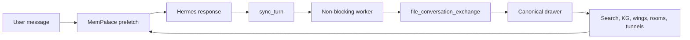

# Hermes × MemPalace: memory that finally takes part in the agent's lifecycle

I have just taken part in the largest open source pull request of my career so far: the native integration of MemPalace as a memory provider for Hermes. The core was merged into `develop` on August 11, 2026, after **2,591 lines added**, six files changed, eight successful CI jobs and explicit approval for the 3.7.0 release train.[1]

Yet my name does not appear as the author of the merged PR.[1]

The main work belongs to [Raman Gupta](https://github.com/raman325).[1]

My contribution took a different form: I turned four issues raised during review into a testable patch, then audited the backfill and found two paths that silently dropped Hermes responses. Part of my patch was replaced by a cleaner design; the problems and tests it captured still changed the final result.[1][2][4]

> In one sentence: MemPalace does more than give Hermes new buttons; it slots into its lifecycle, archives exchanges without blocking the conversation, preloads relevant context and exposes **27 tools** over a structured local palace.[1]
{: .prompt-info }

## The starting point: Hermes already had memory plugins

Saying that MemPalace "finally brings memory to Hermes" would be false. The current Hermes documentation already describes **eight external providers**; only one can be active at a time, alongside `MEMORY.md` and `USER.md`. The provider contract can inject context, preload memories before a turn, synchronize exchanges after the response, react when a session ends and expose its own tools.[6]

The real question was therefore not: *can we connect a vector database to Hermes?* It was: *can we make MemPalace a coherent part of how Hermes works, without creating a second source of truth beside the agent?*

| Area | Before this PR | With the MemPalace provider |
|---|---|---|
| Trigger | The model must explicitly call a tool or MCP server | Hermes calls the provider hooks at the right time |
| Turn writes | Risk of an integration-specific path | The same `file_conversation_exchange()` as the rest of MemPalace |
| Recall | Search triggered on demand | Context preloaded before the turn, plus explicit search |
| Data | Bounded Hermes memory or a separate external service | Local palace, drawers, wings, rooms, knowledge graph and tunnels |
| Agent surface | Tools added by a plugin | **27 tools** plus lifecycle hooks |
| Write latency | A write can delay the response | Bounded background worker |
| System contexts | Cron and flush can contaminate memories | Explicit guard against these contexts |

## Why this is not "just another plugin"

A conventional MCP plugin mainly extends what the agent **can request**. The MemPalace provider also extends what the infrastructure **does automatically** around every response: initialization, context injection, `prefetch`, `sync_turn`, session changes, mirroring memory writes and clean shutdown. That difference changes the level of integration.[1][6]



The important detail is `file_conversation_exchange()`. Conversations imported later and turns captured live must receive the same metadata, identifiers and routing. Otherwise, two apparently compatible memories slowly diverge into two formats: a search finds the history but not the live data, a date filter ignores some drawers, or a wing behaves differently depending on the ingestion path.[1]

The provider also goes through `ChromaBackend.get_or_create_collection()` instead of opening ChromaDB directly. This centralizes the embedding function and avoids recreating the dimension bug that had blocked several earlier attempts on the Hermes side. Status operations are capped at **5,000 metadata records** and explicitly report when the view is truncated, so a large palace does not turn a simple inspection into a full load.[1]

> The new level does not come from the number of tools. It comes from one invariant: automatic capture, automatic recall and explicit operations must all target the same palace, the same collection and the same drawer format.
{: .prompt-tip }

## The first real blocker: recording the same conversation twice

The first maintainer review identified a dangerous flaw: `sync_turn()` recorded each completed turn, then `on_session_end()` processed the complete transcript again. Because `filed_at` contributes to the drawer identifier, the second write did not replace the first; it created a new, nearly identical memory.[1]

Over long-term use, this is not a cosmetic defect. Search results become polluted with repetitions and the statistics inflate.[1]

I opened a stacked PR with **170 additions and 9 deletions**, including tests to address this issue, align the passthrough tools with the configured `palace_path`, mirror the default memory target and propose backup support.[2]

Raman closed this patch without merging it as written.[2]

His initial choice was simpler and safer: make `sync_turn()` the sole capture path in the core, then build recovery for missed turns in a separate PR.[1][2]

It was the right decision. Deduplicating two different representations of the same turn, with sanitized arguments on one side and a raw transcript containing tools and injected content on the other, is more subtle than using a counter or comparing text.[1][3]

The follow-up [#1941](https://github.com/MemPalace/mempalace/pull/1941) adds fingerprints, branch-lineage analysis and an explicit policy: when the result is ambiguous, accept a bounded duplicate rather than lose a turn. At the time of writing, it remains open as a draft.[3]

## The second blocker: writing to one palace and searching another

The provider knew about `self._palace_path`, but several of its 27 tools delegated to the MemPalace MCP server, which resolved its own global configuration.[1] With a custom path, Hermes could therefore record and search in one palace while CRUD operations, duplicate handling or tunnels modified another location.[1]

To the user, the symptom looks exactly like memory loss: "I just added it, so why can't search find it?" My patch made the problem concrete. The accepted version went further: it unified resolution of the palace, collection and knowledge graph without introducing a second setting that could drift.[1][2]

The same review found that `on_memory_write()` only copied `target="user"`, even though Hermes uses `target="memory"` by default. The provider could therefore ignore most ordinary notes. The final fix distinguishes the two subjects in the graph: user facts and agent notes are no longer mixed together.[1]

## My second pass: backfill dropped responses involving tools

After the core, I reviewed the installation and backfill PR. The tests passed, but they only used simple `user → assistant` pairs. A real agent turn often looks like this:

```text
user
→ assistant(tool_use)
→ user(tool_result)
→ assistant(final response)
```

The parser associated the user message with only the first assistant message. It therefore archived the `tool_use` stub, often with no text, and discarded the actual final response. For a coding agent, this is not an edge case: it is the normal flow.[4]

I also reproduced a second defect: `hermes sessions export` produces one session object per JSONL line, with the messages nested inside it. The backfill treated each line as though it were a message directly and silently returned zero exchanges.[4]

Both findings were fixed in the follow-up commit: the backfill now reuses the live provider's segmentation, retains tool markers and the final response, and understands the actual structure of JSONL exports. PR #1942 explicitly credits `@GoXLd` for these two discoveries. It too remains open as a draft at the time of publication.[4]

>A "verbatim" memory is not allowed to succeed silently:
>1. **A turn involving tools must retain the final response**, not just the call stub.
>2. **A valid export that produces zero exchanges must be tested as a functional error.**
>3. **When the choice is between a duplicate and a loss, loss is the wrong side of the trade-off.**
{: .prompt-danger }

## The participants: a PR carried by a discussion, not one person

The #1915 thread has five human participants. The automated reviewers Gemini Code Assist and Copilot also left comments, but I deliberately separate them from the people.[1]

| Participant | Role in the thread |
|---|---|
| [raman325](https://github.com/raman325) | Author of the provider, tests and final fixes; he split the former large PR into a reviewable series |
| [igorls](https://github.com/igorls) | Maintainer and reviewer; he enforced the architectural invariants, requested fixes, then approved and merged the core |
| [GoXLd](https://github.com/GoXLd) | Author of the stacked review patch, tests for the four blockers, then the backfill audit that found two data-loss paths |
| [vavush](https://github.com/vavush) | Revived the thread after several weeks of waiting and checked the status of the blockers |
| [alistairwalsh](https://github.com/alistairwalsh) | Shared independent experience with a large Qdrant installation and proposed durability follow-ups |

There is also a history before this thread: #1915 is the refocused version of a broader integration, itself descended from earlier attempts and the open invitation in NousResearch/hermes-agent#6323. That is another reason not to present this result as the isolated work of a single author.[1][5]

## The honest part: my contribution is not in the merge as I wrote it

The merged PR contains no commit signed `GoXLd`. My PR to Raman's fork was closed, and its deduplication strategy was not retained as written. Claiming "I wrote the merged feature" would therefore be incorrect.[1][2]

My actual contribution is still verifiable: a two-file patch with tests, four issues turned into concrete behavior, a technical discussion that led to a cleaner solution, then two backfill bugs reproduced with real message and export formats. It is less visible than a line count in the final merge, but closer to what a good contribution to a mature project looks like: reducing risk before the release.[2][4]

Another important limitation: **only the #1915 core has been merged**.[1]

Scan-based recovery for missed turns (#1941) and the `mempalace hermes install` command with backfill and documentation (#1942) are still drafts.[3][4]

The latest visible public release remains v3.6.0.[7]

The reviewer placed the core on the 3.7.0 release train, but the complete installation experience has not yet been published.[1][4]

## Summary

| Item | Status verified on August 11, 2026 |
|---|---|
| Hermes provider core | **Merged into `develop`** |
| #1915 diff | **2,591 additions**, 1 deletion, 6 files |
| Exposed MemPalace surface | **27 tools** |
| Tests announced in the core | **42 new tests** |
| Merge CI | **8 successful jobs**: build, GPU, lint, Linux 3.9/3.11/3.13, macOS, Windows |
| My stacked patch | 170 additions, 9 deletions; closed after redesign |
| Backfill findings | **2 defects** reproduced and fixed in #1942 |
| Release train | Core approved for **3.7.0**; public release still unavailable |
| Follow-ups | #1941 and #1942 open as drafts |

The importance of this integration is not that Hermes gets one more memory. Hermes can already load several providers. The change is that a local palace can now follow the agent's actual lifecycle: prepare context, absorb every turn, respect session changes, mirror notes, expose its topology and remain consistent with historical imports.[1][6]

For me, this PR also changes the definition of a contribution. My code was not merged word for word, but it served as a prototype, a test suite and constructive pressure on the riskiest invariants. The question is no longer "how many of my lines are in the merge?" but "which memory losses will never reach users because of this review?"

## Sources

[1] https://github.com/MemPalace/mempalace/pull/1915 — MemPalace PR #1915 — Hermes memory provider core
[2] https://github.com/raman325/mempalace/pull/2 — GoXLd review fixes for PR #1915
[3] https://github.com/MemPalace/mempalace/pull/1941 — MemPalace PR #1941 — scan-based dedup safety nets
[4] https://github.com/MemPalace/mempalace/pull/1942 — MemPalace PR #1942 — backfill, install command, and docs
[5] https://github.com/NousResearch/hermes-agent/issues/6323 — Hermes Agent issue #6323 — MemPalace memory provider
[6] https://hermes-agent.nousresearch.com/docs/user-guide/features/memory-providers — Hermes Agent — Memory Providers
[7] https://github.com/MemPalace/mempalace/releases — MemPalace releases
