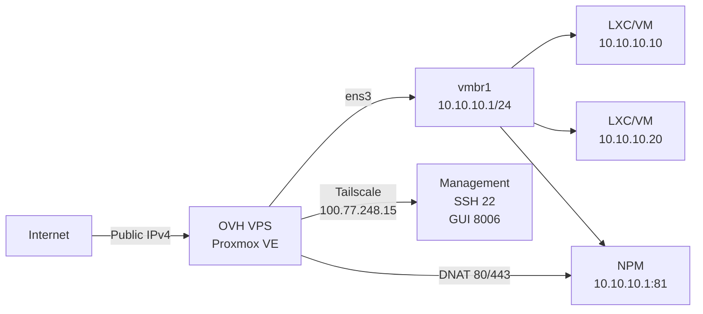

# Proxmox VE on an OVHcloud VPS: from KVM validation to hardened firewall

I have an OVHcloud "Model 3" VPS (6 vCore, 12 GB RAM, 100 GB NVMe, 2 Gbit/s unmetered) running Debian 13 Trixie. Goal: install Proxmox VE 8 to run LXC containers and, if the hardware allows, real KVM VMs. OVH doesn't provide a Proxmox template — you have to build the stack yourself, and the first question is: **is nested KVM actually available?**

> In one sentence: nested KVM validated (`vmx` + `/dev/kvm` + `kvm-ok`), Proxmox installed on Debian 13, NAT network `vmbr1` (10.10.10.0/24) with DNAT 80/443 to NPM, nftables firewall *default-drop* exposing only Tailscale (SSH 22, GUI 8006) and Tailscale UDP 41641 — 0 failed systemd units.
{: .prompt-info }

## Starting point

| Area | Initial state |
|---|---|
| VPS | OVH Model 3 — 6 vCore / 12 GB / 100 GB NVMe / 2 Gbit/s |
| Base OS | Debian 13 (Trixie) minimal, hostname `vps-17aa660c-vps-ovh-net` |
| Access | OVH KVM console + SSH (ed25519 key) |
| Proxmox | Not installed |
| Network | 1 public IPv4, no failover IP |
| Goal | Proxmox VE 8 + LXC/VM + internal reverse proxy + minimal public surface |

This VPS isn't bare metal: it's KVM inside KVM. OVH docs say "custom config allowed, at your own risk" — so the burden of proof is on me.

## Verify nested KVM before buying

I already had a smaller OVH VPS handy. I ran the full test suite **before** ordering the Model 3.

```bash
# 1. VT-x/AMD-V flag exposed to guest
egrep -wo 'vmx|svm' /proc/cpuinfo | head
# vmx
# vmx
# vmx
# vmx

# 2. KVM device present
ls -la /dev/kvm
# crw-rw---- 1 root kvm 10, 232 Sep 7 15:22 /dev/kvm

# 3. Kernel modules loaded
lsmod | grep kvm
# kvm_intel 413696 0
# kvm 1380352 1 kvm_intel
# irqbypass 12288 1 kvm

# 4. Official test
apt update && apt install -y cpu-checker
kvm-ok
# INFO: /dev/kvm exists
# KVM acceleration can be used
```

All four checks pass. **Nested KVM is operational**: the VPS can host Proxmox which in turn will launch hardware-accelerated KVM VMs.

> If `kvm-ok` says "KVM acceleration can NOT be used", Proxmox still installs but QEMU VMs will run in TCG (software emulation) — unusable in production. LXC only.
{: .prompt-danger }

## Installation: Debian 13 → Proxmox VE 8

No ISO via OVH KVM console. The supported method: **Proxmox on top of Debian**.

```bash
# 1. Clean hostname
hostnamectl set-hostname gxd
# /etc/hosts: 127.0.0.1 gxd gxd.local

# 2. SSH key (ed25519) already in place for root@gxd

# 3. Proxmox repo (no-subscription)
echo "deb http://download.proxmox.com/debian/pve bookworm pve-no-subscription" \
  > /etc/apt/sources.list.d/pve-install-repo.list
wget -qO- https://enterprise.proxmox.com/debian/proxmox-release-bookworm.gpg \
  | gpg --dearmor > /etc/apt/trusted.gpg.d/proxmox.gpg

# 4. Install
apt update
apt install -y proxmox-ve postfix open-iscsi
# (postfix: "Internet site" config, mail name = gxd)

# 5. Reboot → interface at https://<IP>:8006
```

Installation took ~4 min. After reboot, Proxmox UI responds on port 8006.

> **Non-negotiable rule**: never touch Proxmox networking (`/etc/network/interfaces`, `vmbr0`) without the OVH KVM console open in parallel. A mistake = lost SSH = recovery only via KVM.
{: .prompt-warning }

## Networking: one public IPv4 → NAT + DNAT

With a single public IPv4, the `vmbr0` bridge "like on dedicated" doesn't work. I built an **internal NAT bridge** (`vmbr1`) and **DNAT** to Nginx Proxy Manager.



**`/etc/network/interfaces`** (relevant excerpt):

```bash
auto vmbr1
iface vmbr1 inet static
    address 10.10.10.1/24
    bridge-ports none
    bridge-stp off
    bridge-fd 0
    # NAT + DNAT handled by nftables (see below)
```

**nftables** — *default-drop* policy on `input` and `forward`, explicit allows only:

```nft
table inet filter {
  chain input {
    type filter hook input priority filter; policy drop;
    iifname "lo" accept
    ct state established,related accept
    ip protocol icmp accept
    ip6 nexthdr ipv6-icmp accept
    # Management ONLY via Tailscale
    iifname "tailscale0" tcp dport { 22, 8006 } accept
    # Tailscale transport + OVH DHCP
    iifname "ens3" udp dport 41641 accept
    iifname "ens3" udp sport 67 udp dport 68 accept
  }
  chain forward {
    type filter hook forward priority filter; policy drop;
    ct state established,related accept
    # NAT egress vmbr1 → ens3
    iifname "vmbr1" oifname "ens3" accept
    # DNAT ingress 80/443 → NPM (10.10.10.1)
    iifname "ens3" oifname "vmbr1" ip daddr 10.10.10.1 tcp dport { 80, 443 } accept
    # Tailscale ↔ vmbr1
    iifname "tailscale0" oifname "vmbr1" ip daddr 10.10.10.0/24 accept
    iifname "vmbr1" oifname "tailscale0" ip saddr 10.10.10.0/24 accept
  }
}
table ip nat {
  chain prerouting {
    type nat hook prerouting priority dstnat; policy accept;
    iifname "ens3" ip daddr <PUBLIC_IPV4> tcp dport 80  dnat to 10.10.10.1:80
    iifname "ens3" ip daddr <PUBLIC_IPV4> tcp dport 443 dnat to 10.10.10.1:443
  }
  chain postrouting {
    type nat hook postrouting priority srcnat; policy accept;
    oifname "ens3" ip saddr 10.10.10.0/24 masquerade
  }
}
```

Result: **public surface = 2 ports (80, 443) + UDP 41641 (Tailscale)**. SSH (22) and Proxmox GUI (8006) **unreachable from the internet** — only via Tailscale.

## Nginx Proxy Manager in LXC (10.10.10.1)

A lightweight LXC container (Debian 13, 512 MB RAM, 4 GB disk), Docker + official NPM image.

```bash
# Inside the NPM LXC
docker run -d \
  --name npm \
  --network host \
  -v /data:/data \
  -v /letsencrypt:/etc/letsencrypt \
  jc21/nginx-proxy-manager:latest
```

NPM listens on `10.10.10.1:81` (admin GUI) and `10.10.10.1:80/443` (traffic). The nftables DNAT routes public traffic to it.

## Post-install validation

| Check | Command | Result |
|---|---|---|
| Failed systemd units | `systemctl --failed` | **0 loaded units listed** |
| Public listening ports | `ss -ltnp | grep -E ':22\|:8006\|:3128\|:81'` | 22/8006/3128/81 **absent** on `ens3` |
| Ports on Tailscale | `ss -ltnp | grep 100.77.248.15` | 22, 8006 **present** |
| DNAT 80/443 | `nft list table ip nat` | Rules `dnat to 10.10.10.1:80/443` **present** |
| MASQUERADE vmbr1 | `nft list table ip nat` | `oifname "ens3" ip saddr 10.10.10.0/24 masquerade` **present** |
| Proxmox GUI access | `curl -k https://100.77.248.15:8006` | **200 OK** (via Tailscale) |
| NPM GUI access | `curl http://100.77.248.15:81` | **200 OK** (via Tailscale) |
| Nested KVM in Proxmox | `kvm-ok` (in Proxmox host) | **KVM acceleration can be used** |

Port 3128 (SPICE proxy) listens on `*` but **blocked by firewall** — no SPICE console access from outside. noVNC (via 8006) is sufficient.

> **SPICE note**: if you ever want SPICE console, add `iifname "tailscale0" tcp dport 3128 accept` to the `input` chain. For noVNC, nothing to change.
{: .prompt-tip }

## What didn't work / traps

1. **Default OVH hostname** (`vps-xxx-vps-ovh-net`) — Proxmox uses it for the cluster node name. Change **before** Proxmox install, otherwise renaming the PVE node later is a pain.
2. **`rpcbind` on 0.0.0.0:111** and **LLMNR on :5355** — enabled by default on Debian/Proxmox. Disabled via `systemctl disable --now rpcbind.socket rpcbind` and `systemctl mask systemd-resolved` (LLMNR). Firewall already blocked them, but clean = silent.
3. **IPv6** — OVH provides a `/64` but I haven't wired routing to `vmbr1` yet. For now: IPv4 only + Tailscale (which provides IPv6 ULA).
4. **Proxmox backup** — no `vzdump` job to remote storage yet. To do.

## Summary

| Metric | Result |
|---|---|
| Nested KVM | Validated (`vmx`, `/dev/kvm`, `kvm-ok` ✓) |
| Installation | Debian 13 → Proxmox VE 8 (no-subscription) |
| RAM available for guests | ~10 GB (2 GB Proxmox host) |
| Storage available for guests | ~85 GB (after OS + Proxmox) |
| Public surface | TCP 80, 443 + UDP 41641 only |
| Admin access | Tailscale only (SSH 22, GUI 8006, NPM 81) |
| Reverse proxy | NPM in LXC (10.10.10.1) + nftables DNAT |
| Firewall | nftables *default-drop*, 0 failed units |
| Next step | First LXC service (e.g. 10.10.10.10) → DNS → HTTPS via NPM → Let's Encrypt cert |

The question is no longer "does it work" but **"which first service do I deploy in LXC 10.10.10.10"**. The stack is ready: Proxmox manages lifecycle, nftables filters, Tailscale gives clean admin, NPM terminates TLS. The rest is application.

---

*OVH Model 3 VPS — 6 vCore / 12 GB / 100 GB NVMe / 2 Gbit/s — Proxmox VE 8.2 / Debian 13 Trixie / nftables / Tailscale / Nginx Proxy Manager. Network config validated 2026-09-09.*