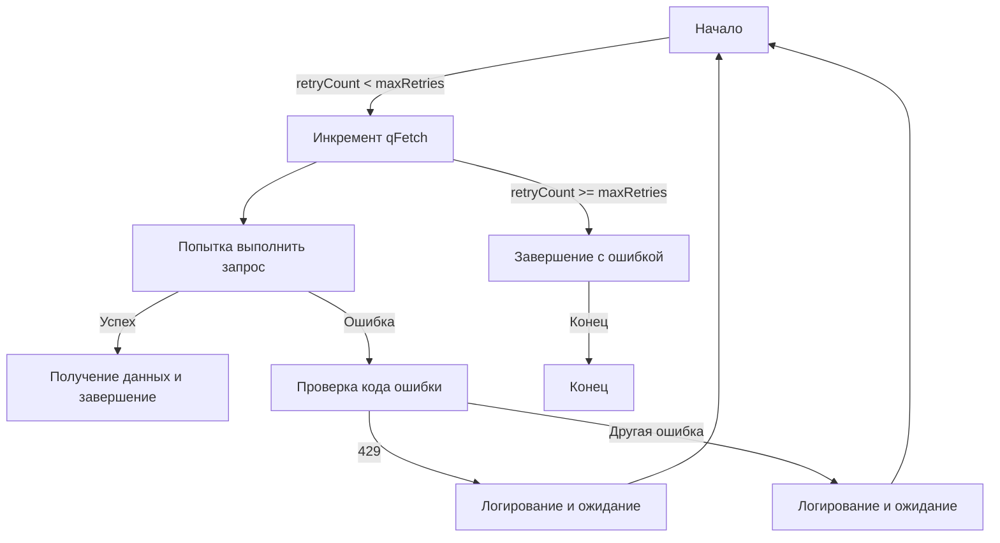

# Оптимизация управления запросами в Google Apps Script

Чтобы оптимизировать работу с запросами к внешним серверам в Google Apps Script, важно учитывать возможные ошибки и задержки ответов, а также подсчитывать общее количество выполненных запросов.

## Пример кода с логикой повторных попыток (`retry`)

Вот пример кода, иллюстрирующий этот подход с использованием `UrlFetchApp.fetch` и логики повторных попыток (`retry`):

```javascript
let qFetch = 0;

// Логика повторных попыток
do {
    try {
        // Попытка запроса через UrlFetchApp.fetch
        UrlFetchApp.fetch("URL_DU_SERVEUR");
        
        // Инкремент переменной qFetch при успехе
        qFetch++;
    } catch (error) {
        // Обработка ошибок, qFetch здесь не увеличивается
    }
} while (/* Условие выхода из цикла */);

// Вывод общего количества выполненных запросов
console.log(`Nombre total de requêtes : ${qFetch}`);
```

Другой пример — `UrlFetchApp.fetch` с логикой повторных попыток (`retry`) в моём парсере:

```javascript

for (var retryCount = 0; retryCount < maxRetries; retryCount++) {
  qFetch++; //wrong
  try {
    qFetch++;
    response = UrlFetchApp.fetch(url, { muteHttpExceptions: false });
    fetchedData = response.getContentText();
    break;
  } catch (error) {
    if (response && response.getResponseCode() == 429) {
      Logger.log("Erreur 429. Réessayez après " + retryDelay + " secondes.");
      totalSleepTime += retryDelay;
      Utilities.sleep(retryDelay);
    } else {
      Logger.log("Erreur lors de la récupération des données : " + error + " Pause (ms) : " + retryDelay);
      totalSleepTime += retryDelay;
      Utilities.sleep(retryDelay);
    }
  }
}
```

В этом скрипте переменная qFetch увеличивается при каждой попытке — независимо от того, завершился ли `UrlFetchApp.fetch` успехом или ошибкой. Это позволяет подсчитать общее количество запросов, отправленных внешнему серверу, и даёт представление о производительности скрипта.



Учитывая эти аспекты, вы сможете повысить надёжность своего скрипта и получить полезную информацию о его поведении при взаимодействии с внешними серверами.
