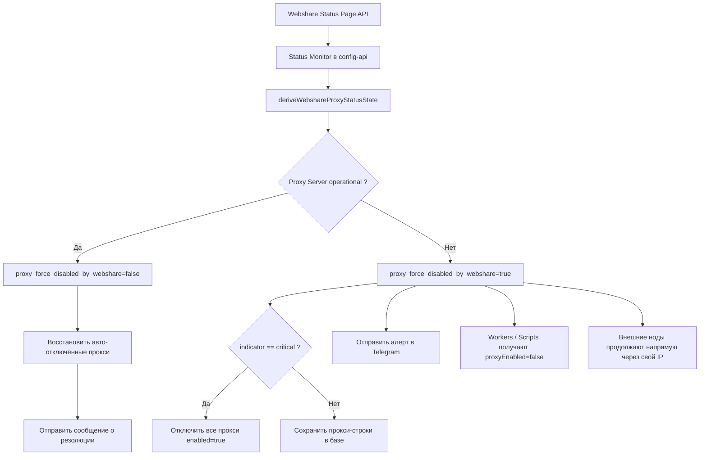

# Когда провайдер прокси падает...

{: .shadow }
*Стандартная карточка заменяется видом инцидента, чтобы исключить любую двусмысленность для оператора.*

Недавно я внедрил довольно интересную автоматизацию на проде: если `webshare.io` деградирует или теряет прокси-сервис, инфраструктура автоматически отключает использование прокси Webshare, деактивирует соответствующие прокси-записи, переключает трафик на внешние ноды другого провайдера и немедленно уведомляет технический Telegram-канал.

Тема напрямую касается **DevOps** и **SRE**:

- детекция инцидента провайдера
- изменение runtime-поведения без ручного вмешательства
- сокращение blast radius
- автоматическое восстановление после резолюции
- операционная видимость в дашборде

> Одной фразой: когда Webshare падает, система отключает прокси, держит сервис онлайн через внешние ноды, а затем автоматически восстанавливает состояние.
{: .prompt-info }

## Проблема

Инцидент провайдера — это не просто warning в UI. Это **событие управления runtime'ом**.

Во многих архитектурах скрапинга, API-медиации или распределённого сбора прокси считаются стабильным ресурсом. На практике они часто являются внешней точкой отказа.

Кейс был прост:

- часть трафика в норме идёт через Webshare
- workers и скрипты потребляют центральную конфигурацию
- внешние ноды могут продолжать обрабатывать запросы напрямую через собственный IP провайдера
- при инциденте Webshare продолжать использовать этот пул — значит лишь наращивать ошибки, шум алертинга и расход ретраев

Цель была не «починить» Webshare. Цель — **убрать Webshare с критического пути как можно быстрее**.

> Мы не любим инциденты. Однако такие моменты дают опыт, практику и быстрый рост. Этот инцидент длился восемь часов...
{: .prompt-tip }

## Архитектурная цель

Принятая логика:

1. мониторить `https://status.webshare.io/api/v2/summary.json`
2. вывести машинно-обрабатываемое состояние
3. активировать глобальный override `proxy_force_disabled_by_webshare`
4. если инцидент критический — также отключить все активные прокси-строки в базе
5. заставить ноды перечитать runtime-конфигурацию
6. продолжить трафик через внешние ноды в прямом режиме
7. отправить техническое Telegram-уведомление
8. автоматически восстановить состояние, когда провайдер вернётся в норму


## Логическая схема



> Здесь речь о плане управления. Реальный путь запросов отделён.
{: .prompt-tip }

## Принцип принятия решения

Есть два уровня:

- **активный инцидент**: отключаем прокси-runtime глобальным флагом
- **критический инцидент**: также отключаем прокси-строки в базе, чтобы операционное состояние было согласовано везде

На практике:

| Состояние Webshare | Прокси-runtime | Прокси-строки в базе | Трафик |
|---|---|---|---|
| `operational` | включён | без изменений / восстановлены | Webshare в норме |
| `degraded_performance` | отключён | сохранены | fallback на внешние ноды |
| `critical` / `full_outage` | отключён | `enabled=false` авто | fallback на внешние ноды |

## 1. Монитор инцидентов

Монитор работает на стороне `config-api`. Он регулярно читает JSON статус-страницы и хранит нормализованное состояние в глобальной конфигурации.

```javascript
const WEBSHARE_STATUS_SUMMARY_URL =
  process.env.WEBSHARE_STATUS_SUMMARY_URL ||
  'https://status.webshare.io/api/v2/summary.json';

const PROXY_FORCE_DISABLED_BY_WEBSHARE_KEY = 'proxy_force_disabled_by_webshare';
const PROXY_WEBSHARE_STATUS_STATE_KEY = 'proxy_webshare_status_state';
const PROXY_AUTO_DISABLED_BY_WEBSHARE_CRITICAL_KEY =
  'proxy_auto_disabled_by_webshare_critical';

function deriveWebshareProxyStatusState(summary) {
  const components = Array.isArray(summary?.components) ? summary.components : [];
  const incidents = Array.isArray(summary?.incidents) ? summary.incidents : [];

  const proxyServer =
    components.find((component) => String(component?.name || '').trim() === 'Proxy Server') || null;

  const dashboardApi =
    components.find((component) => String(component?.name || '').trim() === 'Web Dashboard/API') || null;

  const ongoingIncident =
    incidents.find((incident) => String(incident?.status || '').trim().toLowerCase() !== 'resolved') || null;

  const proxyComponentStatus = String(proxyServer?.status || 'unknown').trim().toLowerCase();
  const dashboardComponentStatus = String(dashboardApi?.status || 'unknown').trim().toLowerCase();
  const summaryIndicator = String(summary?.status?.indicator || 'unknown').trim().toLowerCase();

  return {
    active: proxyComponentStatus !== 'operational',
    incident_id: ongoingIncident?.id ? String(ongoingIncident.id) : null,
    incident_name: ongoingIncident?.name ? String(ongoingIncident.name) : null,
    incident_status: ongoingIncident?.status ? String(ongoingIncident.status) : null,
    proxy_component_status: proxyComponentStatus,
    dashboard_component_status: dashboardComponentStatus,
    summary_indicator: summaryIndicator,
    checked_at: new Date().toISOString(),
    source: 'https://status.webshare.io/'
  };
}
```

Мы не читаем эту статус-страницу как человек. Мы превращаем её в **решающее состояние**. Оно затем управляет конфигурацией.

## 2. Глобальный override, отключающий runtime

Когда состояние выведено, система решает, нужно ли отключить использование прокси.

```javascript
async function syncWebshareProxyAvailability(trigger = 'manual') {
  const currentState = parseStoredWebshareStatusState(
    globalMap.get(PROXY_WEBSHARE_STATUS_STATE_KEY)
  );

  const currentOverride = parseBooleanFlag(
    globalMap.get(PROXY_FORCE_DISABLED_BY_WEBSHARE_KEY),
    false
  );

  const summary = await fetchWebshareStatusSummary();
  const nextState = deriveWebshareProxyStatusState(summary);

  const shouldDisable = nextState.active;
  const shouldDisableProxyRows = nextState.summary_indicator === 'critical';

  const activationChanged =
    shouldDisable !== currentState.active ||
    shouldDisable !== currentOverride;

  if (activationChanged) {
    await upsertConfGlobal({
      key: PROXY_FORCE_DISABLED_BY_WEBSHARE_KEY,
      value: shouldDisable ? 'true' : 'false',
      type: 'boolean'
    });
  }
}
```

Этот глобальный флаг централизует решение. Его читают несколько runtime'ов. Он избавляет от дублирования одного и того же условия повсюду.

## 3. Критический режим: отключить прокси и в базе

Когда глобальный индикатор становится `critical`, одного runtime-override уже недостаточно. База и дашборд должны показывать то же состояние, что и runtime.

```javascript
async function disableEnabledProxiesForWebshareCritical() {
  const proxies = await directusRead(
    COLLECTIONS.CONF_PROXIES,
    { enabled: { _eq: true } },
    'id,proxy_ip,enabled,updated_at',
    null,
    -1
  );

  const disabledEntries = [];

  for (const proxy of proxies || []) {
    const updated = await directusUpdate(COLLECTIONS.CONF_PROXIES, proxy.id, {
      enabled: false
    });

    disabledEntries.push({
      id: proxy.id,
      proxy_ip: proxy.proxy_ip,
      disabled_at: updated?.updated_at || null
    });
  }

  return disabledEntries;
}
```

При резолюции:

```javascript
async function restoreProxiesAutoDisabledByWebshareCritical(entries) {
  for (const entry of entries) {
    const proxy = proxyMap.get(String(entry.id));
    if (!proxy) continue;
    if (proxy.enabled !== false) continue;

    if (entry.disabled_at && proxy.updated_at && proxy.updated_at !== entry.disabled_at) {
      continue; // не затирать более свежую правку человека
    }

    await directusUpdate(COLLECTIONS.CONF_PROXIES, entry.id, {
      enabled: true
    });
  }
}
```

Система **не включает обратно** весь пул. Она возвращает только то, что отключила сама, и только если запись никто не менял в промежутке.

> Ключевой момент: автоматизация не должна затирать более свежее человеческое решение.
{: .prompt-warning }

## 4. Анти-спам алертинга

Классическая ловушка такой автоматизации — «шторм алертов». Если критическое состояние уже активно, не нужно переотправлять алерт при каждом обновлении страницы или каждом цикле мониторинга.

Исправление — хранить настоящее состояние:

```javascript
{
  critical_active: true,
  entries: [...]
}
```

а не выводить этот статус только из списка отключённых прокси.

Это исключает сценарий:

- инцидент всё ещё активен
- дополнительных прокси для отключения больше нет
- система думает, что нужно ре-алертить, потому что список пуст

Система алертинга должна выявлять сбой, но также обязана **избегать шума**.

> Повторяющийся инцидент не должен порождать повторный алерт, если состояние не изменилось.
{: .prompt-info }

## 5. Переключение на стороне нод

Когда глобальный override выставлен, ноды должны применить его без редеплоя.


```javascript
const globalsRows = await directusRead(
  COLLECTIONS.CONF_GLOBALS,
  { key: { _in: ['proxy_enabled', 'proxy_force_disabled_by_webshare'] } },
  DEFAULT_DIRECTUS_URL,
  DEFAULT_DIRECTUS_TOKEN
);

proxyEnabledByUser = parseBooleanFlag(globalsMap.proxy_enabled, true);
proxyForceDisabledByWebshare = parseBooleanFlag(
  globalsMap.proxy_force_disabled_by_webshare,
  false
);

WEBSHARE_ENABLED = proxyEnabledByUser && !proxyForceDisabledByWebshare;
PROXY_POOL_ENABLED = WEBSHARE_ENABLED;
RESOLVED_NODE_IP = (nodeConfig.proxy_ip || envIP || localIP || '').trim();
```

Результат:

- приложение остаётся онлайн
- сервис не останавливается
- пул Webshare отключён
- внешние ноды продолжают отвечать напрямую со своим IP провайдера

Мы не делаем «stop the world». Мы убираем сбойную внешнюю зависимость.

## 6. Конфигурация, отправляемая workers

Скрипты и workers не должны пересчитывать это состояние. Они получают уже разрешённую конфигурацию:


```javascript
const proxyEnabled = computeEffectiveProxyEnabledFromGlobals(globals);
const proxyDisabledByWebshareStatus = parseBooleanFlag(
  globals.proxy_force_disabled_by_webshare,
  false
);

const config = {
  global: {
    proxyEnabled,
    proxyDisabledByWebshareStatus
  }
};
```

Клиенты остаются простыми. Логика — централизованной. Дашборд показывает то же состояние, что и runtime.

## 7. Техническое Telegram-уведомление

При инциденте система отправляет сообщение с:

- типом выполненного действия
- количеством авто-отключённых прокси
- уровнем `indicator`
- именем и статусом инцидента
- статусом компонентов Webshare
- источником сигнала
- триггером (`startup` или `schedule`)

Пример сообщения:

```text
⚠️ Webshare incident detected
Action: proxy usage auto-disabled
Proxies auto-disabled: 85
Indicator: critical
Incident: Increased proxy error rate
Status: identified
Proxy Server: full_outage
Web Dashboard/API: full_outage
Trigger: schedule
Source: status.webshare.io
```

{: .shadow }
*Уведомление отправляется, как только инцидент обнаружен и прокси-override активирован.*

Сообщение о резолюции подтверждает восстановление, возможный auto-restore и снятие override.

{: .shadow }
*Сообщение о возврате к норме после автоматического снятия failover.*

> На изображениях видно, что 0 прокси были отключены и включены автоматически. Всё нормально — я отключал их вручную, поэтому и включать их нужно вручную.

{: .shadow }

Пока всё, что я сделал, остаётся теорией и заслуживает проверки на практике. С нетерпением жду следующего сбоя сети Webshare…
Лентяй, которому просто не хочется писать тесты. 😄
{: .prompt-info }


## 8. Видимость в дашборде

Механизм failover должен оставаться видимым. Поэтому я добавил в дашборд:

- кнопку состояния `Webshare.io`
- цветовой код `OK / Warning / Critical`
- карточку инцидента, заменяющую обычную метрику при активном инциденте
- tooltip на `Proxy runtime: disabled`
- отображение времени последней проверки


*Статус-страница Webshare даёт здесь внешний сигнал, запускающий защитную логику.*

Цель проста:

> В системе внутренний баг — или она сознательно защитилась от инцидента провайдера?

## 9. Почему этот паттерн полезен в SRE

Эта автоматизация закрывает несколько SRE-потребностей:

- **контролируемая деградация**: система продолжает работать, с меньшим числом зависимостей
- **централизация решения**: одно состояние — источник истины
- **само-ремедиация**: немедленное человеческое действие не требуется
- **защита от каскадных ошибок**: меньше бесполезных ретраев, меньше шума, меньше расхода
- **автоматическое восстановление**: нет ручного долга в конце инцидента

## 10. Что я запомнил

Если внешний компонент критичен на пути запроса, до сбоя нужно подготовить три вещи:

1. машинно-обрабатываемый сигнал
2. стратегию быстрого отключения
3. fallback-способность, сохраняющую сервис полезным

В данном случае Webshare был уже не простой зависимостью «up/down». Он был параметром маршрутизации.

Именно такой тип автоматизации меняет реальную устойчивость системы.


---

Эта логика приносит пользу, когда **мониторинг**, **конфигурация**, **runtime**, **алертинг** и **видимость для оператора** рассказывают одну и ту же историю.

Спасибо за внимание!
