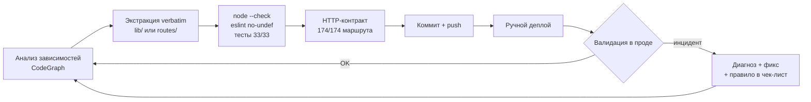

# Claude Fable 5: три дня, 100 000+ строк, живой прод

Привет всем!
Последние три дня (8–10 июля) я провёл над задачей, которую откладывал месяцами: полный рефакторинг моей продовой инфраструктуры (той, что крутит мои трейдинговые и мониторинговые проекты). Express-бэкенд из **24 702 строк в одном файле**, React-дашборд со страницами по 2 700 строк, API, отвечающие по 20 секунд, и база PostgreSQL, растущая без ограничений.

Эту задачу я уже пытался запустить с другими моделями — включая модели OpenAI. Сценарий всегда был один: через несколько файлов контекст переполнялся, модель теряла нить принятых решений и в итоге предлагала «открыть новую беседу». На базе в 100 000+ строк начинать с нуля каждые четверть часа — это приговор.

Разница в этот раз: я работал в паре с **Claude Fable 5**, новой моделью Anthropic (класс Mythos, выше Opus), через Claude Code. Три дня в **одной непрерывной беседе**, которая прошла через бэкенд, фронтенд, браузерные замеры и SQL-патчи, ни разу не попросив начать заново. И результат превзошёл то, что я считал возможным.

> Одной фразой: ~90 коммитов за 3 дня, монолит, уменьшенный в 60 раз, API до 35 раз быстрее, 4.5 GB возвращены на PostgreSQL — и ноль откатов.
{: .prompt-info }

## Отправная точка

| Зона | Состояние на 8 июля |
|---|---|
| `config-api.js` (Express-бэкенд) | 24 702 строки, 174 маршрута, 260 коммитов за 6 месяцев, один файл |
| Страницы React-дашборда | 6 «горячих» страниц от 1 500 до 2 700 строк каждая |
| Frontend-бандл | 1 007 kB одним чанком (постоянный warning Vite) |
| `GET /api/cloudflare/workers` | **19.8 секунды** |
| PostgreSQL | системные таблицы Directus на 4.5 GB, никакой ретенции метрик |

Это не игрушечный проект: это прод, на котором работают мои Cloudflare workers, скрипты мониторинга Steam Market и моя бухгалтерия. Каждая ошибка стоит реальных денег.

{: .shadow }
*Часть периметра: 63 Cloudflare worker'а на 12 аккаунтах, с CPU-квотами, 48-часовыми графиками и массовым редеплоем. Это та страница, чьё API отвечало 19.8 секунды.*

## Метод: ИИ не переписывает, он перемещает

Классическая ловушка LLM на legacy-коде — «творческое переписывание»: модель попутно улучшает, а через три недели обнаруживается тихая регрессия. Правило, наложенное с первого дня, было обратным:

>Правила, наложенные на модель, не подлежащие обсуждению:
1. **Перемещение verbatim** — байт-в-байт, проверено git-сравнением. Никаких «улучшений» попутно.
2. **Один коммит = одно изменение**, всегда обратимое.
3. **После каждого шага**: `node --check`, тесты, eslint no-undef, сравнение HTTP-контракта (174/174 маршрута).
4. **Деплой и валидация в проде** перед следующим шагом.
{: .prompt-danger }

Что меня поразило: Fable 5 **превращал собственные инциденты в чек-лист**. В первый день забытый экспорт сломал страницу Workers в проде (500). Модель продиагностировала, исправила, затем добавила «обязательный eslint no-undef после каждой экстракции» в свою процедуру — и инцидент ни разу не повторился на ~40 последующих экстракциях.



## Инструменты, данные модели

Недооценённый момент: качество работы напрямую зависит от доступов, которые даёшь агенту. За три дня Fable 5 работал с:

- **CodeGraph** (MCP): граф всех символов репозитория для анализа зависимостей перед каждой экстракцией
- **Directus MCP**: прямой доступ на чтение к живой базе — именно он подтвердил «100 прокси × 35 мс = ваши 3.5 секунды»
- **Chrome DevTools MCP**: модель управляла Chrome, получила открытую сессию моего дашборда и сама замерила каждый endpoint каждой страницы
- **pgAdmin4**: через тот же управляемый Chrome она заполняла Query Tool, выполняла SQL-патчи и читала результаты в таблице

Последний пункт стоит подчеркнуть: я не давал root-доступ к PostgreSQL. Модель сама предложила наименее привилегированный вариант (панель pgAdmin вместо сервера), и я видел каждый запрос на экране.

## Дни 1–2: монолит

`config-api.js` уменьшился с 24 702 до **413 строк** — composition root, который делает лишь bootstrap и одиннадцать вызовов `registerXxxRoutes(app)`. 174 маршрута живут в 10 модулях `routes/`, логика — в 26 модулях `lib/`.

Попутно модель нашла то, что похоронили шесть месяцев коммитов:

- 3 предсуществующих бага (спящий `ReferenceError` в авто-паузе, флуд 403 на старых коллекциях, сломанная дедупликация масок)
- 2 мёртвые дублированные функции (`sleep()`, `parseBooleanFlag()` — из которых выполнялась лишь одна версия благодаря hoisting'у)
- 3 инцидента, пойманных в проде, каждый превращён в правило проверки

## День 3: сначала измерить, потом оптимизировать

Правило плана было строгим: «оптимизация начинается только после замеров». Модель сначала сделала code splitting по маршрутам (основной бандл: 1 007 → 204 kB), затем прошла каждую страницу дашборда в браузере и сняла тайминги каждого API-вызова.

Вердикт был безапелляционным — и трижды один и тот же виновник:

```js
// Паттерн, стоивший секунды, найден в ТРЁХ разных endpoint'ах:
for (const script of scripts) {
  const items = await directusRead(COLLECTIONS.CONF_ITEMS,
    { id: { _in: script.monitored_items } });   // 85 последовательных запросов...
}
```

{: .shadow }
*Страница Scripts: 76 скриптов мониторинга, звёзды каденции, квоты UrlFetch. Она вызывала `GET /api/scripts`... который грузил items каждого скрипта по одному.*

Классический N+1, но в REST-версии: 85 последовательных вызовов Directus по ~50 мс каждый. Фикс — единый батч, с ловушкой, которую модель заметила сама: **Directus по умолчанию ограничивает чтение 100 строками**, так что батч без `limit: -1` тихо обрезал бы результаты.

{: .shadow }
*Реальные замеры, сделанные в браузере с аутентифицированной сессией — до 8 июля, после 10-го.*

| Endpoint | До | После | Прирост |
|---|---:|---:|---:|
| `GET /api/scripts` (вызывается на 5 страницах) | ~5 с | **0.9 с** | ×5.7 |
| `GET /api/proxies` | ~3.5 с | **0.1 с** | ×35 |
| `GET /api/cloudflare/workers` | 19.8 с | **~3 с** | ×6 |

Для Cloudflare-endpoint'а N+1 был на стороне внешнего API (63 worker'а × вызов `settings` на каждого, конкурентность 4): конкурентность поднята, чтения D1 распараллелены, плюс in-process-кэш с инвалидацией в трёх единственных endpoint'ах, меняющих bindings. Всё замерено до/после в одном браузере.

Бонус, найденный во время замеров: страница Proxies перезапускала **4 тяжёлых запроса каждые 5 секунд**, пока вкладка оставалась открытой — слишком широкий `invalidateQueries` на таймере. Фоновое давление на ноду снижено в ~70 раз.

## База данных: возвращённые 4.5 GB

Карта таблиц выявила аномалию: `directus_revisions` весила **3 384 MB при... 7 244 живых строках**. Старые чистки удаляли строки, но PostgreSQL никогда не возвращает место ОС без `VACUUM FULL`.

| Таблица | До | После | Длительность блокировки |
|---|---:|---:|---:|
| `directus_revisions` | 3 384 MB | **3.4 MB** | 4.8 с |
| `directus_activity` | 1 121 MB | **1.8 MB** | 1.1 с |
| `script_execution_logs` | 935 MB | уплотнена (−354 788 строк) | 3.6 с |

И чтобы это не повторилось: три функции ретенции + jobs pg_cron (30 дней для логов, 60 дней для часовых метрик), всё задокументировано живым снапшотом **18 активных jobs**.

{: .shadow }
*Query Tool pgAdmin, управляемый Fable 5 через браузер: 18 активных jobs pg_cron, включая три ретенции, добавленные в тот день (имена баз анонимизированы).*

Моя любимая часть: «загадка» из 3 009 ревизий на `directus_collections`. Модель размотала след через `user_agent` и `origin` в таблице активности... и обнаружила, что виновником был **я сам**: каждый drag-and-drop коллекции в админке Directus шлёт PATCH на все коллекции группы. Ни бага, ни фикса — просто честный ответ.

> Даже «исчезнувшие» jobs pg_cron получили свою аутопсию: `cron.job_run_details` хранит следы удалённых jobs. Одного из них никогда не существовало — счётчик замен прокси никогда бы не обнулился в день биллинга.
{: .prompt-tip }

> Агент с доступом к проду остаётся инструментом, требующим рамок: минимально необходимый доступ, деструктивные действия только по явной валидации, и тихие окна для всего, что блокирует базу. Модель соблюдала эти рамки сама — но ставить их должны вы.
{: .prompt-warning }

## Что конкретно меняет Fable 5

Я давно использую LLM для кода. Вот что отличает это поколение:

1. **Контекст больше не ломается.** Это самое заметное изменение по сравнению с моделями OpenAI, которые я использовал раньше: больше никаких «пожалуйста, откройте новый чат», никаких резюме, переписываемых вручную из сессии в сессию. Fable 5 продержал три дня и 100 000+ строк кода в одной непрерывной нити — а когда сессия возобновлялась, сам подгружал точное состояние работ из своей персистентной памяти.
2. **Автономия держится долго.** Распил 6 React-страниц (13 500 проанализированных строк, 15 извлечённых модулей, 6 коммитов, build + тесты после каждой страницы) прошёл одним автономным прогоном, без единого вопроса.
3. **Он отказывается жульничать.** На трёх страницах полная экстракция потребовала бы изменить props — то есть поведение. Модель извлекла то, что было безопасно, задокументировала оставленное и объяснила почему. Ровно то, чего ждёшь от сеньора.
4. **Он измеряет вместо того, чтобы гадать.** Каждая оптимизация проходила путь: замер → причина → минимальный фикс → повторный замер. Когда я сказал «причина наверняка в базе», он проверил в живой базе — и доказал, что это прикладной N+1, а не отсутствующий индекс.
5. **Он инструментирует собственное окружение.** Нет доступа к браузеру? Он сам настроил MCP Chrome DevTools, попросил меня лишь залогиниться, и сделал остальное.
6. **Память персистентна.** Каждая сессия возобновляется с точным состоянием работ, известными ловушками («Directus limit 100», «не сливать одноимённые хелперы Bank и Inventory») и уже принятыми решениями.

## Итоги

| Метрика | Результат |
|---|---|
| Длительность | 3 дня, ~90 коммитов |
| Бэкенд | 24 702 → 413 строк, HTTP-контракт цел (174/174) |
| Фронтенд | бандл в 5 раз легче, 6 страниц распилено |
| API | от ×5.7 до ×35 в зависимости от endpoint'а |
| PostgreSQL | −4.5 GB, 18 jobs pg_cron задокументированы |
| Откаты | **0** |
| Попутно исправленные предсуществующие баги | 3 |

Реальная стоимость моего участия: решения (ретенция 30 или 60 дней? какое окно для `VACUUM FULL`?), деплои и визуальные проверки после каждого шага. Всё остальное — анализ, код, замеры, SQL-патчи, документация — это модель.

Год назад эта задача заняла бы у меня месяц, и я, вероятно, бросил бы её на трети. Мои предыдущие попытки с моделями OpenAI систематически упирались в один предел: размер и длительность. Здесь, честно, я был удивлён — видеть, как модель поглощает эквивалент всего моего монорепо, держит решения в голове три дня и исправляет собственные ошибки по пути, — это похоже не на инкрементальное улучшение, а на **смену уровня**.

Вопрос больше не «может ли ИИ помочь с legacy», а «какие доступы и какую методику ему дать, чтобы он работал как senior SRE». С правильным чек-листом и правильными предохранителями Fable 5 — лучший технический напарник, с которым я работал. Что-то по-настоящему мощное приближается.
