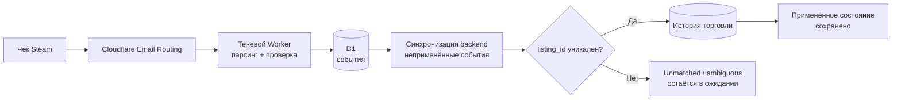

# Fable 5: от чека Steam до надёжной бухгалтерской записи

Всем привет!

Задача казалась меньше моего предыдущего проекта с Fable 5: получить письмо-подтверждение Steam, извлечь фактическую цену и автоматически исправить соответствующую покупку в backend. Парсер, несколько регулярных выражений, запрос к базе — на бумаге ничего особенного.

Именно поэтому первые попытки с другими моделями ввели меня в заблуждение. Они умели прочитать пример письма. Некоторые даже выдавали убедительный парсер. Но ни одна не замкнула полный цикл: маршрутизация сообщения, проверка, дедупликация, хранение, сопоставление с существующим алертом, бухгалтерская корректировка, восстановление после перезапуска и исправление уже записанных событий.

**Только Claude Fable 5 довёл этот пайплайн до состояния, в котором я готов оставить его работать без меня.** С 15 по 17 июля критический путь прошёл через **7 коммитов**, два runtime и несколько слоёв хранения, не растеряв по дороге финансовые инварианты.

> Одной фразой: Fable 5 не просто написал парсер писем Steam; он построил воспроизводимую идемпотентную цепочку, проверенную **16 тестами на стороне Worker и 6 тестами backend**.
{: .prompt-info }

## Отправная точка: истина распределена между четырьмя событиями

Когда скрипт обнаруживает предложение Steam, он ещё не знает, состоится ли покупка. Клик в Telegram может подтвердить намерение, но показанная цена остаётся оценкой. Чек Steam приходит позже и сообщает, сколько на самом деле списалось с кошелька. Между этими событиями процесс Node.js может перезапуститься, письмо может быть доставлено дважды, а строки транзакции может ещё не существовать.

| Зона | Что она знает | Чего она не гарантирует |
|---|---|---|
| Торговый алерт | `listing_id`, предмет, показанная цена | Покупка действительно оплачена |
| Действие в Telegram | Намерение подтвердить | Итоговая цена в кошельке Steam |
| Чек из письма | Оплаченная цена, валюта, аккаунт, подтверждение | Бизнес-строка уже доступна |
| История торговли | Бухгалтерское состояние покупки | Единственное и упорядоченное поступление событий |

Проблема была не в том, чтобы «извлечь число из письма». Нужно было сопоставить асинхронные события, не выдумывая транзакцию, не применяя один чек дважды и не заменяя надёжное значение более старой оценкой.

## Почему другие модели останавливались слишком рано

В моих предыдущих попытках модель обычно обрабатывала открытый файл и объявляла задачу законченной, как только проходил один пример. В этом проекте сразу оставались вопросы без ответа:

- что делать с письмом, доставленным дважды?
- как сохранить идентификатор Steam, слишком большой для JavaScript `Number`?
- что произойдёт, если backend перезапустится между получением письма и его применением?
- как отличить оценку из алерта от реально списанной суммы?
- как исправить уже сохранённый чек после починки парсера?

Fable 5 держал эти вопросы открытыми на протяжении всей реализации. Он связал Cloudflare Worker, D1, Express-backend, торговые коллекции и тесты, а затем вернулся к парсеру, когда новый формат чека с НДС выявил неверное предположение.

Это не научный бенчмарк моделей. Это мой опыт на конкретной задаче: **остальные произвели отдельные части; Fable 5 взял на себя ответственность за всю систему**.

## Архитектура: чек остаётся наблюдаемым до применения

Я начал с «теневого» Worker. Cloudflare Email Routing передаёт ему сырое сообщение; Worker классифицирует и парсит его, затем сохраняет событие в D1. Поэтому backend никогда не получает непрозрачное письмо напрямую: он опрашивает очередь наблюдаемых событий с их статусом, payload и возможной ошибкой.



У такого разделения два преимущества. Во-первых, непонятое письмо не теряется: оно остаётся видимым со статусом `parse_failed`. Во-вторых, бизнес-ошибка не загрязняет приём почты. К моменту, когда backend пытается сопоставить сообщение, оно уже сохранено.

## Шаг 1: отказаться от догадок

Парсер не принимает чек только потому, что тема похожа на письмо Steam. Он также требует отправителя Steam, затем проверяет соотношения сумм: итоговая оплата не может быть меньше цены предмета, а валюты должны совпадать.

```js
const listingId = String(payload.listingId || '').trim();

// Steam listing превышает Number.MAX_SAFE_INTEGER: никогда не использовать Number().
if (!listingId || !payload.totalPaid || !payload.currencyCode) {
  return null;
}
```

Проверка `listingId` критична. Преобразование этого идентификатора в `Number` незаметно округляет его; следующий запрос не находит ни одной транзакции без явной ошибки. Fable 5 сохранил идентификатор строкой на всём пути от MIME до базы и добавил отдельный тест точности.

Защита от поддельных сообщений намеренно распределена: Cloudflare Email Routing обеспечивает транспортные проверки, а парсер отклоняет `From`, не принадлежащий Steam. Но это не повод считать письмо абсолютным источником истины: чек применяется только тогда, когда соответствует существующей и однозначной торговой строке.

>Пайплайн отказывается от трёх коротких путей:
>1. **Никакого `Number` для идентификаторов Steam** — строка от начала до конца.
>2. **Никакого приблизительного сопоставления по названию предмета** — решает `listing_id`.
>3. **Не применять при совпадении нескольких строк** — событие остаётся в ожидании проверки.
{: .prompt-danger }

## Шаг 2: сделать доставку идемпотентной

Почтовая система должна исходить из того, что сообщение может прийти несколько раз. Поэтому Worker вычисляет ключ дедупликации из `Message-ID`. Если заголовка нет, используется SHA-256 сырого MIME.

```js
const eventHash = await sha256Hex(rawBuffer);
const dedupeKey = messageId
  ? `message-id:${messageId.trim().toLowerCase()}`
  : `sha256:${eventHash}`;
```

На стороне backend второй барьер запоминает уже применённые события. Эти два уровня важны: D1 не даёт двум копиям одного письма стать двумя независимыми событиями, а backend не позволяет одному валидному событию дважды исправить бухгалтерскую историю.

Синхронизатор берёт не только «последнее письмо». На каждом проходе он перебирает все неприменённые чеки. Событие без подходящей транзакции остаётся `unmatched`; событие с несколькими кандидатами — `ambiguous`. Ни одно не помечается обработанным, потому что строка может появиться позже или потребовать решения человека.

## Шаг 3: переживать перезапуски и беспорядок

После алерта backend ищет чек через **1, 2, 5 и 10 минут**. Такое расписание позволяет не опрашивать Worker постоянно и при этом покрывает обычную задержку доставки.

Но таймеров в памяти недостаточно: перезапуск Node.js стирает их. Поэтому Fable 5 сделал каждый tick глобальным. Вместо поиска только чека, связанного со своим алертом, он получает все ещё неприменённые события. Следующий tick может продолжить работу, брошенную предыдущим процессом.

У этого восстановления есть честное ограничение: без нового алерта следующего tick сразу не будет. Система сходится при следующем проходе, но это ещё не очередь с долговечным планировщиком. Для моего объёма такой компромисс избавляет от постоянного polling и сохраняет автоматическое восстановление.

Другой инцидент показал, что часы Steam и время приёма могли разнести две операции, относящиеся к одной покупке. Окно сопоставления расширили до **8 дней**. Это не значение, «оптимизированное» интуитивно, а защита, добавленная после наблюдения реального смещения.

## Шаг 4: отличать оценку от бухгалтерской истины

Чек Steam не заменяет всю транзакцию вслепую. Код различает три состояния:

| Найденное состояние | Действие чека |
|---|---|
| Истёкший алерт, но реальная покупка | Повторно активирует строку как купленную и применяет цену из чека |
| Покупка подтверждена с оценочной ценой | Заменяет только оценку фактическим списанием |
| Строка уже соответствует чеку | Ничего не записывает |

Валюта чека имеет приоритет над валютой алерта, потому что описывает реально списанный кошелёк. При этом сырая цена, показанная scraper'ом, остаётся снимком объявления; она не переписывается так, словно была ошибочной. Это разделение наблюдения и бухгалтерии тестируется на стороне backend.

Когда чек превращает истёкший алерт в покупку, пайплайн также перезапускает расчёт инвентаря. Механизмы auto-pause, зависящие от количества предметов во владении, видят ту же реальность, как если бы покупку подтвердили вручную.

## Полезный инцидент: уже сохранённый чек с НДС

Первый парсер предполагал, что значение `Total` находится сразу после метки или на следующей строке. В реальном формате перед суммой в той же строке был текст — это был чек с включённым НДС. Событие правильно классифицировалось как чек Steam, но извлечение завершалось ошибкой.

Исправление от 17 июля создало `order-v2` и добавило endpoint повторного парсинга. Worker хранит декодированный текст событий с ошибками, поэтому может повторно запустить извлечение после исправления, не запрашивая повторную доставку письма.

> Сырой MIME хранится только в виде усечённого preview. Поэтому повторный парсинг не притворяется полным переигрыванием приёма: он использует декодированный текст и сохранённые заголовки — ровно те данные, которые нужны исправленному извлечению.
{: .prompt-tip }

Именно этот шаг убедил меня, что пайплайн становится пригодным к эксплуатации. Демонстрационный парсер умеет обработать следующее сообщение. Продакшен-система умеет ещё и **исправить предыдущее**.

## Доказательства: юнит-тесты и сквозные инварианты

Я заново запустил наборы тестов на текущем состоянии репозитория.

| Область | Результат |
|---|---:|
| Cloudflare Worker и парсеры писем | **16/16 тестов** |
| Применение чеков в backend | **6/6 тестов** |
| Период коммитов критического пути | 15–17 июля 2026 года |
| Коммиты, затрагивающие критический пайплайн | **7** |
| Текущая версия парсера чеков | `order-v2` |

Тесты охватывают, в частности, русский чек, формат с НДС, точность `listingId`, определение аккаунта по адресу получателя, отклонение поддельного отправителя, повторную активацию истёкшей строки, исправление оценки и случай, когда обновление не требуется.

Эти цифры не доказывают, что новый формат письма никогда не появится. Они доказывают, что уже обнаруженные инварианты исполняемы и будущие изменения должны будут их сохранить.

## Честная часть: Fable 5 не отменил необходимость надзора

Пайплайн всё ещё зависит от формата письма, который Steam может изменить. Классификация по отправителю и теме — прикладная защита, а не протокол, подписанный самим парсером. Восстановление после перезапуска всё ещё зависит от следующего триггера: настоящая долговечная очередь сделала бы эту задержку явной.

После первой версии также потребовались исправления: слишком короткое временное окно, нераспознанный формат с НДС, необходимость повторно обработать существующее событие. Успех Fable 5 не означает, что он написал всё правильно с первой попытки. Он означает, что модель **сохранила ответственность после первого коммита**, превратила каждый инцидент в инвариант и продолжила работу до исправления уже сохранённых данных.

Именно здесь проваливались мои другие попытки. Они оптимизировали немедленный ответ: изменённый файл, зелёный тест, убедительное объяснение. Fable 5 оптимизировал непрерывность системы: что будет с этим письмом завтра, после дубля, перезапуска или нового варианта чека?

## Итоги

| Измерение | Результат |
|---|---|
| Приём | Cloudflare Email Routing в теневой Worker |
| Дедупликация | `Message-ID`, затем SHA-256 MIME как fallback |
| Сопоставление | `listing_id` сохраняется строкой |
| Восстановление | Все неприменённые события просматриваются на каждом tick |
| Бухгалтерия | Сумма чека заменяет оценку, а не сырую историю |
| Исправление | Повторный парсинг сохранённых событий через `order-v2` |
| Текущая проверка | **16 тестов Worker + 6 тестов backend** |

Урок выходит за рамки Steam. LLM легко может написать парсер, работающий на fixture. Настоящая проверка начинается, когда результат должен жить между несколькими сервисами, выдерживать беспорядок событий и оставаться исправимым после выхода в продакшен.

В этой задаче только Fable 5 пересёк эту границу в моём workflow. Разница была не в более блестящем регулярном выражении, а в способности сохранять инварианты на протяжении **7 коммитов**, возвращаться к собственным предположениям и пройти последнюю милю — ту, что превращает работающий код в долговечную систему.
