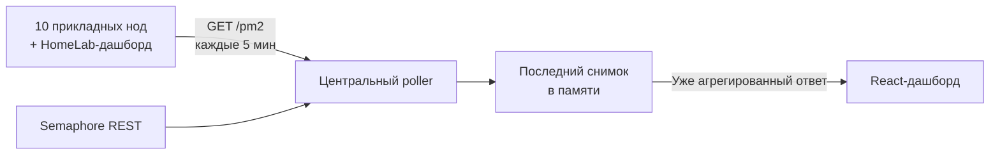

# 11 серверов, 66 процессов и ни одного кластера мониторинга

Всем привет!

У меня работает небольшая, намеренно разнородная инфраструктура: десять прикладных нод и дашборд в моём HomeLab. У большинства серверов всего **одно vCPU и 1–2 GB RAM**. Восемь машин Oracle остаются в рамках free tier, VPS с выделенным IPv4 сейчас обходится мне в **2 доллара в месяц**, а дашборд работает у меня дома просто потому, что мне нравится самому возиться с железом.

На таких машинах слой абстракции никогда не бывает бесплатным. Установка полноценной платформы только ради проверки, остаются ли мои процессы PM2 в статусе `online`, добавила бы сервисы, хранилище и ещё один жизненный цикл, который пришлось бы обслуживать. Мне нужны были ответы на гораздо более простые вопросы: какие процессы запущены, сколько CPU и памяти они потребляют, сколько раз перезапускались и успешно ли завершились обновления.

Поэтому я написал HTTP-агент на Node.js из **112 строк**, запустил его под самим PM2, а затем связал все одиннадцать машин с дашбордом через Tailscale. Временные ряды он не хранит: центральный сервис держит в памяти только последнее известное состояние.

> Одной фразой: **11 машин, 66 процессов PM2, медиана CPU 0,3% и 61,4 MiB RSS на агента**, около 62,3 MiB JSON в месяц и 24 доллара платного облака в год.
{: .prompt-info }

## Отправная точка

До появления этого агента дашборд уже знал, отвечает ли нода, и хранил бизнес-статистику моих скриптов. Но доступный сервер не гарантирует, что все его процессы исправны. Worker может остановиться, уйти в цикл перезапусков или пропасть после деплоя, пока сервер продолжает отвечать как обычно.

| Зона | Состояние до агента PM2 |
|---|---|
| Доступность сервера | Известна из дашборда |
| Подробное состояние процессов | Ручная проверка через `pm2 status` |
| CPU и RSS по процессам | Видны только по SSH |
| Число перезапусков | Видно только по SSH |
| Последнее обновление системы | Уже доступно через Semaphore |
| История CPU/RAM | Для моего сценария не нужна |

Целью было не построить новую платформу наблюдаемости. Нужно было лишь закрыть разрыв между «сервер отвечает» и «нужные мне процессы действительно работают».

{: .shadow }
*Дашборд показывает 10/10 прикладных нод онлайн. HomeLab-дашборд отслеживается отдельно. Tooltip PM2 показывает статус, CPU, память и число перезапусков каждого процесса; адреса и некоторые внутренние имена скрыты.*

Счётчики запросов и их доля успешного выполнения на снимке — уже существовавшие бизнес-метрики. Агент PM2 не строит эти графики и не хранит их историю.

## Моё правило: абстракция должна окупать свою аренду

Я люблю контейнеры, когда они дают полезную изоляцию, воспроизводимую поставку или границу безопасности. Здесь жизненным циклом приложений уже управляли Linux и PM2. Добавлять контейнерный runtime только ради запуска системы мониторинга означало бы дублировать уже имеющуюся функцию.

Мою философию можно сформулировать так:

> У слоя абстракции есть стоимость и назначение. Скрипт легче контейнера, как контейнер легче виртуальной машины. Но правильный выбор — не всегда самый нижний слой: это самый нижний слой, который всё ещё даёт действительно необходимые гарантии.
{: .prompt-tip }

Zabbix и Grafana не «плохие» и не обязательно дорогие. [Zabbix распространяется с открытым исходным кодом](https://www.zabbix.com/license), а у [Grafana Cloud есть бесплатный тариф](https://grafana.com/pricing/). Но их ценность как раз в функциях, которые мне здесь не требовались: временных рядах, хранении истории, запросах, сложных алертах, логах и корреляции.

>Что я отказался строить без конкретной необходимости:
>1. **Базу метрик** — я не анализирую изменение RSS за полгода.
>2. **Пайплайн логов** — моими логами по-прежнему управляют существующие инструменты.
>3. **Контейнерный слой** — перезапуски уже обеспечивают PM2 и операционная система.
>4. **Поддельный клон Grafana** — если такие потребности появятся, я возьму специализированную платформу.
{: .prompt-danger }

## Endpoint поверх `pm2 jlist`

Агент не изобретает новый collector. PM2 уже знает процессы, их статусы и счётчики. Endpoint выполняет `pm2 jlist`, сокращает результат и возвращает только нужные дашборду поля:

```js
const list = JSON.parse(jlistJson);
const procs = list.map((p) => ({
  name: p?.name,
  status: p?.pm2_env?.status,
  cpu: p?.monit?.cpu ?? 0,
  mem: p?.monit?.memory ?? 0,
  restarts: p?.pm2_env?.restart_time ?? 0,
  uptime: p?.pm2_env?.pm_uptime ?? null,
}));
```

Весь HTTP-контракт состоит из одного endpoint `GET /pm2`. Маршрут можно защитить Bearer-токеном, хотя агенты в любом случае доступны только через приватную LAN или Tailscale. Соответствующий публичный порт закрыт.

Сам агент объявлен в `ecosystem.config.js`. Получается, PM2 следит за инструментом, который опрашивает PM2. Это звучит замкнуто, но модель отказа остаётся простой: если агент исчезает, центральный сервис получает ошибку или timeout и помечает его снимок как устаревший.

## Снимок, а не база

Полный поток состоит из четырёх этапов:



Браузер никогда не обращается напрямую к одиннадцати агентам. Центральный poller опрашивает их примерно раз в пять минут, после чего дашборд читает уже подготовленный результат. Поэтому открытие пяти вкладок не умножает число вызовов к небольшим серверам.

Semaphore остаётся источником истины для обновлений пакетов. Я не копирую его историю в новую базу: дашборд получает через API последнее состояние задач и показывает его рядом со статусом PM2.

Компромисс намеренный: после перезапуска центрального сервиса снимок в памяти исчезает. Он восстанавливается в следующем цикле. Для оперативного состояния возрастом в несколько минут я предпочитаю эту временную потерю ещё одной базе, которую нужно резервировать, чистить и мигрировать.

## Что на самом деле показывает дашборд

Каждая нода получает badge вроде `6/6` или `8/8`. Он становится зелёным, когда все процессы, полученные от агента, имеют статус `online`. При наведении tooltip показывает для каждого процесса:

- имя и статус;
- мгновенное значение CPU от PM2;
- RSS в памяти;
- число перезапусков;
- время последней проверки.

Timestamp не менее важен, чем цвет. Зелёный badge двухчасовой давности ничего не доказывает о текущем состоянии. Дашборд должен различать «всё в порядке» и «всё было в порядке при последнем контакте».

На снимке видимый `8/8` относится к одной строке, а tooltip `pm2 6/6` привязан к badge другой строки ниже. React-компонент использует одну и ту же пару `online/total` для badge и его tooltip: двух конкурирующих методов расчёта нет.

## Реальные измерения

Я выполнил пять циклов чтения на одиннадцати агентах и получил **55 успешных ответов**. Вызовы шли по приватным адресам, без записи данных и перезапуска процессов.

| Измерение | Результат |
|---|---:|
| Опрошено машин | **11** |
| Процессы в последнем цикле | **66/66 online** |
| CPU агента, медиана | **0,3%** |
| CPU агента, p95 | **0,7%** |
| Пиковый CPU в серии | 2,9% |
| RSS агента, минимум | 29,3 MiB |
| RSS агента, медиана | **61,4 MiB** |
| RSS агента, максимум | 73,0 MiB |
| Ответ JSON, медиана | 690 байт |
| Полный ответ JSON от 11 хостов | **7 563 байта** |
| Payload JSON в день | 2,08 MiB |
| Payload JSON за 30 дней | **62,3 MiB** |
| Медианная задержка с моего рабочего места | 708 ms |
| Задержка p95 с моего рабочего места | 934 ms |

Расчёт сети учитывает только тело JSON, без заголовков HTTP/TCP. А CPU — это снимок PM2, не научный benchmark Node.js. При первом отдельном чтении один агент даже показал 7,2%. Следующая серия дала медиану 0,3% и p95 0,7%: вывод по единственному замеру был бы обманчивым.

Таблицы «до/после» для RAM нет: до агента этой функции не существовало. Выдуманная оценка стоимости самостоятельно размещённого Zabbix на моих машинах не сделала бы сравнение честнее.

## 24 доллара за облако в год

Топология почти так же важна, как код. В ней смешаны free tier, арендованный VPS и домашнее оборудование:

| Часть | Текущая реальная стоимость |
|---|---:|
| 8 VM Oracle Cloud | **0 долларов**, free tier |
| VPS с выделенным IPv4 в российском дата-центре | **2 доллара в месяц** |
| Тот же VPS до изменения цены | 1 доллар в месяц |
| Платное облако за двенадцать месяцев по текущей цене | **24 доллара** |
| Tailscale Personal | **0 долларов** в этих рамках |
| HomeLab-дашборд | оборудование и электричество не учтены |

Если разделить их на десять показанных нод, 24 доллара составляют **2,40 доллара на ноду в год**. Эта цифра не превращает HomeLab в бесплатную машину: она отражает только счёт за облачный хостинг. Оборудование, электричество и подключение никуда не исчезают.

Дашборд мог бы работать у провайдера, как остальные машины. Я размещаю его дома, потому что так интереснее: мне нравится собирать машины, понимать их поведение и держать часть инфраструктуры под рукой. Этот выбор связан с хобби не меньше, чем с оптимизацией.

Низкая цена — не повод считать эти серверы одноразовыми. Наоборот: при одном vCPU и 1–2 GB RAM каждый ненужный daemon напрямую уменьшает запас ресурсов для приложений. Минимализм становится операционным ограничением, а не эстетической позой.

## Честная часть: маленький агент всё равно ломался

Файл короткий, но интеграция в реальный жизненный цикл привела к нескольким полезным инцидентам.

### `pm2 resurrect` заставил агента исчезнуть

Первая версия была запущена обычной командой `pm2 start`. После `pm2 resurrect` вернулись только процессы, описанные в постоянной конфигурации. Значит, агент работал лишь до следующего штатного перезапуска.

Исправлять нужно было не HTTP-код: агента следовало добавить в `ecosystem.config.js`. Процесс по-настоящему входит в инфраструктуру только тогда, когда штатный механизм восстановления умеет его пересоздать.

### Правильный сервер, неправильный пользователь

На некоторых машинах `pm2 list` выглядел пустым. Процессы существовали, но под другим пользователем и с другим `PM2_HOME`. Агент правильно опрашивал PM2 — просто не тот daemon.

PM2 — не абстрактный глобальный сервис: его состояние зависит от Unix-пользователя, который его запускает. Теперь это ограничение учтено в деплое.

### `pm2 restart` сохранил старый entrypoint

На дашборде старый агент возвращал неполный контракт. Перезапуск процесса, разумеется, не менял путь уже зарегистрированного скрипта. Пришлось удалить запись и создать её заново с правильным файлом.

### Автоматизация может сама стать сбоем

Прерванный удалённый деплой оставил сомнения в реальном состоянии процессов. Прежде чем повторно запустить задачу на всех машинах, я проверил процессы средствами операционной системы. Даже автоматизация, созданная для повышения надёжности десяти серверов, должна уметь останавливаться, не превращаясь в их общую точку отказа.

> Минимальный код сокращает число компонентов для диагностики. Он не отменяет необходимости понимать Unix-пользователей, запуск, восстановление и идемпотентность деплоя.
{: .prompt-warning }

## Чего эта система не делает

Эта архитектура отвечает на намеренно ограниченный набор вопросов. Она не предоставляет:

- временные ряды CPU или RAM;
- исторические графики PM2;
- PromQL;
- централизованный сбор логов;
- SNMP или обнаружение оборудования;
- сложные правила алертинга;
- постоянный снимок после перезапуска центрального API.

Если однажды мне понадобится сопоставлять метрики за полгода, отправлять алерты в несколько каналов или исследовать распределённые логи, специализированная платформа станет оправданной зависимостью. Я не стану превращать этот агент в плохую копию Zabbix или Grafana.

## Итоги

| Метрика | Результат |
|---|---:|
| Машин под наблюдением | **11** |
| Видимых прикладных нод | **10/10 online** |
| Измеренных процессов PM2 | **66/66 online** |
| Размер агента | **112 строк** |
| Медианный CPU агента | **0,3%** |
| Медианный RSS агента | **61,4 MiB** |
| Месячный payload JSON | **62,3 MiB** |
| Расходы на платное облако | **24 доллара в год** |
| Дополнительная база метрик | **нет** |
| Дополнительный контейнер | **нет** |

Я не заменил Zabbix. Я построил ровно тот уровень наблюдения, который сейчас нужен этой инфраструктуре: один endpoint, один poller, один снимок и один badge, сообщающий, какие процессы действительно живы.

Самый интересный результат не в том, что скрипт «лучше» контейнера. Архитектура часто становится понятнее, если требовать от каждого нового слоя обоснования его существования. Контейнеры, базы метрик и платформы наблюдаемости действительно полезны, но только когда задача, которую они решают, существует на самом деле.

На машинах с одним vCPU, которые в среднем обходятся в несколько долларов в год, этот вопрос уже не теоретический: **даёт ли эта зависимость больше, чем потребляет ресурсов и сложности?** Для мониторинга моих 66 процессов ответ в итоге уместился в 112 строк Node.js.
