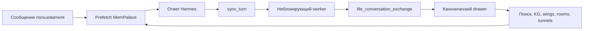

# Hermes × MemPalace: память, которая наконец участвует в жизни агента

Я только что поучаствовал в самом крупном open source pull request в моей практике на сегодняшний день: нативной интеграции MemPalace в качестве провайдера памяти для Hermes. Её путь начался с первого коммита 7 апреля 2026 года, а 11 августа core был влит в `develop` после **2 591 добавленной строки**, изменений в шести файлах, восьми успешных CI jobs и явного одобрения для релизной ветки 3.7.0.[1][8][9]

Однако автором влитого PR указан не я.[1]

Основную работу выполнил [Raman Gupta](https://github.com/raman325).[1]

Мой вклад выглядел иначе: я превратил четыре найденные на ревью проблемы в тестируемый патч, затем провёл аудит backfill и нашёл два пути, на которых ответы Hermes молча терялись. Часть моего патча заменили более чистым решением, но зафиксированные в нём проблемы и тесты повлияли на итоговый результат.[1][2][4]

> Одной фразой: MemPalace не просто добавляет Hermes новые кнопки; он встраивается в его жизненный цикл, архивирует обмены, не блокируя разговор, заранее подгружает релевантный контекст и предоставляет **27 инструментов** над структурированным локальным дворцом.[1]
{: .prompt-info }

## 126 дней от прототипа до merge

Если смотреть только на PR #1915, история начинается 2 июля 2026 года. Но это уже финальная итерация provider core, а не начало разработки интеграции.[1]

Первый коммит интеграции, [`11b1996d`](https://github.com/MemPalace/mempalace/commit/11b1996db7c82b9d728b912307906074ec1832ba) (`feat: Hermes memory provider integration`), был создан 7 апреля в 00:16 UTC. Через несколько секунд ZK-Snarky открыл PR #3 с той же концепцией: нативный memory provider, автоматическая запись разговоров, инструменты palace и команда установки.[8][9]

Первый вариант появился быстро. Четыре исходных коммита были сделаны 7 апреля между 00:16 и 06:51 UTC, то есть примерно за шесть с половиной часов. Затем PR #3 закрыли как устаревший относительно основной ветки и изменившегося API Hermes, но сама работа не исчезла.[9]

PR #1684 прямо говорит, что продолжает #3. Raman сохранил четыре исходных коммита ZK-Snarky в основании ветки, выполнил rebase и поверх них перестроил интеграцию под актуальный `MemoryProvider` API. Работа также продолжала обсуждение провайдера в Hermes Agent issue #6323. После ревью большой PR разделили на части.[5][10]

Так появился #1915. В его описании прямо сказано, что #1684 разбивается на два PR и перед нами первая часть: ядро провайдера и тесты. Команду `mempalace hermes install`, backfill существующих сессий и документацию вынесли в отдельный последующий PR, чтобы core можно было проверить отдельно.[1]

| Этап | Дата | Что произошло |
|---|---|---|
| Первый коммит реализации | 7 апреля 2026, 00:16 UTC | Начало разработки провайдера |
| PR #3 | 7 апреля 2026 | Первый полный вариант интеграции |
| PR #1684 | 3 июня 2026 | Возвращение к работе, rebase и обновление под новый API |
| PR #1915 | 2 июля 2026, 18:46 UTC | Ядро провайдера выделено в отдельный PR |
| Merge #1915 | 11 августа 2026, 10:53 UTC | Core принят в `develop` |

От первого коммита до merge прошло **126 дней 10 часов** — чуть больше четырёх месяцев. Финальный этап реализации и ревью в #1915 занял **39 дней 16 часов**, то есть около 40 календарных дней.[1][8]

> Эти 126 дней нельзя называть 126 человеко-днями разработки. Это календарный путь функции: быстрый первый прототип, закрытие устаревшего PR, изменение API Hermes, возвращение к работе, rebase, несколько раундов ревью и разделение реализации на более маленькие PR.
{: .prompt-tip }

И слово «внедрение» здесь требует оговорки: 11 августа было влито именно ядро memory provider. Установка, backfill и документация на тот момент оставались в отдельном последующем PR.[1][4]

## Отправная точка: у Hermes уже были плагины памяти

Было бы неправильно сказать, что MemPalace «наконец добавляет память в Hermes». В актуальной документации Hermes уже описаны **восемь внешних провайдеров**; одновременно может быть активен только один, в дополнение к `MEMORY.md` и `USER.md`. Контракт провайдера умеет внедрять контекст, предварительно загружать воспоминания перед ходом, синхронизировать обмены после ответа, реагировать на завершение сессии и предоставлять собственные инструменты.[6]

Поэтому настоящий вопрос звучал не так: *можно ли подключить к Hermes векторную базу данных?* А так: *можно ли сделать MemPalace согласованной частью работы Hermes, не создавая рядом с агентом второй источник истины?*

| Область | До этого PR | С провайдером MemPalace |
|---|---|---|
| Запуск | Модель должна явно вызвать инструмент или MCP-сервер | Hermes вызывает hooks провайдера в нужный момент |
| Запись ходов | Риск отдельного пути для конкретной интеграции | Тот же `file_conversation_exchange()`, что и в остальном MemPalace |
| Вызов памяти | Поиск запускается по запросу | Предзагрузка контекста до хода плюс явный поиск |
| Данные | Ограниченная память Hermes или отдельный внешний сервис | Локальный palace, drawers, wings, rooms, граф знаний и tunnels |
| Поверхность агента | Инструменты, добавленные плагином | **27 инструментов** плюс hooks жизненного цикла |
| Задержка записи | Запись может замедлить ответ | Ограниченный фоновый worker |
| Системные контексты | Cron и flush могут загрязнять воспоминания | Явная защита от этих контекстов |

## Почему это не «ещё один плагин»

Обычный MCP-плагин в первую очередь расширяет то, что агент **может запросить**. Провайдер MemPalace расширяет ещё и то, что инфраструктура **делает автоматически** вокруг каждого ответа: инициализацию, внедрение контекста, `prefetch`, `sync_turn`, смену сессии, зеркалирование записей в память и корректное завершение работы. Именно эта разница меняет уровень интеграции.[1][6]



Важная деталь — `file_conversation_exchange()`. Импортированные задним числом разговоры и ходы, захваченные в реальном времени, должны получать одинаковые метаданные, идентификаторы и маршрутизацию. Иначе две на первый взгляд совместимые памяти постепенно расходятся в два формата: поиск находит историю, но не текущие данные, фильтр по дате игнорирует часть drawers или wing ведёт себя по-разному в зависимости от пути загрузки.[1]

Провайдер также использует `ChromaBackend.get_or_create_collection()` вместо прямого открытия ChromaDB. Это централизует функцию embedding и не даёт повторить ошибку размерности, которая заблокировала несколько предыдущих попыток со стороны Hermes. Операции статуса ограничены **5 000 записями метаданных** и явно сообщают об усечении представления, чтобы большой palace не превращал простую проверку в полную загрузку.[1]

> Новый уровень определяется не количеством инструментов. Он определяется инвариантом: автоматический захват, автоматический вызов памяти и явные операции должны обращаться к одному palace, одной collection и одному формату drawer.
{: .prompt-tip }

## Первый настоящий блокер: записать один разговор дважды

Первое ревью maintainer выявило опасный дефект: `sync_turn()` записывал каждый завершённый ход, после чего `on_session_end()` повторно обрабатывал полный transcript. Поскольку `filed_at` участвует в идентификаторе drawer, вторая запись не заменяла первую, а создавала новое, почти идентичное воспоминание.[1]

При длительном использовании это не косметический дефект. Результаты поиска постепенно засоряются повторами, а статистика раздувается.[1]

Я открыл stacked PR на **170 добавлений и 9 удалений** с тестами, чтобы решить эту проблему, привязать passthrough-инструменты к настроенному `palace_path`, зеркалировать стандартный target памяти и предложить поддержку backup.[2]

Raman закрыл этот патч, не вливая его в исходном виде.[2]

Его первоначальный выбор был проще и безопаснее: сделать `sync_turn()` единственным путём захвата в core, а восстановление пропущенных ходов вынести в отдельный PR.[1][2]

Это было правильное решение. Дедупликация двух разных представлений одного хода — очищенных аргументов с одной стороны и сырого transcript с инструментами и внедрённым содержимым с другой — сложнее простого счётчика или сравнения текста.[1][3]

Follow-up [#1941](https://github.com/MemPalace/mempalace/pull/1941) добавляет fingerprints, анализ происхождения веток и явную политику: при неоднозначности допустить ограниченный дубликат, а не потерять ход. На момент написания статьи он всё ещё открыт как draft.[3]

## Второй блокер: записывать в один дворец, а искать в другом

Провайдер знал о `self._palace_path`, но несколько из его 27 инструментов делегировали работу MCP-серверу MemPalace, который разрешал собственную глобальную конфигурацию.[1] Поэтому с пользовательским путём Hermes мог записывать и искать в одном palace, тогда как CRUD-операции, работа с дубликатами или tunnels изменяли другое расположение.[1]

Для пользователя симптом выглядит точно как потеря памяти: «Я только что это добавил, почему поиск ничего не находит?» Мой патч сделал проблему конкретной. Принятая версия пошла дальше: она унифицировала разрешение palace, collection и графа знаний, не вводя второй параметр, который мог бы рассинхронизироваться.[1][2]

На том же ревью выяснилось, что `on_memory_write()` копировал только `target="user"`, хотя Hermes по умолчанию использует `target="memory"`. Поэтому провайдер мог игнорировать большинство обычных заметок. В финальном исправлении эти два типа разделены в графе: факты о пользователе и заметки агента больше не смешиваются.[1]

## Второй проход: backfill терял ответы с инструментами

После core я перечитал PR установки и backfill. Тесты проходили, но использовали только простые пары `user → assistant`. Настоящий ход агента часто выглядит так:

```text
user
→ assistant(tool_use)
→ user(tool_result)
→ assistant(финальный ответ)
```

Парсер связывал сообщение пользователя только с первым сообщением assistant. Поэтому он архивировал stub `tool_use`, часто без текста, и отбрасывал настоящий финальный ответ. Для coding agent это не редкий случай, а обычный поток.[4]

Я также воспроизвёл второй дефект: `hermes sessions export` создаёт по одному объекту сессии на строку JSONL, а сообщения находятся внутри него. Backfill считал каждую строку непосредственно сообщением и молча возвращал ноль обменов.[4]

Обе находки исправили в последующем commit: теперь backfill повторно использует сегментацию live-провайдера, сохраняет маркеры инструментов и финальный ответ и понимает реальную структуру JSONL-экспортов. В PR #1942 явно указан вклад `@GoXLd` в обнаружение этих двух дефектов. На момент публикации он тоже остаётся открытым draft.[4]

>«Дословная» память не имеет права молча сообщать об успехе:
>1. **Ход с инструментами должен сохранять финальный ответ**, а не только stub вызова.
>2. **Корректный экспорт, из которого получено ноль обменов, должен тестироваться как функциональная ошибка.**
>3. **Если приходится выбирать между дубликатом и потерей, потеря — неверная сторона компромисса.**
{: .prompt-danger }

## Участники: PR, который двигала дискуссия, а не один человек

В thread #1915 участвовали пять человек. Автоматические reviewers Gemini Code Assist и Copilot тоже оставляли замечания, но я намеренно отделяю их от людей.[1]

| Участник | Роль в thread |
|---|---|
| [raman325](https://github.com/raman325) | Автор провайдера, тестов и финальных исправлений; разделил прежний большой PR на серию, удобную для ревью |
| [igorls](https://github.com/igorls) | Maintainer и reviewer; зафиксировал архитектурные инварианты, запросил исправления, затем одобрил и влил core |
| [GoXLd](https://github.com/GoXLd) | Автор stacked review patch, тестов четырёх блокеров, затем аудита backfill, обнаружившего два пути потери данных |
| [vavush](https://github.com/vavush) | Возобновил thread после нескольких недель ожидания и проверил статус блокеров |
| [alistairwalsh](https://github.com/alistairwalsh) | Поделился независимым опытом большой установки Qdrant и предложил follow-ups по надёжности |

Цепочка от #3 через #1684 к #1915 — ещё одна причина не представлять результат как изолированную работу одного автора. В эту историю входят исходная реализация ZK-Snarky, переработка Raman под изменившийся API, требования maintainer и последующие review-вклады.[1][8][9][10]

## Честная часть: мой вклад вошёл в merge не в том виде, в котором я его написал

Во влитом PR нет ни одного commit, подписанного `GoXLd`. Мой PR в fork Raman был закрыт, а его стратегия дедупликации не была принята в исходном виде. Поэтому утверждать «я написал влитую feature» было бы неверно.[1][2]

При этом мой реальный вклад можно проверить: patch из двух файлов с тестами, четыре проблемы, превращённые в конкретное поведение, техническая дискуссия, приведшая к более чистому решению, и два бага backfill, воспроизведённые на реальных форматах сообщений и экспортов. Это менее заметно, чем счётчик строк в финальном merge, но ближе к хорошему вкладу в зрелый проект: снизить риск до релиза.[2][4]

Ещё одно важное ограничение: **влит только core #1915**.[1]

Scan-based восстановление пропущенных ходов (#1941) и команда `mempalace hermes install` с backfill и документацией (#1942) всё ещё находятся в draft.[3][4]

Последним видимым публичным релизом остаётся v3.6.0.[7]

Reviewer включил core в релизную ветку 3.7.0, но полный процесс установки пока не опубликован.[1][4]

## Итоги

| Элемент | Состояние проверено 11 августа 2026 года |
|---|---|
| Core провайдера Hermes | **Влит в `develop`** |
| Полный календарный путь | **126 дней 10 часов** от первого коммита до merge core |
| Финальная итерация #1915 | **39 дней 16 часов** от открытия PR до merge |
| Diff #1915 | **2 591 добавление**, 1 удаление, 6 файлов |
| Предоставляемая поверхность MemPalace | **27 инструментов** |
| Тесты, заявленные в core | **42 новых теста** |
| CI merge | **8 успешных jobs**: build, GPU, lint, Linux 3.9/3.11/3.13, macOS, Windows |
| Мой stacked patch | 170 добавлений, 9 удалений; закрыт после redesign |
| Находки в backfill | **2 дефекта** воспроизведены и исправлены в #1942 |
| Релизная ветка | Core одобрен для **3.7.0**; публичного релиза пока нет |
| Follow-ups | #1941 и #1942 открыты как drafts |

Значимость этой интеграции не в том, что Hermes получает ещё одну память. Hermes уже умеет загружать несколько провайдеров. Изменение в том, что локальный palace теперь может следовать реальному жизненному циклу агента: готовить контекст, поглощать каждый ход, учитывать смену сессий, зеркалировать заметки, показывать свою топологию и сохранять согласованность с историческими импортами.[1][6]

Для меня этот PR также меняет само определение вклада. Мой код не был влит слово в слово, но он стал прототипом, набором тестов и конструктивным давлением на самые рискованные инварианты. Вопрос теперь не в том, «сколько моих строк вошло в merge?», а в том, «какие потери памяти никогда не дойдут до пользователей благодаря этому ревью?»

## Источники

[1] https://github.com/MemPalace/mempalace/pull/1915 — MemPalace PR #1915 — Hermes memory provider core
[2] https://github.com/raman325/mempalace/pull/2 — GoXLd review fixes for PR #1915
[3] https://github.com/MemPalace/mempalace/pull/1941 — MemPalace PR #1941 — scan-based dedup safety nets
[4] https://github.com/MemPalace/mempalace/pull/1942 — MemPalace PR #1942 — backfill, install command, and docs
[5] https://github.com/NousResearch/hermes-agent/issues/6323 — Hermes Agent issue #6323 — MemPalace memory provider
[6] https://hermes-agent.nousresearch.com/docs/user-guide/features/memory-providers — Hermes Agent — Memory Providers
[7] https://github.com/MemPalace/mempalace/releases — MemPalace releases
[8] https://github.com/MemPalace/mempalace/commit/11b1996db7c82b9d728b912307906074ec1832ba — Первый коммит интеграции Hermes memory provider
[9] https://github.com/MemPalace/mempalace/pull/3 — Первоначальный PR #3 — Hermes memory provider integration
[10] https://github.com/MemPalace/mempalace/pull/1684 — Продолжение PR #3, rebase и обновление под актуальный MemoryProvider API
