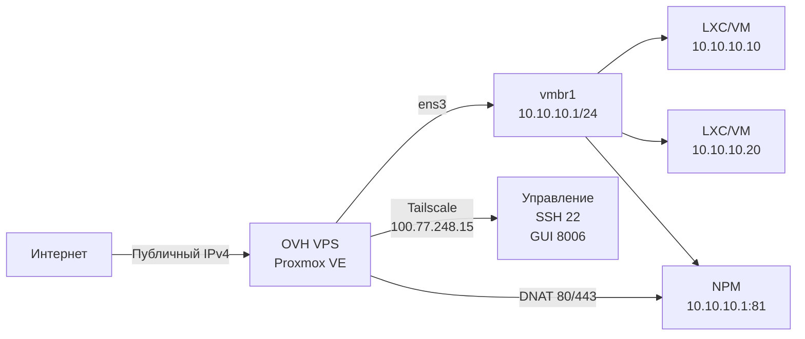

# Proxmox VE на VPS OVHcloud: от проверки KVM к закаленному firewall'у

У меня есть VPS OVHcloud «Model 3» (6 vCore, 12 ГБ RAM, 100 ГБ NVMe, 2 Гбит/с безлимит) на Debian 13 Trixie. Задача: поставить Proxmox VE 8, чтобы гонять LXC-контейнеры и — если железо позволяет — настоящие KVM-VM. OVH не даёт готовый образ Proxmox — стек собирать самому, и главный вопрос: **есть ли на самом деле nested KVM?**

> Одной фразой: nested KVM пройден (`vmx` + `/dev/kvm` + `kvm-ok`), Proxmox установлен на Debian 13, сеть NAT `vmbr1` (10.10.10.0/24) с DNAT 80/443 на NPM, nftables *default-drop* прогладывает только Tailscale (SSH 22, GUI 8006) и Tailscale UDP 41641 — 0 юнитов systemd в failed.
{: .prompt-info }

## Исходная точка

| Зона | Состояние |
|---|---|
| VPS | OVH Model 3 — 6 vCore / 12 ГБ / 100 ГБ NVMe / 2 Гбит/с |
| Базовая ОС | Debian 13 (Trixie) minimal, hostname `vps-17aa660c-vps-ovh-net` |
| Доступ | KVM-консоль OVH + SSH (ключ ed25519) |
| Proxmox | Не установлен |
| Сеть | 1 публичный IPv4, нет failover IP |
| Цель | Proxmox VE 8 + LXC/VM + внутренний reverse proxy + минимальная публичная поверхность |

Это не bare metal: это KVM внутри KVM. Документация OVH гласит: «custom config разрешена, на свой страх и риск» — значит, доказывать работоспособность мне.

## Проверка nested KVM перед покупкой

У меня уже был слабее VPS OVH под рукой. Прогнал полную батарею тестов **до** заказа Model 3.

```bash
# 1. Флаг VT-x/AMD-V проброшен в гостя
egrep -wo 'vmx|svm' /proc/cpuinfo | head
# vmx
# vmx
# vmx
# vmx

# 2. Устройство KVM присутствует
ls -la /dev/kvm
# crw-rw---- 1 root kvm 10, 232 Sep 7 15:22 /dev/kvm

# 3. Модули ядра загружены
lsmod | grep kvm
# kvm_intel 413696 0
# kvm 1380352 1 kvm_intel
# irqbypass 12288 1 kvm

# 4. Официальный тест
apt update && apt install -y cpu-checker
kvm-ok
# INFO: /dev/kvm exists
# KVM acceleration can be used
```

Все четыре проверки проходят. **Nested KVM работает**: VPS может хостить Proxmox, который в свою очередь запустит аппаратно-ускоренные KVM-VM.

> Если `kvm-ok` говорит «KVM acceleration can NOT be used» — Proxmox установится, но QEMU-VM будут в TCG (софтовая эмуляция) — в проде непригодны. Только LXC.
{: .prompt-danger }

## Установка: Debian 13 → Proxmox VE 8

Никакого ISO через KVM-консоль OVH. Поддерживаемый путь: **Proxmox поверх Debian**.

```bash
# 1. Чистый hostname
hostnamectl set-hostname gxd
# /etc/hosts: 127.0.0.1 gxd gxd.local

# 2. SSH-ключ (ed25519) уже лежит для root@gxd

# 3. Репозиторий Proxmox (no-subscription)
echo "deb http://download.proxmox.com/debian/pve bookworm pve-no-subscription" \
  > /etc/apt/sources.list.d/pve-install-repo.list
wget -qO- https://enterprise.proxmox.com/debian/proxmox-release-bookworm.gpg \
  | gpg --dearmor > /etc/apt/trusted.gpg.d/proxmox.gpg

# 4. Установка
apt update
apt install -y proxmox-ve postfix open-iscsi
# (postfix: конфиг «Internet site», mail name = gxd)

# 5. Ребут → интерфейс на https://<IP>:8006
```

Установка заняла ~4 мин. После ребута UI Proxmox отдаётся на 8006 порту.

> **Непереводимое правило**: никогда не трогай сеть Proxmox (`/etc/network/interfaces`, `vmbr0`) без открытой параллельно KVM-консоли OVH. Ошибка = потеря SSH = восстановление только через KVM.
{: .prompt-warning }

## Сеть: один публичный IPv4 → NAT + DNAT

С одним публичным IPv4 классический `vmbr0` «как на dedicated» не заведётся. Сделал **внутренний NAT-бридж** (`vmbr1`) и **DNAT** на Nginx Proxy Manager.



**`/etc/network/interfaces`** (актуальный фрагмент):

```bash
auto vmbr1
iface vmbr1 inet static
    address 10.10.10.1/24
    bridge-ports none
    bridge-stp off
    bridge-fd 0
    # NAT + DNAT рулит nftables (см. ниже)
```

**nftables** — политика *default-drop* на `input` и `forward`, разрешены только явные правила:

```nft
table inet filter {
  chain input {
    type filter hook input priority filter; policy drop;
    iifname "lo" accept
    ct state established,related accept
    ip protocol icmp accept
    ip6 nexthdr ipv6-icmp accept
    # Управление ТОЛЬКО через Tailscale
    iifname "tailscale0" tcp dport { 22, 8006 } accept
    # Tailscale transport + DHCP OVH
    iifname "ens3" udp dport 41641 accept
    iifname "ens3" udp sport 67 udp dport 68 accept
  }
  chain forward {
    type filter hook forward priority filter; policy drop;
    ct state established,related accept
    # NAT исходящий vmbr1 → ens3
    iifname "vmbr1" oifname "ens3" accept
    # DNAT входящий 80/443 → NPM (10.10.10.1)
    iifname "ens3" oifname "vmbr1" ip daddr 10.10.10.1 tcp dport { 80, 443 } accept
    # Tailscale ↔ vmbr1
    iifname "tailscale0" oifname "vmbr1" ip daddr 10.10.10.0/24 accept
    iifname "vmbr1" oifname "tailscale0" ip saddr 10.10.10.0/24 accept
  }
}
table ip nat {
  chain prerouting {
    type nat hook prerouting priority dstnat; policy accept;
    iifname "ens3" ip daddr <PUBLIC_IPV4> tcp dport 80  dnat to 10.10.10.1:80
    iifname "ens3" ip daddr <PUBLIC_IPV4> tcp dport 443 dnat to 10.10.10.1:443
  }
  chain postrouting {
    type nat hook postrouting priority srcnat; policy accept;
    oifname "ens3" ip saddr 10.10.10.0/24 masquerade
  }
}
```

Итог: **публичная поверхность = 2 порта (80, 443) + UDP 41641 (Tailscale)**. SSH (22) и GUI Proxmox (8006) **недоступны из интернета** — только через Tailscale.

## Nginx Proxy Manager в LXC (10.10.10.1)

Лёгкий LXC-контейнер (Debian 13, 512 МБ RAM, 4 ГБ диск), Docker + официальный образ NPM.

```bash
# Внутри LXC NPM
docker run -d \
  --name npm \
  --network host \
  -v /data:/data \
  -v /letsencrypt:/etc/letsencrypt \
  jc21/nginx-proxy-manager:latest
```

NPM слушает `10.10.10.1:81` (админка) и `10.10.10.1:80/443` (трафик). nftables DNAT маршрутизирует публичный трафик к нему.

## Валидация после установки

| Проверка | Команда | Результат |
|---|---|---|
| Failed systemd units | `systemctl --failed` | **0 loaded units listed** |
| Публичные слушающие порты | `ss -ltnp \| grep -E ':22\|:8006\|:3128\|:81'` | 22/8006/3128/81 **отсутствуют** на `ens3` |
| Порты на Tailscale | `ss -ltnp \| grep 100.77.248.15` | 22, 8006 **присутствуют** |
| DNAT 80/443 | `nft list table ip nat` | Правила `dnat to 10.10.10.1:80/443` **есть** |
| MASQUERADE vmbr1 | `nft list table ip nat` | `oifname "ens3" ip saddr 10.10.10.0/24 masquerade` **есть** |
| Доступ к Proxmox GUI | `curl -k https://100.77.248.15:8006` | **200 OK** (через Tailscale) |
| Доступ к NPM GUI | `curl http://100.77.248.15:81` | **200 OK** (через Tailscale) |
| Nested KVM в Proxmox | `kvm-ok` (в хосте Proxmox) | **KVM acceleration can be used** |

Порт 3128 (SPICE proxy) слушает на `*` но **заблокирован файрволом** — доступа к SPICE-консоли извне нет. noVNC (через 8006) вполне достаточно.

> **Примечание про SPICE**: если понадобится SPICE-консоль — добавь `iifname "tailscale0" tcp dport 3128 accept` в chain `input`. Для noVNC ничего менять не надо.
{: .prompt-tip }

## Что не зашло / подводные камни

1. **Дефолтный hostname OVH** (`vps-xxx-vps-ovh-net`) — Proxmox использует его как имя ноды в кластере. Меняй **до** установки Proxmox, иначе переименовать ноду PVE потом больно.
2. **`rpcbind` на 0.0.0.0:111** и **LLMNR на :5355** — включены по дефолту в Debian/Proxmox. Выключил через `systemctl disable --now rpcbind.socket rpcbind` и `systemctl mask systemd-resolved` (LLMNR). Firewall их и так блокировал, но чисто = тихо.
3. **IPv6** — OVH даёт `/64`, но роутинг в `vmbr1` пока не пробросил. Пока: только IPv4 + Tailscale (который даёт IPv6 ULA).
4. **Бэкап Proxmox** — джобы `vzdump` на удалённый storage ещё нет. Сделать.

## Итоги

| Метрика | Результат |
|---|---|
| Nested KVM | Пройден (`vmx`, `/dev/kvm`, `kvm-ok` ✓) |
| Установка | Debian 13 → Proxmox VE 8 (no-subscription) |
| RAM под гостей | ~10 ГБ (2 ГБ хост Proxmox) |
| Диск под гостей | ~85 ГБ (после ОС + Proxmox) |
| Публичная поверхность | TCP 80, 443 + UDP 41641 — и всё |
| Доступ админа | Только Tailscale (SSH 22, GUI 8006, NPM 81) |
| Reverse proxy | NPM в LXC (10.10.10.1) + nftables DNAT |
| Firewall | nftables *default-drop*, 0 failed units |
| Следующий шаг | Первый LXC-сервис (напр. 10.10.10.10) → DNS → HTTPS через NPM → сертификат Let's Encrypt |

Вопрос больше не «работает ли это», а **« какой первый сервис разверну в LXC 10.10.10.10 »**. Стек готов: Proxmox управляет жизненным циклом, nftables фильтрует, Tailscale даёт чистое администрирование, NPM терминирует TLS. Остальное — уже приложения.

---

*VPS OVH Model 3 — 6 vCore / 12 ГБ / 100 ГБ NVMe / 2 Гбит/с — Proxmox VE 8.2 / Debian 13 Trixie / nftables / Tailscale / Nginx Proxy Manager. Сетевая конфигурация провалидирована 2026-09-09.*